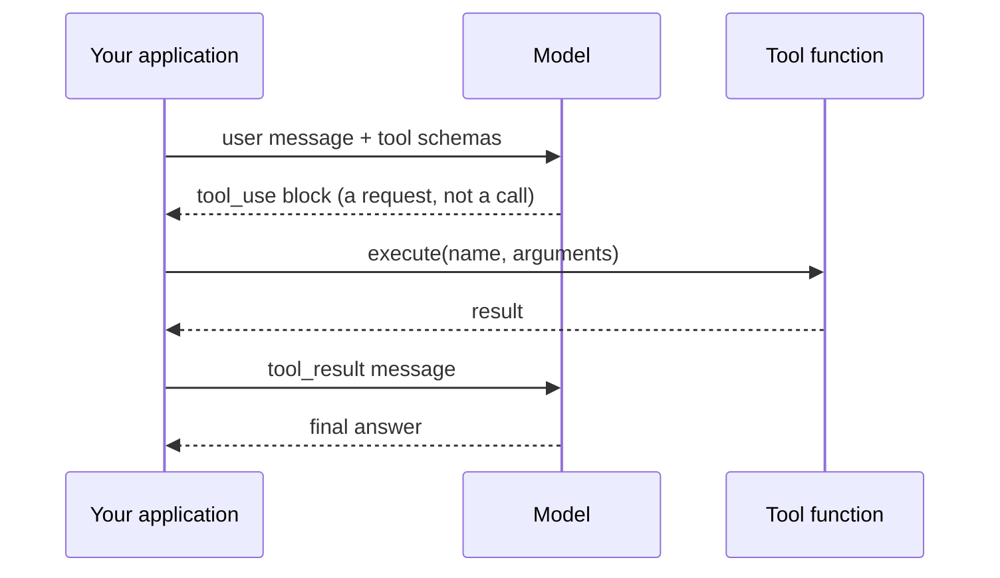

# Chapter 01 — One tool call

## TL;DR

A single tool call is the atomic unit of every agent. The model emits a structured request describing which function to run with which arguments; your code runs it; the result is fed back as another message; the model writes its final answer. No loop yet, no memory, no orchestration — one round-trip. This chapter is about getting that round-trip exactly right. Everything else in the course is variations and stacks on this same mechanism.

---

## Why this matters

Ask a model "what is the square root of 4,892,769" and it will approximate. Ask it "what is the weather in Tokyo right now" and it will fabricate. These are not bugs — they are correct behavior for a next-token predictor with no calculator and no internet.

Function calling does not make the model smarter. It gives the model a way to ask your code for things it cannot do itself. The model decides *when* to ask and *with what arguments*; the actual work happens where you can guarantee correctness — in your code. Once that split is in your head, you will write better tools and fewer broken agents.

---

## The concept

### The model writes a request; your code does the work

Imagine a chef who can read the dining room but cannot cook. The chef writes a ticket — "two eggs, scrambled, dry toast" — and hands it to the kitchen. The kitchen executes. The plate comes back. The chef garnishes and serves.

A language model with a tool is the chef. Its "ticket" is a structured block that says *which tool* to call and *what arguments* to use. It cannot run the function itself — it cannot run anything. Your application is the kitchen.

When something goes wrong, the question becomes diagnostic: did the chef write a bad order, or did the kitchen cook it wrong? Two different failures, two different fixes. Once you can separate them in your head, debugging stops feeling like magic.

### The four-step cycle



1. **Describe the tools.** Send the user message alongside a list of tool definitions — name, description, JSON schema for the arguments.
2. **Model emits a request.** If the model decides a tool is needed, the response contains a structured block — `tool_use` in Anthropic-shaped APIs, `tool_calls` in OpenAI-shaped ones — with a unique `id`, the tool's name, and the arguments.
3. **You execute.** Look up the function by name, validate the arguments against the schema, run it, capture the result.
4. **Feed the result back.** Send a `tool_result` message referencing the same `id`. The model now has the answer and writes its final reply.

```jsonc
// What the model emits in step 2 — a request, not a call.
{ id: "call_abc", name: "get_weather", input: { city: "Tokyo" } }

// What you send back in step 4 — same id, your result as content.
{ tool_use_id: "call_abc", content: "18°C, partly cloudy" }
```

Same protocol whether the tool fetches the weather, queries your database, or runs a shell command. The wire format does not care what the tool does; you do.

### The schema is the contract

A tool definition has three parts the model can see:

- **Name** — the identifier the model uses to invoke it.
- **Description** — prose telling the model *when to use it, when not to, and what it returns*. This is the model's only guidance. A vague description ("gets weather") leads to the model calling the tool at the wrong times; a precise one ("returns current conditions for a single city; do not use for historical data") leads to fewer mistakes.
- **Input schema** — JSON Schema for each argument: name, type, whether required, a per-field description.

```jsonc
// What a tool definition looks like — shape, not a specific SDK.
{
  name: "get_weather",
  description: "Returns current conditions for a single city. \
                Use for weather questions; do not use for historical data.",
  input_schema: {
    type: "object",
    properties: { city: { type: "string", description: "e.g. 'Tokyo'" } },
    required: ["city"]
  }
}
```

Ask your agent to write your first tool definition in your own language and stack. It will. Read what it produces and check that the description tells the model both *when* to call the tool and *when not to*. Half the bugs in production agents trace back to a description that did not say "do not use for X."

### Schema and function must move together

The most common silent failure in tool calling is schema drift. You rename a parameter in your code from `city` to `location`, but the schema still says `city`. The model faithfully emits `{ "city": "Tokyo" }`. Your dispatch code passes that to a function that expects `location`. The function blows up at runtime — and the model, which saw the schema, has no idea why.

The schema is the contract you sign with the model. Break the contract and the model has no way to tell. Treat the schema and the handler as one unit; if you change one, change the other in the same commit. Sebastian Raschka's coding-agent walkthrough makes this point especially well — worth a read if the schema-and-handler relationship still feels fuzzy.

### Bad inputs and errors are messages, not exceptions

The model emits arguments that match the schema *most of the time*. Sometimes it sends a string where you wanted an integer, omits a field marked optional but actually required by your code, or invents a value not in the allowed enum. The function itself can fail too — file not found, network timeout, permission denied. None of these should crash the conversation.

The pattern every production system converges on:

- Validate the arguments against the schema before executing.
- If validation fails, return the error as a `tool_result`. Don't throw.
- If the function fails at runtime, return *that* as a `tool_result` too — with a message useful to the model, not a stack trace.

The model is surprisingly good at recovering from errors it can read. It cannot recover from errors that killed the process. Wrapping exceptions as tool results is the difference between an agent that gracefully retries and an agent that silently stops mid-task.

### Tool results have shape

Two things about results that are not obvious until you have shipped one.

**The `id` round-trip is mandatory.** Every `tool_use` block has an `id`. Your `tool_result` must reference that same `id`. Lose the correlation and the model cannot match the result to the request — the conversation breaks in confusing ways. This is mechanical, easy to miss, and worth a unit test.

**Large results do not belong inline.** A grep that returns 50 KB, or a file read that returns 2 MB, will blow your context window, kill your prompt cache, and slow every subsequent turn. The pattern in production: if a result exceeds some threshold, send the model a snippet plus a pointer, and stash the full thing somewhere the model can ask for if it needs to. OpenCode wraps this in a dedicated truncation service; Hermes Agent enforces per-tool result-size limits. Your agent can build the equivalent for your stack in ten minutes.

### Provider-specific knobs worth knowing

The four-step cycle is universal. Providers layer on top of it a handful of controls and modes that change the cycle's behavior in useful ways. Six worth knowing before you go to production:

- **`tool_choice`.** Per-request control over whether the model *must* call a tool, *may* call any tool, *must not* call a tool, or *must call a specific tool*. Use *must-call-X* when you know the answer requires a tool (a routing layer); use *none* when you want pure text. Anthropic, OpenAI, Bedrock, and Gemini all support this in some form.
- **Parallel tool calls.** Modern providers let the model emit multiple `tool_use` blocks in one response. OpenAI exposes a per-request `parallel_tool_calls: false` switch to turn this off when your downstream cannot handle them out of order. Ch.02 covers how the loop dispatches multiple calls; the on/off switch is here.
- **Strict schema mode.** OpenAI's `strict: true` (and its equivalents elsewhere) guarantees the model produces arguments matching the JSON schema exactly. With strict on, you can skip half your validation code; with it off, you must defend at the dispatch boundary. Trade-off: strict modes restrict what the schema can express (fewer JSON Schema features supported).
- **Structured outputs.** A close cousin of tool calls. Instead of *call this tool with these args*, you tell the model *respond with JSON matching this schema*. Same JSON-schema discipline; different mechanism (a `response_format` field rather than a tool definition). Use it when the model's final answer is data, not an action.
- **Hosted (built-in) tools.** Providers ship tools that *they* execute, not you — web search, code execution, file search, computer use. The schema and tool-use shape look the same on the wire, but the result comes back without your dispatch code running. Trade-off: simpler integration, less control over what runs and how it bills.
- **Refusals and content filters.** The model can decline to call a tool (or any tool) on safety grounds. Anthropic surfaces this as a `refusal` block; OpenAI as a separate content type or finish reason. Treat a refusal like any other tool result — log it, surface it to the user, let the loop continue. Ch.18 covers the deeper threat model; this chapter just wants you to know refusals exist.

The wire format and exact field names move; the concepts are stable. Ask your agent for the current provider docs the day you wire any of these in.

### Providers differ; the concept does not

Anthropic uses `tool_use` and `input`. OpenAI uses `tool_calls` and `arguments`. Bedrock has its own shape. Higher-level SDKs (Vercel AI SDK, LangChain, custom adapters in Hermes Agent and OpenCode) normalize across them. The field names move around. The mechanism — model emits structured request, code runs it, result returns — is identical everywhere. If you can read one provider's docs, you can read another's in five minutes.

If you are building seriously, hide the wire format behind a small adapter so your tools do not care which provider you used last week. Both OpenCode and Hermes Agent do exactly this; ask your agent to scaffold one for your stack.

---

## Real-system notes

- **OpenCode** defines tools with typed schemas wrapped by a small `Tool.define` helper, tracks each call as a typed lifecycle object, and truncates large outputs through a dedicated service. Strong reference for "what does a clean tool registry look like."
- **Hermes Agent** uses `ToolEntry` objects bundling schema, handler, and per-tool result-size limits, and classifies tool errors into recoverable vs. fatal categories so the loop knows whether to retry.
- **OpenClaw** and **Paperclip** show that a "tool" need not be a local function. Channel adapters, workflow steps, shell commands, even calls to other agents all become tools the model can invoke, as long as they speak the same name-plus-schema-plus-result contract.

---

## Common failure cases

The chapter above is the round-trip done right. This section is what still breaks once that round-trip is wired into a real provider and a real handler — the failures you hit in the first week, not the clever edge cases. They are ordered by how often they bite: the first two go wrong on almost every agent the day you wire up tools; the last three start to matter once the tool does real work or the model has real choices to make.

### Every tool request must get an answer, or the next turn 400s

*The symptom in one line: the conversation just stops, and the provider rejects your next call with an error about an unanswered tool call.*

This is the single most common wiring bug, and it surfaces as a hard API error rather than a wrong answer — which is mercifully easy to spot but easy to *cause*. Every `tool_use` block the model emits has an `id`, and the provider requires that your *next* message contain exactly one `tool_result` for *each* of those ids — no more, no fewer. You break the rule three ways: your handler throws and you swallow the exception, so no result goes back; the model emits two parallel tool calls (this chapter's "parallel tool calls" knob) and you answer only the first; or you reorder messages and the result lands before the request. The provider sees a dangling request and refuses the whole conversation. The chapter says the `id` round-trip is "worth a unit test" — this is *why*, and the failure is structural, not statistical.

The fix is an invariant, not a try/catch: **answer every tool_use, unconditionally.** Collect the ids the model emitted, and before you send the next request, assert that your `tool_result` set covers exactly that id set — same as the "wrap exceptions as tool results" rule from this chapter, extended to *cover the whole set*. A handler that throws still owes the model a `tool_result` carrying the error (Ch.03 calls this the result envelope); a refusal still owes a result; a parallel batch owes one per id. Operationally, watch the rate of these dangling-block API rejections — it should be flat zero, so any non-zero count is an alarm, not a dashboard line. The anti-pattern to ban in review: a `for` loop over tool calls with a `continue` or early `return` inside it, which is exactly how one id silently goes unanswered.

```ts
// Don't dispatch and hope. Reconcile the id sets before the next model call.
const requested = new Set(toolUses.map(t => t.id));
const results = await Promise.all(toolUses.map(runToolReturningEnvelope)); // never throws
const answered = new Set(results.map(r => r.tool_use_id));
assert(eqSets(requested, answered), "dangling tool_use — provider will 400");
```

### The arguments pass the schema but the value is made up

*The symptom in one line: the JSON is perfectly well-formed, the tool runs, and the result is confidently wrong.*

The chapter covers the *shape* failure — a string where you wanted an integer — and validation catches that. The higher-frequency failure is the one validation *can't* catch: the model emits `{ "order_id": "ORD-48213" }` where `ORD-48213` is a plausibly-formatted ID that does not exist, or `{ "city": "Tokoyo" }`, or a date in the right format but the wrong year. The arguments match the JSON schema exactly, so they sail through every check this chapter describes; the function then runs against a hallucinated value and either errors deep in your stack or — worse — returns something for the *wrong* entity. Strict schema mode (the provider knob from this chapter) makes this *more* likely to slip through, not less, because it guarantees well-formed arguments and can lull you into skipping the semantic check.

The fix lives one layer past the schema, and the chapter's own rule carries it: **bad inputs are messages, not exceptions** — so when a value is well-formed but doesn't resolve, return a `tool_result` that *names what was wrong and what to do instead*, not a generic failure. `"No order found with id ORD-48213. Valid ids look like ORD-NNNNN and must reference an existing order; ask the user to confirm the number."` gives the model something to recover from; `"lookup failed"` gives it nothing and it will retry the same bad id. This is the validation-pipeline's "semantically safe" stage that Ch.03 makes explicit — the check that the value *means* something, run after the check that it *parses*. Measure it per tool: track a **tool-error rate** split into schema errors versus not-found / semantic errors, because a rising semantic-error rate on one tool usually means its description never told the model where to *get* a valid value.

### The model won't call the tool when it should — or calls it constantly when it shouldn't

*The symptom in one line: the agent fabricates an answer it had a tool for, or it calls a tool on turns that needed none.*

Both directions trace to the same root and both are common. Under-calling: the user asks for today's exchange rate, the model answers from stale training data instead of calling `get_rate`, because the description read like a hint rather than a rule. Over-calling: the model calls `search_docs` on a plain greeting, burning a round-trip and latency on a turn that needed pure text. The chapter's "a description tells the model *when not to* call it" is the lever, but under deadline teams write the happy-path description and stop. This is not a hallucination quirk to tolerate — it is a tunable behavior.

Two fixes, both named in this chapter but rarely applied as a feedback loop. First, treat tool selection as a measurable thing: sample real turns and score **tool-selection precision and recall** — did it call the tool when a tool was needed (recall), and avoid calling one when none was (precision)? A low number on either side points straight at the description, which is the cheapest thing in the system to edit. Second, when the choice is *not* the model's to make, take it: use the `tool_choice` knob from this chapter — *must-call-X* in a routing layer where you already know a tool is required, *none* when you want a guaranteed text reply. The anti-pattern is "fix" by stuffing the system prompt with *"ALWAYS use the search tool"* — that swings you straight into over-calling and bloats the cached prefix (Ch.04). Edit the *tool's* description, or set `tool_choice`; don't shout in the system prompt.

### A single tool call hangs and takes the whole turn down with it

*The symptom in one line: one slow dependency, and the agent appears frozen with no error and no result.*

The four-step cycle is synchronous — step 3 blocks until your handler returns — so a tool that calls a flaky upstream API with no timeout will hang the entire turn, and from the user's side the agent has simply stopped. The chapter doesn't cover timeouts because they live just outside the wire protocol, but they bite weekly the moment a tool reaches across a network. The nastier version is partial: under parallel tool calls, one slow tool in the batch stalls all of them, because you're waiting on the whole `Promise.all` before you can answer *any* id.

The fix is a **per-tool deadline that converts a hang into a readable result**, not a thrown exception that kills the turn. Wrap each handler in a timeout sized to that tool — a local file read gets 2 seconds, a third-party API gets 10, a deliberately long job gets a different design entirely (Ch.08's durable execution, not a blocking call). On timeout, return a `tool_result` like `"get_rate timed out after 10s; the rate service may be down — try again or proceed without it"`, which keeps the loop alive and lets the model route around the dead dependency. Set the per-tool timeout *below* any overall turn budget the loop enforces (Ch.02's stop conditions), so a single tool can never consume the whole turn's time. Watch each tool's latency distribution, and alarm on the **p99**, not the average — the average hides exactly the slow tail that causes the freeze.

### A large tool result silently wrecks every later turn

*The symptom in one line: nothing errors, but each turn after a big result gets slower and more expensive for no obvious reason.*

The chapter flags that large results don't belong inline; the failure mode worth going deeper on is *why it's invisible*. A `grep` that returns 50 KB or a file read of 2 MB doesn't crash anything — it lands in the message array, gets re-sent on every subsequent turn, and quietly does three things at once: it eats context-window headroom, it invalidates the prompt cache (Ch.04) because the prefix changed shape, and it drags latency and cost up on *every following turn*, not just the one that produced it. There is no exception to catch, so this is usually discovered by reading a bill, not a stack trace.

The fix is the chapter's snippet-plus-pointer pattern, made enforceable: **clip at the tool boundary with a hard byte budget, before the result ever enters the message array.** If a result exceeds the threshold, send the model a head/tail snippet plus a handle it can call back for the full thing (OpenCode wraps this in a dedicated truncation service; Hermes Agent enforces per-tool result-size limits — both named in this chapter's Real-system notes). Make the clip a property of the *tool definition*, not a thing you remember to do at each call site, so it can't be forgotten on the one tool that returns megabytes. And measure the **result-size distribution per tool** — a long tail there is a leading indicator of the slow, expensive turns before anyone notices the bill, the same way Ch.16 treats result size as a first-class trace attribute.

---

## Pair with your agent

A few prompts that work well on this chapter:

- *"Define one tool from my project in my language and stack. Make the description tell the model both when to use it and when not to. Then show me the exact JSON the model would emit when calling it."*
- *"Rename a field in my handler but not the schema. Mock a model call and show me precisely how the failure surfaces — and where I would catch it."*
- *"Wrap my tool so any thrown exception becomes a `tool_result` error the model can read and retry from. Show me the before-and-after."*
- *"Implement result truncation: if a tool returns more than 4 KB, send the model a summary and write the full result to a temp file the model can request."*
- *"Walk me through how OpenCode defines a tool and dispatches it, then write the equivalent in my stack — keeping the same shape but using my idioms."*

---

## What's next

One tool call is the atom. Ch.02 puts it inside a loop with stop conditions, retries, and the ability to chain calls into multi-step work. That is the boundary where chatbots end and agents begin.
