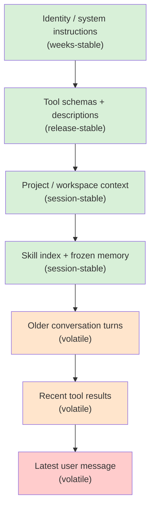

# Chapter 04 — Prompts, context, and the cache that pays for it

## TL;DR

A system prompt is not a string. It is an assembled structure with two halves: a stable prefix that should not change between turns (system rules, tool schemas, project context, frozen memory snapshot) and a volatile tail that does (the latest user message, recent tool results). Providers cache the prefix, so a steady prefix costs once and is reused on every subsequent turn — and a prefix that changes by a single byte pays full price every turn. This chapter is about how to assemble the prompt so caching actually fires, what breaks it (almost always something you did not notice), and how to design the builder so memory updates, tool changes, and compaction do not silently invalidate everything you just paid for.

---

## Why this matters

You ship an agent. It works fine. Two weeks later your bill is four times what you expected. You read the model usage logs and notice that `cache_read_input_tokens` is near zero and `cache_creation_input_tokens` is full. The prompt is rebuilding from scratch every turn. You inspect the system prompt — and there at the top is `Date.now()` from when you added "the assistant knows the current time" to be helpful. Every turn has a different timestamp, every turn is a cache miss, every turn pays full price.

The fix is one line. The lesson is bigger: cache savings are invisible until they break, and prompts have a half-dozen ways to silently break them. This chapter is about designing the prompt so that does not happen.

---

## The concept

### The prompt is an assembled structure

A useful mental model: the prompt is a stack of layers, ordered from least likely to change at the top to most likely to change at the bottom.



The line between stable and volatile is roughly the line between cacheable and not. Designing the prompt is mostly about getting things on the right side of that line and keeping them there.

OpenCode, Hermes Agent, OpenClaw, and the leading commercial coding agents all build the system prompt in roughly this order, with a deterministic merge so the byte sequence is identical between calls when nothing meaningful has changed.

### The immutability rule

The most surprising rule, the one most teams discover by violating it: *the system prompt is frozen once built.*

If a tool runs mid-loop and writes to `MEMORY.md`, the running system prompt does not change. The update becomes visible *next session*, not this one. Hermes Agent enforces this explicitly — file-backed memory updates are intentionally not reflected in the running prompt. Leading coding agents do the same. The reason is mechanical: any change to the prefix byte sequence invalidates the cache for every turn that follows.

This rule has two consequences worth absorbing:

- **You can keep the prompt cache-warm across long sessions** if and only if nothing rewrites the prefix mid-flight. Background memory writes go to disk; they are read on the next session start.
- **A "live" prompt is more expensive than a frozen one**, often by a large multiple. If a feature feels like it needs live prompt updates ("show the model the current time on every turn"), put it in the volatile tail, not the stable prefix.

### Caching, in provider-neutral terms

What providers actually cache is a *prefix* of your message stream. If the next request's prefix matches the previous request's prefix byte-for-byte, the provider skips re-processing those tokens and bills you a small fraction of the normal price. The mechanics differ by provider:

- **OpenAI-shaped APIs** cache prefixes automatically. No marker — if your tokens match an earlier request, you get the discount.
- **Anthropic-shaped APIs** require explicit `cache_control` blocks. You can mark up to four breakpoints; the provider caches up to each one independently.
- **Other providers** (Bedrock, Gemini, Vertex) sit somewhere in between, usually exposed through your SDK's normalization layer.

Either way, the rule for your prompt builder is the same: keep the prefix bytes identical, and put change at the end. Provider differences are about how aggressively you can shape the cache and how to measure hits.

```ts
// Anthropic-style explicit caching — mark a breakpoint at the end of the stable prefix.
{
  system: [
    { type: "text", text: identitySection },
    { type: "text", text: toolSchemas },
    { type: "text", text: projectContext,
      cache_control: { type: "ephemeral" } }  // ← cache up to here
  ],
  messages: [ ...volatileTurns ]
}
```

### The four-block sliding window

Anthropic's caching lets you place breakpoints on *messages*, not just the system block. A pattern that has emerged across production systems is a *four-block sliding window*: one breakpoint at the end of the system prompt, and three more on the most recent few user/assistant turns. Hermes Agent's `apply_anthropic_cache_control` does exactly this; the leading commercial coding agents show the same shape.

What this buys you: a long conversation that keeps the system prompt warm forever, *and* re-caches the last two or three turns each round, so the next turn's effective new-token cost is roughly whatever the user just typed plus the latest tool result. Without this, a fifty-turn conversation re-processes a growing chunk of recent history on every step; with it, the recent-history overhead stays roughly constant.

You do not need this on day one. You will reach for it the first time you watch your cost grow super-linearly with conversation length.

### Cache TTL: short, long, and warming

Cache entries do not live forever. As of mid-2026, Anthropic's ephemeral cache defaults to roughly five minutes per breakpoint, with an opt-in extension to about an hour at a per-token price premium; OpenAI-shaped automatic caching uses a similar provider-managed window. Check your provider's current pricing before you tune — these numbers move. The architectural trade-off, however, is stable:

- **Short TTL** works for active sessions where consecutive turns are seconds or minutes apart. Every hit refreshes the entry, so a busy conversation never sees an expiration.
- **Long TTL** is worth the upfront premium when sessions are bursty — a user asks a question, walks away for half an hour, comes back. Without the longer TTL the entire prefix re-pays on their return.
- **Cache warming** is a niche but useful pattern for gateway-style systems: send a small no-op request after a session is created (or restored from disk after eviction) to prime the cache before the user's real first message. Some production gateways do this transparently for high-value sessions.

The right setting comes from looking at the actual *time between turns* in your real traffic. If your p50 turn gap is under a minute, the default TTL is fine. If your p90 is over ten minutes, the long-TTL premium is almost certainly cheaper than letting the cache cool and re-paying full price on each return. The decision is data-driven — ask your agent to pull the histogram and pick the threshold; do not eyeball it.

### What breaks the cache

Almost everything tempting is dangerous. The usual offenders, concretely:

- **`Date.now()` or any timestamp in the prefix.** Every turn is a fresh value. Every turn is a cache miss.
- **Tool registry changes.** Adding or removing a tool changes the schema bytes, which sit early in the prefix. Memoize the schema array per (agent, model) combination, but understand that registry mutations are expensive.
- **Nondeterministic ordering.** If you assemble the prompt from `Object.entries()` or a filesystem walk without sorting, the order can vary by runtime version, by OS, by mood. OpenClaw uses a static `CONTEXT_FILE_ORDER` map; Hermes Agent uses a fixed section list. Pick an order and pin it.
- **Background memory writes that update the running prompt.** Already covered in the immutability rule — worth restating because it is the easiest one to introduce by accident.
- **User-specific data injected into a shared prefix.** If multiple users hit the same agent, per-user data belongs in the tail; the prefix should be user-agnostic.
- **Whitespace and formatting drift.** A single extra newline counts as a miss. If you template the prompt, lock down the whitespace.
- **Locale-dependent formatting** (`toLocaleString()` on a number, `format()` on a date) producing different bytes on different machines.
- **A "session start" banner that includes the session ID.** Looks harmless, kills caching across sessions.
- **An auto-formatter or linter rewriting your prompt template on disk.** A reformat-on-save tool inserting a trailing newline or normalizing quotes will silently invalidate every cached prefix the next time the service deploys.
- **High-precision numeric formatting.** Rendering a score or price with full floating-point precision into the prefix can yield different last digits on different machines or library versions.

The shortest debugging path is to log a fingerprint — a SHA of the rendered prefix — on every request, and watch the value across turns. If the fingerprint changes when nothing meaningful changed, you have a leak. We will use that fingerprint twice more in this chapter.

### Layered fingerprints when the prefix drifts

A single prefix-wide fingerprint catches drift; it does not tell you *where* the drift came from. The cheap upgrade is to log one fingerprint per layer of the prefix, alongside the overall one:

```ts
debug: {
  prefixFingerprint:   sha(prefix.bytes).slice(0, 12),
  identityFingerprint: sha(prefix.identity).slice(0, 12),
  toolsFingerprint:    sha(prefix.toolSchemas).slice(0, 12),
  contextFingerprint:  sha(prefix.projectContext).slice(0, 12),
  memoryFingerprint:   sha(prefix.frozenMemory).slice(0, 12)
}
```

When the overall hash drifts, the per-layer hashes localize the cause. A tools-hash change across a deploy is usually an enabled-tool delta or a description edit. A context-hash change mid-session is usually a workspace-walk reorder or a context file rewritten on disk. A memory-hash change during a session is the immutability rule being violated. The per-layer view turns *"the cache broke somewhere"* into *"someone edited a tool description"* in one log line.

For the cases where the per-layer hash narrows the suspect down but does not name the bytes, stash the most recent successful rendered prefix to disk (or to a small in-memory ring) and `diff` the current one against it. A stray newline, a reordered key, a high-precision number — all show up immediately. OpenCode and Hermes Agent already persist rendered prefixes for other reasons (compaction, session resume); turning that into a debug surface is a few lines, not a new system.

This is the tool you reach for when the cache hit ratio drops and *"nothing changed."*

### Tool schemas are part of the prefix

Tool definitions live near the top of the prompt and they tend to be large. They also change more than people expect — enabling a new tool, tweaking a description, narrowing an enum, adding a parameter, all change the bytes. The pattern across production systems:

- **Memoize the tool schema array per agent profile.** OpenCode does this per (agent, model) combination so identical agents share an identical schema string.
- **Pin the order.** Tools should appear in the same order every time. Alphabetize, or use an insertion-ordered registry, but never iterate an unordered hash.
- **Treat tool description edits like prefix changes.** They *are* prefix changes. Roll them out at session boundaries, not mid-session.

This is also why Ch.03's "fewer tools, sharper reasoning" point pays a second dividend: fewer tools is fewer prefix bytes is more cache reuse.

### Compaction is a cache discontinuity

Ch.02 introduced compaction as a per-iteration outcome alongside continue and stop, with the techniques deferred to Ch.05. The piece worth flagging *here* is that compaction breaks the message-level cache on the turn it fires — the message array has been rewritten, the provider sees a new prefix from that point.

A useful design choice: compact at the *back* of the history (summarize the oldest turns into a brief, leave the recent turns alone) rather than in the middle. Tail compaction sacrifices cache for content that was about to roll off anyway; middle compaction invalidates everything from the compaction point onward, which can be most of the conversation. OpenCode's `SessionCompaction.Service` and Hermes Agent's `ContextCompressor` both work this way — they protect a window of recent turns and rewrite only the older content.

The compaction trigger itself is also a cache-aware decision. Compacting eagerly (every five turns) burns cache often; compacting reactively (only when you are about to overflow) keeps the cache warm longer. Most systems converge on reactive.

### Per-agent prompt variants without cache explosion

Multi-agent systems (Ch.10, Ch.14) have different prompts per agent — explore, build, plan, compaction, titler, summarizer. Naively, this means N different system prompts and N different caches. The pattern that keeps caches sharable:

- **Put the truly shared parts first** — universal rules, base tool registry, project context.
- **Put agent-specific overrides second** — extra tools, permission rules, agent persona, role-specific instructions.
- **Cache at the boundary** between the two halves.

OpenCode uses exactly this shape: a two-part system array where the first half is model-family rules and the second half is agent-specific. The first half stays cache-warm across all agents in a session; only the second half costs a cache miss when you switch from `explore` to `build`. The savings compound: in a session with frequent agent handoffs (common in coding workflows), the shared half can hit the cache thousands of times.

### Project context comes from somewhere

The "project / workspace context" layer in the diagram does not appear by magic. Production agents discover it through a fixed pipeline that runs once at session start:

- **Walk upward from the working directory** looking for context files (`AGENTS.md`, project-level instruction files, `README.md`, repository root markers). Leading coding agents typically stop at the first git root or filesystem boundary.
- **Read in a deterministic order.** OpenClaw's `CONTEXT_FILE_ORDER` is a static map (`soul.md`, `identity.md`, `AGENTS.md`, `MEMORY.md`, `README.md` in fixed positions); Hermes Agent uses a fixed section list in `build_system_prompt`. Pin the order so the bytes are identical between runs of the same project.
- **Cap the size.** A 50-KB `README.md` shoved into the prefix is 50 KB of cache miss the first time and 50 KB of payload to keep warm forever. Truncate, or summarize once at session start with a cheap model and cache the summary on disk.
- **Snapshot, then freeze.** Whatever was on disk at session start is what the running prompt sees, period. Edits to those files mid-session affect the next session, not this one — same immutability rule as memory.
- **Respect privacy boundaries.** A multi-user agent must not read user-specific files into a shared prefix. Either scope the cache per user (different cache lines per user) or keep user data in the tail.

OpenCode resolves project-scoped state via per-project caches so two projects do not bleed context into each other's prompts. The general rule across systems: *discovery is part of the builder, and the builder is what your fingerprint covers.* If the workspace walk found a new file or a file changed on disk between sessions, your fingerprint should change, and you should expect (and accept) the cache miss. The point of pinning order and capping size is to make sure the only cache misses are *real* ones — not artifacts of filesystem traversal order.

### Snapshot vs. live: where memory enters the prompt

By Ch.05–07, most systems have at least two memory sources:

- **File-backed memory** (MEMORY.md, USER.md, skill files) — read at session start, *baked into* the system prompt, frozen.
- **External or queried memory** (vector DB, knowledge base, retrieved documents, fresh search results) — fetched per turn, lives in the *volatile tail*, not the prefix.

This split exists *because of* caching. Anything that has to be queried freshly cannot be cached safely; anything that can be loaded once and held stable can. Hermes Agent makes the distinction explicit: `MemoryManager.prefetch_all()` runs once, before the loop starts, and what it returns gets folded into the frozen prefix; mid-loop memory queries are added as tool results in the tail.

The rule: if your memory layer wants to be in the prefix, freeze it. If it wants to be live, accept the tail. Trying to have both — live updates to a "stable" prefix — is the most common way teams accidentally destroy their cache hit rate.

### The cache and the resume button are the same thing

A side effect worth noticing: the discipline that keeps the cache warm is the same discipline that makes session resume work. A frozen prefix, a deterministic build, a stable byte sequence — these are exactly what you need to rehydrate an agent from disk and continue without surprises.

If you can prove your prefix fingerprint is the same after a process restart, you can resume against a warm cache. Hermes Agent's persisted system prompt in `SessionDB` exists for this — the gateway can stop and restart the agent without re-paying for its own prefix. Paperclip's adapter session codec serves the same purpose one level up the stack: opaque state the orchestrator stores so the next heartbeat picks up byte-for-byte where the last one left off.

This is why teams that skip Ch.04's discipline pay twice: their cache hit rate is poor *and* their resume story is fragile. The two are the same problem from two angles, and they share a fix. We will pick this up in Ch.08.

### Cache hit rate is observability

A cache you do not measure is a cache you cannot trust. Providers return usage fields on every response; track them and watch their ratio over time:

```ts
// Cache hit ratio — what fraction of input tokens came from the cache.
type Usage = {
  input_tokens: number;
  cache_read_input_tokens?: number;     // a hit
  cache_creation_input_tokens?: number; // first time, paid full
  output_tokens: number;
};

function cacheHitRatio(usages: Usage[]) {
  const cached  = sum(usages.map(u => u.cache_read_input_tokens     ?? 0));
  const created = sum(usages.map(u => u.cache_creation_input_tokens ?? 0));
  const fresh   = sum(usages.map(u => u.input_tokens));
  return cached / Math.max(cached + created + fresh, 1);
}
```

Plot this number per session and per agent. The right value for a steady multi-turn workflow is usually somewhere between 60% and 95%. When it drops, the first thing to check is the prefix fingerprint from the previous subsection; the second is whether a release shipped that changed a tool description, an instruction, or a context file.

This metric belongs in Ch.16's trace pipeline. The earlier you wire it, the faster you catch the next `Date.now()`-equivalent before the bill comes in.

### The prompt-builder contract

A clean prompt builder has two methods and one debug helper:

```ts
type PromptBuilder = {
  buildStablePrefix(session: Session): Promise<StablePrefix>;
  buildVolatileTail(run: RunState):   Promise<Message[]>;
};

async function buildRequest(s: Session, r: RunState, b: PromptBuilder) {
  const prefix = await b.buildStablePrefix(s);
  const tail   = await b.buildVolatileTail(r);
  return {
    system:   prefix.blocks,
    messages: tail,
    debug:    { prefixFingerprint: prefix.sha256 }  // log on every request
  };
}
```

The contract enforces the discipline. Stable goes one way, volatile the other; whatever sneaks into the wrong half is caught by the type system or by the fingerprint. The fingerprint is the smoking gun when something silently shifts — a single log line that catches a regression no unit test will.

Hermes Agent goes one step further and persists the rendered prefix to its SessionDB. When the gateway evicts the in-memory agent and the next user message reconstructs it, the *exact same bytes* are replayed, and the cache hits across the eviction. This is the gold standard for gateway-style architectures where agents are not persistent in memory. If you cannot persist the full prefix, at least persist the fingerprint and the inputs that produced it — so when the cache misses you can prove whether it was a builder bug or a legitimate change.

---

## Real-system notes

- **OpenCode** uses a two-part system array (model-family rules + agent-specific overrides) preserved across calls for Anthropic caching, memoizes tool schemas per (agent, model) combination, and has a `SessionCompaction.Service` that protects a window of recent turns when summarizing older history.
- **Hermes Agent** is the strongest reference for cache-aware design end-to-end: file-backed memory is a frozen snapshot baked into the prompt at session start, system prompts are persisted in `SessionDB` to survive agent eviction, and a four-block sliding window of `cache_control` breakpoints (system + last three messages) keeps recent turns re-cacheable.
- **OpenClaw** maintains cache stability through a static `CONTEXT_FILE_ORDER` map for deterministic file merging (`soul.md`, `identity.md`, `AGENTS.md`, `MEMORY.md`, `README.md` always in the same position) and isolates provider-specific prompt files so a model-family change does not invalidate other providers' caches.
- **Paperclip** does not build the inner system prompt itself — adapters do — but it persists session parameters opaquely so adapters can replay them across heartbeats. The lesson at the orchestration level: prompt continuity is a state-management problem, not a string-building problem.

---

## Common failure cases

The chapter above is the design. This section is what still breaks once that design is running in production — the failures that actually show up on the bill and in the latency graphs — and the pattern that resolves each. They are ordered by how often they bite, not by how clever they are: the first two go wrong on nearly every agent that ships, usually by accident; the last two start to matter once you have real traffic, many tenants, or long conversations.

### A live value sneaks into the prefix and the cache never fires

*The symptom in one line: the bill is several times what you expected and `cache_read_input_tokens` is sitting near zero.*

This is the most common cache failure there is, and it is almost never deliberate. Someone adds a "the assistant knows the current time" line, or a greeting that names the session, or a counter ("turn 14 of this conversation"), and now a value in the stable prefix changes every single turn. Every turn is a fresh prefix, every turn is a full-price cache miss, and nothing errors — the agent works perfectly, it just costs four times as much. The reason it survives review is that the leaked value is usually *helpful*: a timestamp, a request ID, a per-turn counter, a randomized tip-of-the-day. Helpful, dynamic, and sitting on the wrong side of the stable/volatile line.

The fix is to make the leak *loud* instead of silent, and the lever is the **prefix fingerprint** this chapter already builds — turned into an alarm. Log the SHA of the rendered stable prefix on every request, and alarm when the fingerprint changes *within a single session* (the immutability rule says it must not) or when the per-session **cache hit ratio drops below a floor** — 60% is a reasonable tripwire for a steady multi-turn workflow, below which something is re-paying that should not be. Treat anything dynamic as guilty until proven static: a value that wants to be live belongs in the volatile tail, never the prefix. The cheapest insurance is a unit test that builds the prefix twice, a few milliseconds apart, and asserts the two fingerprints are byte-identical — that one assertion catches `Date.now()` before it ever reaches production.

### A deploy quietly invalidates every warm cache

*The symptom in one line: cache hit rate was healthy yesterday, a release shipped, and now every session is paying full price for its prefix.*

The within-session leak above is per-turn; this one is per-deploy and worse, because it hits *all* sessions at once. Nothing in the prompt-builder code changed — but a reformat-on-save tool normalized the quotes in your prompt template, or a dependency bump reordered the tool schema serialization, or someone edited one tool description for clarity. The bytes of the stable prefix shifted, and on the next deploy every live session's cached prefix stopped matching. The graphs drift down all at once and stay down until the caches re-warm; if deploys are frequent, the cache barely gets a chance to pay for itself at all.

The fix is to treat the rendered prefix as a **build artifact under change control**, not an incidental output. Snapshot the per-layer fingerprints (identity, tools, context, memory) this chapter describes into your release pipeline, and **fail the deploy — or at least raise a loud warning — when a layer's fingerprint changes without a corresponding intentional change** to that layer. A tools-fingerprint delta with no tool edit in the diff is a serialization-order bug or a stray formatter; an identity-fingerprint delta with no instruction edit is whitespace drift. When a prefix change *is* intentional (you really did edit a tool description), the anti-pattern is shipping it mid-day to live sessions — roll prefix changes out at session boundaries and expect the one-time re-warm cost, the same way you would batch a migration. The per-layer fingerprint turns "the cache broke on Tuesday's release" into "the formatter touched the template" in one log line.

### Cache discipline collapses the moment you have more than one tenant

*The symptom in one line: caching looked great in the single-user demo, and the hit rate fell off a cliff the week you onboarded real customers.*

A single-user prefix caches beautifully because there is only one of it. The first time you serve many users from the same agent, two things break at once. If you keep the prefix user-agnostic but forget to scope the *cache lookup* per tenant, you risk one tenant's prefix serving another's request — a correctness and privacy bug, not just a cost one. And if you "fix" that by folding per-user data (their name, their preferences, their workspace path) into the prefix, you now have a distinct prefix per user, the shared cache shatters into thousands of single-use entries, and your hit rate craters because almost no prefix is ever reused. Either way the cache stops being a shared asset.

The fix is to make the **shared/per-tenant boundary explicit in the builder and in the cache key**. Keep everything truly common — system rules, base tool registry, model-family instructions — in a first block that is genuinely user-agnostic and cached once across all tenants; push everything user-specific into the volatile tail or into a clearly-scoped second block whose cache line is keyed by tenant. This is the same two-part split this chapter describes for per-agent variants, applied to tenants: shared first, scoped second, cache at the boundary. The metric that proves it works is **cache reuse count per prefix** — how many requests hit each distinct cached prefix. If that number is near 1.0 across your fleet, your prefix is accidentally per-user and the shared cache is doing nothing; a healthy multi-tenant system shows the shared block reused across the whole population while only the scoped tails miss. Ch.15 owns the broader multi-tenant isolation story; the piece that lives here is keeping the cache shared without leaking one tenant's bytes into another's prefix.

### Compaction fires too eagerly and keeps the cache cold

*The symptom in one line: a long conversation never overflows context, yet its cost per turn stays stubbornly high and lumpy.*

Compaction rewrites the message array, which means it breaks the message-level cache from the point it touches forward — a necessary cost when you are about to overflow, a pure waste when you are not. The failure is a trigger that fires on a fixed cadence (every five turns, say) regardless of pressure: each firing throws away cache the conversation was about to reuse, the recent turns re-process from scratch, and the per-turn cost sawtooths instead of staying flat. The conversation is nowhere near the context limit, but you are paying as if every few turns were turn one. It is easy to miss because total cost still looks "reasonable" — it is just quietly 30–50% higher than it needs to be.

The fix names two patterns this chapter introduces and makes them measurable. First, **compact reactively, not on a cadence** — trigger only when you are genuinely approaching the context budget, so the cache discontinuity is paid for by content that was about to roll off anyway. Second, **compact at the back, never the middle** — summarize the oldest turns and protect a window of recent ones, so the breakpoint moves as little of the cached suffix as possible. To know whether your trigger is too eager, watch the **ratio of compactions to turns** alongside the cache hit ratio: if compactions are firing well before context pressure would force them, the trigger is the bug, and the cache-hit graph will show a dip on every compaction that did not need to happen. Ch.05 owns the compaction techniques themselves; the cache-shaped lesson here is that *when* you compact is a cost decision, and "as late as safely possible" is almost always the right answer.

---

## Pair with your agent

A few prompts that work well on this chapter:

- *"Audit my current system prompt. Identify every part that could move between calls — timestamps, locale formatting, nondeterministic ordering, user-specific data, session IDs — and rewrite the builder so the prefix is byte-stable."*
- *"Add a SHA-256 fingerprint of my rendered stable prefix to every request log. Run a real ten-turn session and show me the fingerprint at each turn. If it drifts, find why."*
- *"Implement the four-block sliding window pattern: one `cache_control` breakpoint at the end of my system prompt, three more on the most recent user/assistant messages. Then plot `cache_read_input_tokens` vs. `cache_creation_input_tokens` across a twenty-turn conversation."*
- *"Refactor my prompt assembly into a two-part system array — model-family rules first, agent-specific overrides second. Add a second agent profile and show me that the first half of the cache is shared between them."*
- *"My agent has a `MEMORY.md` file that updates mid-session. Modify the loop so updates are written to disk but the running system prompt stays frozen. Verify with the fingerprint that the prefix bytes are unchanged after a memory write."*
- *"Walk me through how Hermes Agent persists its system prompt in SessionDB and replays it byte-identically after agent eviction. Then implement the equivalent for my stack — even a minimal version that survives a process restart."*
- *"Pull a histogram of time-between-turns across my last fifty sessions. Use the p50 and p90 to recommend a cache TTL setting, with the math for why — comparing the cost of long-TTL premium against the cost of re-caching on cold returns."*

---

## What's next

You now have a prompt designed to stay cache-warm and reproducible. The next problem is the volatile tail it sits on top of — the conversation history, tool results, and working memory that grow every turn. Ch.05 covers how to keep that tail from exploding without breaking the cache you just built; Ch.06–07 cover the longer-term memory that feeds back into the *next* session's prefix, where this chapter's discipline starts paying you back.
