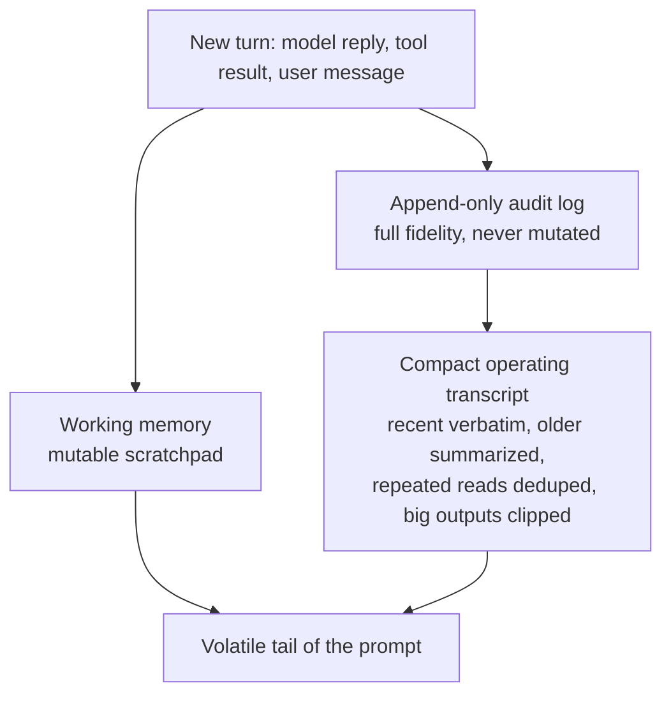

# Chapter 05 — Short-term memory

## TL;DR

Short-term memory is everything that lives in the volatile tail of the prompt from Ch.04 — the conversation transcript, recent tool results, and a small scratchpad the agent uses to keep track of the current task. It is the layer that grows every turn and the layer that breaks first when a loop runs long. This chapter is about the three views of that memory (append-only audit, compact operating view, mutable scratchpad) and the half-dozen techniques production systems use to keep the operating view small without losing what the model needs: clipping tool outputs, deduplicating repeated reads, asymmetric reduction, mid-turn summarization, two-phase collapse-then-compact, and per-tool disposition rules.

---

## Why this matters

Your agent has been running for forty turns. Every read of every file, every grep, every web fetch, every model turn — all of it is sitting in the prompt. Cost per turn is growing linearly. Then the model returns `prompt_too_long`. You add a step that summarizes old turns. The next turn works. The turn after that, the summary itself is also too long. You add a step that summarizes the summary. Now the model has lost the original task and the agent is solving a problem from three turns ago.

Short-term memory done badly is invisible until it explodes; short-term memory done well is invisible because it never explodes. This chapter is the difference.

---

## The concept

### Three views, not one

A production agent does not have *a* transcript. It has three.



- The **append-only audit log** is the truth. Every model turn, every tool call, every tool result, in full. You never edit it. It is what powers resume (Ch.08) and what an auditor will want to look at later.
- The **compact operating transcript** is what the model actually sees on the next turn. It is built fresh from the audit log every time the prompt is assembled — clipped, deduped, summarized. It is a *view*, not a *store*.
- The **working memory** is a small, mutable scratchpad the agent maintains for the current task — the goal, the current plan, files already read, open questions. It can be overwritten every step.

Keeping these three separate is the design that makes everything else in this chapter work. Edit the audit log and your resume is broken; let the operating transcript grow unbounded and your loop dies; let working memory become another transcript and you have created the same problem twice.

OpenCode encodes this split explicitly with `SessionTable` and `PartTable` for the audit log and a compaction service that produces the operating view on demand. Hermes Agent uses a SQLite `messages` table with FTS5 for audit and a `ContextCompressor` to produce the compact view. The shape is the same.

### Clip tool outputs at the boundary

The single highest-leverage move: clip large tool outputs *before* they enter the operating transcript. A 50 KB grep result is 50 KB of context every turn from now until the conversation ends.

```ts
// Clip with a visible omission marker. Silent truncation teaches the model a false view.
function clip(text: string, maxChars = 2_000): string {
  if (text.length <= maxChars) return text;
  const half = Math.floor(maxChars / 2);
  return [
    text.slice(0, half),
    `\n[... ${text.length - maxChars} chars omitted; full result available via <ref> ...]\n`,
    text.slice(-half),
  ].join("");
}
```

Two rules from production: the marker must be visible (the model needs to know it has been clipped, or it will reason as if it has the whole thing), and the full result must be stashed somewhere the model can ask for if it really needs more — a temp file, an attachment, a separate retrieval tool. OpenCode's truncation service writes the full result to disk and returns a snippet plus a pointer; Hermes Agent enforces a `max_result_size_chars` per tool registry entry. Both are variations on the same shape. The stash is durable storage with its own lifecycle — when pointers expire, where attachments are garbage-collected, what happens when the model asks for a `<ref>` that is gone — that is a Ch.08 concern, not this chapter's.

### Deduplicate repeated reads

If the model reads the same file in turn 3 and again in turn 17, the operating transcript does not need both. Drop the earlier one and keep the latest:

```ts
// Latest-wins dedupe: keep only the most recent result per (tool, input) pair.
// Skip tools flagged open_world (Ch.03) — their results are not stable across calls.
function dedupeRepeatedReads(messages: TranscriptMessage[], registry) {
  const stable = (m) => m.role === "tool" && !registry[m.toolName]?.open_world;

  const latest = new Map<string, number>();
  messages.forEach((m, i) => {
    if (!stable(m)) return;
    const key = JSON.stringify({ tool: m.toolName, input: m.toolInput });
    latest.set(key, i);
  });
  return messages.filter((m, i) => {
    if (!stable(m)) return true;  // user/assistant turn, or open-world tool: keep
    const key = JSON.stringify({ tool: m.toolName, input: m.toolInput });
    return latest.get(key) === i;
  });
}
```

The key is per-(tool, input), not per-text — heuristics on text are brittle and lossy. The semantics: the most recent call to the same tool with the same arguments supersedes earlier calls. For a coding agent doing a lot of `read_file`, this is the single biggest savings after clipping.

Dedupe is only safe when the tool's result is *stable given the input*. A `web_fetch` of the same URL at turn 3 and turn 17 can return different bytes; a `read_file` of a file edited between the two turns no longer matches the earlier read; a `now()` or `random()` is different by definition. Ch.03's `open_world: true` metadata is what marks these, and the dedupe skips them — earlier reads of mutable content still document state that mattered at the time. If your tool returns mutable state and you have not marked it `open_world`, your dedupe is silently dropping earlier snapshots, and the model is reasoning as if the latest one was true all along.

A useful side benefit: dedupe is also a doom-loop signal. Three identical tool calls with identical inputs in a row is the same signature Ch.02 used for detecting stuck loops. The same scan finds both — collapse the duplicates, and pause if there are too many.

### Asymmetric reduction: protect both ends, compress the middle

A flat policy ("keep the last 8 turns, summarize the rest") works to a point but leaks information that matters. The pattern across production systems is *asymmetric*: keep a window of recent turns at full fidelity, keep a small window of the *earliest* turns at full fidelity, and summarize everything in between.

- **OpenCode** uses `DEFAULT_TAIL_TURNS = 2` — the last two turns are protected from any compaction.
- **Hermes Agent**'s `ContextCompressor` protects the first *N* and last *N* turns; only the middle is summarized.
- The same shape appears in every well-designed system once it has been pushed past forty turns.

The reason both ends are protected: the *beginning* carries the task framing the model keeps referring back to (the original goal, key constraints, the user's actual question), and the *end* carries the most recent state the model is reasoning about right now. The middle is what the model has already finished reasoning about — facts are still there, raw turns are not.

### Mid-turn summarization

When clipping and dedupe are not enough, you summarize. The standard pattern uses a cheap auxiliary model to compress the middle of the transcript into a short reference block:

```ts
// Compaction inserts a summary block as content the model can read.
async function compactTranscript(messages, opts) {
  const { keepHead = 2, keepTail = 6, summarizer } = opts;
  if (messages.length <= keepHead + keepTail) return messages;

  const head   = messages.slice(0, keepHead);
  const middle = messages.slice(keepHead, -keepTail);
  const tail   = messages.slice(-keepTail);

  const summary = await summarizer.summarize({
    purpose: "Preserve facts needed to continue the task. Reference only.",
    messages: middle,
  });

  return [
    ...head,
    { role: "user",
      content: `[SUMMARY of ${middle.length} earlier turns]\n${summary}` },
    ...tail,
  ];
}
```

Three details that matter in practice:

- **The summarizer is a different model.** OpenCode runs a dedicated `compaction` agent with no tools and a fixed token budget; Hermes Agent calls an `auxiliary_client` configured to a cheaper, faster model. Compaction is one of the few places where running a *less* capable model is the right call: it runs on every long session, the quality bar is "preserve facts," and the cost difference compounds.
- **The summary purpose is explicit.** *"Preserve facts needed to continue the task"* produces a useful summary; *"summarize the conversation"* produces a useless one. Tell the auxiliary model what it is preserving and what role its output plays.
- **The summary is content, not metadata.** The model reads it as part of its prompt on the next turn. A clear marker (`[SUMMARY of N earlier turns]`) lets the model reason explicitly about the fact that it does not have the originals — *"I don't have the details of those turns; let me re-fetch if I need them."*

### What makes a good summary

The summary itself is a small art. A bad summary is worse than no summary — it tells the model facts that are slightly wrong, in a confident voice, with no way to verify. Three properties separate useful summaries from harmful ones:

- **Preserve specifics, drop generalities.** *"The user wanted to upgrade their auth library"* loses the dependency name; *"The user is migrating from `next-auth@4` to `next-auth@5` and has already updated `app/api/auth/[...nextauth]/route.ts`"* is what the model needs. Facts, file paths, identifiers, dates, decisions — these are the load-bearing parts.
- **Label what is reconstructed vs. observed.** *"The agent attempted to run the test suite; the result is unclear from the transcript"* beats *"The tests passed"* when the tests-passed claim came from an inference rather than a direct tool result. A good summarizer flags uncertainty rather than smoothing it over.
- **Keep the original wording where it matters.** When a user said *"exactly the way Stripe does it,"* the summary should quote, not paraphrase. Paraphrased user intent drifts on every pass; quoted user intent holds.
- **Structure the summary, do not just narrate it.** Production summarizers converge on three sections — *facts established* (file paths, identifiers, outcomes that are settled), *decisions made* (with the reasoning), and *unresolved questions* (things the agent could not confirm, things the user has not answered). A flat paragraph mixes all three and forces the model to re-skim. A structured one tells the model where to pick up and what to treat as reference vs. action.

The system prompt for the summarizer matters more than the model choice. A small, well-prompted summarizer produces tighter summaries than a large, poorly-prompted one. OpenCode and Hermes Agent both invest in this prompt explicitly, and the cost is paid back on every long session.

### Compaction triggers: proactive and reactive

When does compaction fire? Two strategies, both in production:

- **Proactive (token threshold).** After each step, compare the operating transcript's token count against `context_limit − max_output − safety_buffer`. If you are above, compact before the next call. OpenCode's `isOverflow()` check runs after every step; the safety buffer is typically a few thousand tokens. The advantage: compaction never happens at a bad moment, and the user does not pay for it in turn-latency.
- **Reactive (prompt-too-long).** Send the next request as-is. If the provider returns `prompt_too_long`, catch it, run a more aggressive compaction pass, retry. The advantage: you do not pay for a summarizer call until you actually need one. The disadvantage: the user waits longer on the turn that triggered it.

Most teams converge on proactive for predictability with a reactive fallback for safety. A third lever — **model fallback** — is in the same drawer: when context is tight, switch to a model with a larger window (Ch.17 covers the routing). Use it when compaction would lose information you cannot afford to lose.

### The compaction boundary marker

Compaction inserts a marker into the operating transcript — OpenCode's `CompactionPart`, Hermes Agent's `SUMMARY_PREFIX` block. The marker is *content* the model can read, not invisible metadata. This matters for two reasons:

- The model can reason about its own gaps. *"I do not have details on the turns between message 5 and message 30 because they were compressed; let me re-read the file if I need them."* Without a marker, the apparent jump in the transcript can confuse the model into either ignoring older context entirely or fabricating it.
- The marker is the seam where the operating transcript and the audit log can be reconciled. A human debugging an agent run finds the marker in the operating view and looks up the original turns in the audit log on disk.

Markers should be unambiguous and short — a single line stating what was summarized and over how many turns. Anything longer is noise the model has to skim every turn.

### Collapse first, then summarize

The cheap moves come before the expensive one. The two-phase pattern: when context starts to grow, first run aggressive clipping and dedupe ("collapse"); only if the transcript is still too large after that, fire the summarizer. Hermes Agent and the leading commercial coding agents both do this — small, mechanical, free operations first; LLM-driven summarization second.

Why: collapse is deterministic, has no per-turn cost, and often resolves the pressure entirely. Summarization costs an extra model call. Saving the summarizer for when you really need it keeps compaction cheap on average — most "compaction events" never reach the second phase.

### Compaction methods, side by side

Up close, "compaction" is not one technique but a family of them, each with a different cost/quality trade-off. The six that appear in production:

| Method | What it does | Cost | What it loses |
|---|---|---|---|
| **Clipping** | Truncate any single tool result that exceeds a size threshold; insert a visible marker; keep the full result on disk. | Effectively free, deterministic. | Detail inside one result. Model can re-fetch via the pointer. |
| **Latest-wins dedupe** | Drop earlier duplicates of the same `(tool, input)` call. | Effectively free, deterministic. | Nothing the model is still using — by definition the later call superseded the earlier. |
| **History snip** | Drop entire old turns (typically older tool results) past a fixed depth; keep model-reasoning turns. | Free. | Detail in old tool results; surrounding reasoning is preserved. |
| **Asymmetric summarization** | An auxiliary LLM compresses the middle of the transcript into a single reference block; head and tail turns stay verbatim. | One auxiliary model call per compaction. | Granular structure of the middle; facts are preserved if the summary is shaped well. |
| **Microcompaction** | Same as summarization but on a smaller window — only the oldest few turns at a time, repeated. | Several small auxiliary calls per long session. | Less per pass; more chances to drift over many passes. |
| **Session rotation** | Start a new session with a handoff block summarizing everything that mattered; chain via `parent_session_id`. | A fresh prompt cache (Ch.04 cost); a new audit log. | Everything not captured in the handoff block. The cache warmth from Ch.04. |

In production, these are not alternatives but a *pipeline*. A typical sequence for a long-running session: clip on every tool insertion → dedupe before every model call → snip turns older than some depth → summarize the middle when the threshold is hit → rotate the session when summarization has already run two or three times. Each method buys you time before the next one fires.

The design decision is not "which one do I pick" but "in what order, with what thresholds." Ask your agent to write the pipeline for your stack and to log which method fired on each compaction event — the histogram across a week of real sessions tells you whether your thresholds are reasonable, which method is doing the heavy lifting, and which you might be able to drop.

### Compaction is also observability

A compaction pipeline you do not measure is one you cannot tune. Three things worth logging on every compaction event:

- **Which method fired** — clip, dedupe, snip, summarize, microcompact, or rotate. The histogram across a week of sessions tells you whether your thresholds are calibrated. If summarization fires on every long session and snip never does, your snip threshold may be too lenient. If rotation fires often, your summarizer prompt may be too weak.
- **Tokens before and after** — the compression ratio per method. Useful for cost forecasting and for catching regressions when someone tweaks the summarizer prompt and the ratio quietly worsens.
- **How many turns later the model referred back to the summarized content** — if the model is repeatedly re-fetching things that were summarized away, your summary is leaving facts out. If the model never refers back to summarized content, you may be summarizing too eagerly and could push the threshold higher.

This metric stream belongs in Ch.16's trace pipeline alongside the cache hit ratio from Ch.04. Together they tell you whether your prompt architecture is actually paying off in production, or whether something silently regressed three releases ago.

### Not all tool results are equal

Different tools deserve different disposition policies in the operating transcript:

- **Skill results and structured tool outputs** are usually short and high-signal. Keep them verbatim.
- **Shell logs, raw file dumps, web-scrape bodies** are long and low-signal once consumed. Clip aggressively on insert; drop entirely a few turns later if the model has moved on.
- **Patches and diffs** are medium-signal and need to remain visible for several turns to support follow-up edits. Keep until the patch is applied or rejected, then drop.
- **Image attachments** are usually heavy but high-signal exactly once. Keep them in the turn they were referenced, then drop or compress to a textual description on later turns.

OpenCode's compaction explicitly protects skill-tool results from being dropped; Paperclip stores adapter output chunks separately and references them in the operating transcript. A useful exercise: classify every tool you have into `keep_verbatim`, `clip_on_insert`, or `drop_after_consumed`, and bake the policy into the tool registry alongside the metadata from Ch.03. The compactor reads the policy; you stop debating "should I drop this" turn by turn.

### Session rotation: when the conversation becomes a new conversation

For very long sessions, even aggressive compaction loses too much. The next step up: rotate to a new session, carrying forward a *handoff* block that summarizes everything that mattered, and chain the new session back to the old one with a `parent_session_id`.

Hermes Agent does this — `ContextCompressor` can generate a new session ID chained via `parent_session_id` in SessionDB, so the full lineage is traceable. Paperclip's `evaluateSessionCompaction()` decides whether to rotate based on max runs per session, max raw input tokens, and max session age in hours; on rotation, it writes a handoff markdown block to bridge the gap explicitly.

Rotation is heavier than compaction — a new session has a fresh system prompt and a fresh cache (Ch.04's cost) — but it is the cleanest reset for long-running agents. The trade-off: rotation buys you a clean slate but costs you the cache warmth you built up. Use it when summarization is no longer enough; do not use it when a compaction pass would do.

### Subagent memory is its own

When the parent loop delegates to a subagent (Ch.10), the subagent gets its own short-term memory. The parent does *not* see the subagent's intermediate turns; the subagent sees only the prompt the parent handed it plus whatever its own tools produce. OpenCode's `task` tool creates a child session with a filtered slice of the parent's context; OpenClaw's `sessions_spawn` does the same.

This is by design. A subagent that filled the parent's transcript with its own tool calls would make compaction much harder and would let intermediate noise pollute the parent's reasoning. The subagent returns a single observation — its final answer — and the parent's transcript records just that.

The corollary, which catches people: if you want the parent to know about a subagent's intermediate work, the subagent must include it in its final answer. Anything the subagent kept private is invisible to the parent forever.

### The frozen snapshot, restated

Memory files that live in the *system prompt* — `MEMORY.md`, `USER.md`, agent notes, skill index — were captured at session start and do not change mid-session. That rule was established in Ch.04 and it applies again here. The volatile tail (this chapter) is where mid-session mutation lives; the stable prefix (Ch.04) is where session-start freezes live. The dividing line is the cache breakpoint.

If you want a piece of memory to be live, put it in the tail (tool results, working memory). If you want it cache-warm, put it in the prefix (memory files, system instructions). Trying to have both — live updates that are also cached — produces an expensive cache miss every turn. This pairing — Ch.04's prefix and this chapter's tail — is the whole architecture for prompt context. Everything else is bookkeeping.

---

## Real-system notes

- **OpenCode** is the strongest reference for the three-view discipline: `SessionTable` and `PartTable` hold the append-only audit, `Truncate.Service` clips tool results at the boundary, `SessionCompaction.Service` runs proactively when `isOverflow` fires, and `CompactionPart` is the visible boundary marker in the operating transcript. The dedicated `compaction` agent (no tools, fixed budget) is a good template for the auxiliary-model pattern.
- **Hermes Agent** has the cleanest mid-turn summarization pipeline: `ContextCompressor` protects head and tail turns, summarizes the middle through `auxiliary_client.call_llm()` with an explicit reference-only marker, and can rotate to a new session chained via `parent_session_id` when summarization alone is not enough. Up to three compaction passes per very long session.
- **OpenClaw** stores per-session transcripts as JSONL files (one file per session) for the audit log and injects MEMORY.md into the prompt as a frozen snapshot at session start — same immutability rule as Ch.04, applied to memory files.
- **Paperclip** is the example of compaction pushed up to the orchestration level: `evaluateSessionCompaction()` watches max runs, max input tokens, and session age, then rotates the agent's session ID with a handoff markdown block when any threshold is crossed. The same shape, one level up the stack.

---

## Common failure cases

The chapter above is the design. This section is what still breaks once that design is running in production — the failures you actually get paged for — and the pattern that resolves each. They are ordered by how often they bite, not by how interesting they are: the first two go wrong on nearly every agent that runs long sessions; the last three start to matter once your sessions get genuinely long or your traffic gets heavy.

### Every compaction quietly torches your cache

*The symptom in one line: the loop keeps working, but the moment compaction fires your cost-per-turn jumps and never recovers for the rest of the session.*

Compaction rewrites the message array — head, a new summary block, tail — and from the provider's point of view that is a brand-new prefix starting at the first byte that changed. Every turn after a compaction event re-pays full price to reprocess the prefix it used to read from cache (Ch.04). On a long session that compacts three or four times, you can spend more on cache *misses* triggered by compaction than on the summarizer calls themselves. Nothing errors; the loop is correct; the bill is just two or three times what you modeled, and the spike hides inside "long sessions cost more, that's expected."

The fix is to treat a compaction event as a deliberate, costed cache reset and to *measure the recovery*, not just the saving. Log `cache_read` vs `cache_creation` token ratio on every turn, and watch what happens to it for the ten turns after each compaction marker — that recovery curve is the real cost of the pass. The operational anti-pattern to kill: **compacting on a moving boundary**. If your summarizer keeps the last `keepTail` *raw turns* but recomputes the boundary every call, the prefix shifts by a turn each time and you never re-warm. Pin the post-compaction prefix and hold it byte-stable until the *next* compaction (Ch.04's deterministic-build rule), so the cache rebuilds once and then compounds again. And reach for compaction one notch *less* eagerly than feels natural: a pass that reclaims 5% of the window but resets the cache is a net loss. The cheap collapse moves (clip, dedupe) do not rewrite the cached prefix the way a summary insert does — prefer them, and save the summarizer for when the window genuinely demands it.

### The summary drops the one fact the agent was about to use

*The symptom in one line: right after a compaction, the agent re-reads a file it already read, re-asks a question already answered, or quietly forgets the original task.*

The middle of the transcript got compressed, and the load-bearing detail — the exact dependency version, the file path it was editing, the constraint the user stated forty turns ago — got smoothed into a generality or dropped. The model now reasons confidently from a summary that is *almost* right, which is worse than no summary: it does not know to re-fetch, because it does not know the fact is missing. The cause is usually a summarizer prompt tuned for brevity over fidelity, or a `keepHead` window too small to protect the original task framing.

The chapter names the cure (preserve specifics, protect both ends); the operational piece teams skip is *proving the summary is good in production rather than hoping*. Instrument **post-compaction re-fetch rate**: when the model issues a tool call within a few turns of a compaction whose `(tool, input)` matches something that was summarized away, count it. A climbing re-fetch rate is your summary leaking facts — alarm on it, because it shows up as latency and cost long before anyone files a "the agent got dumber" ticket. The complementary signal is the chapter's *referred-back* metric inverted: if the model essentially *never* touches summarized content, you are compressing too eagerly and can push `keepHead`/`keepTail` wider or raise the trigger threshold. Two cheap structural defenses pay for themselves: keep the *first* turn (the task framing) outside the compressible middle no matter how long the session runs, and have the summarizer emit the structured *facts / decisions / open questions* shape so the load-bearing identifiers land in a section the model can scan rather than buried in prose.

### Compaction thrashes — it fires, the next turn it fires again

*The symptom in one line: once the session gets big, almost every turn triggers a compaction pass, and the summarizer call is now part of the per-turn latency.*

The proactive trigger fires whenever the operating transcript exceeds `context_limit − max_output − buffer`. If a single compaction pass only drops you *just* under that line, the very next turn's tool result pushes you back over, and you compact again — and again — paying a summarizer call and a cache reset every turn. The reactive `prompt_too_long` fallback has the same trap from the other side: you catch the error, compact a little, retry, succeed, then over-flow on the next turn. This is compaction *thrash*, and it is the difference between a trigger that fires a handful of times across a long session and one that fires forty times.

The fix is **hysteresis**: a high-water mark to start compacting and a meaningfully lower low-water mark to compact *down to*, so each pass buys many turns of headroom instead of one. Concretely — do not compact to "just under the limit"; compact until the transcript is, say, 60–70% of the usable window, so you have real runway before the next pass. Pair that with the chapter's collapse-first ordering (Ch.02's step boundary is where this hangs): run the free clip/dedupe/snip moves first and only fire the summarizer if you are *still* over the high-water mark after them. Then watch the chapter's method histogram — if `summarize` fires on nearly every long turn while `snip` and `dedupe` rarely do, your collapse thresholds are too lenient and the expensive pass is doing work the free ones should have absorbed. The metric that catches thrash directly: **summarizer calls per session**; if it tracks turn count instead of staying flat-and-small, your water marks are too close together.

### The summary of the summary loses the thread

*The symptom in one line: after several compaction passes the agent is confidently solving a slightly wrong version of the task, drifting a little further from the real goal each pass.*

When a compaction pass summarizes a transcript that *already contains a summary block*, you are compressing lossy output a second time — and each re-compression rounds off a little more of the original meaning, like re-saving a JPEG. Microcompaction (many small passes) and naive re-summarization are both exposed to this: facts get paraphrased, the user's exact wording gets generalized, an uncertain inference gets restated as settled fact, and ten passes later the agent's working understanding has drifted measurably from what the user actually asked. Because each pass looks locally reasonable, the drift is invisible until the agent does something clearly off-task.

The fix is to **always re-summarize from the audit log, never from a prior summary** (this chapter's three-view split is what makes that possible — the audit log is full-fidelity and never mutated). When a new pass is needed, rebuild the middle's summary from the original turns on disk, not from the last summary block; the summary is a *view* recomputed from truth, so it never compounds its own error. Cap the number of in-session summarization passes — Hermes Agent's `ContextCompressor` tops out around three before it stops trying to summarize harder — and when you hit that cap, **rotate the session** (Ch.08 treats rotation as a resume primitive): start a clean session with a single handoff block summarized *once from the full audit log*, chained via `parent_session_id`, rather than summarizing a summary a fourth time. The rule: a summary is allowed to be lossy exactly once, against the original — never against another summary.

### Dedupe silently deletes a snapshot that still mattered

*The symptom in one line: the agent acts as if a file or remote value never changed, because only its latest read survived the operating transcript.*

Latest-wins dedupe keeps only the most recent result per `(tool, input)` pair — which is exactly right for a stable read and exactly wrong for a value that changed between the two calls. If a tool returns content that mutates (a file edited mid-session, a `web_fetch` of a page that updates, a counter, a clock) and you have not marked it `open_world` (Ch.03), dedupe drops the earlier snapshots and the model reasons as though the latest value was always true. The agent loses the *before* of a before/after it needed — and like the dropped-fact failure, it does not know the snapshot is gone, so it never re-reads.

The fix is to make the tool registry the single source of truth for what is safe to dedupe, and to *default to unsafe*. Any tool whose result can differ across two identical calls is `open_world: true` and is exempt from dedupe — earlier reads of mutable state stay in the transcript because they documented state that was real at the time. The operational discipline the chapter only gestures at: **audit your `open_world` flags the way you audit a security boundary**, because a missing flag is a silent data-loss bug, not a crash. A cheap check that earns its keep — periodically scan completed sessions for any `(tool, input)` pair that returned *different* bytes across the session yet was *not* flagged `open_world`; every hit is a tool whose flag is wrong and whose earlier snapshots dedupe has been quietly discarding. Bake the disposition into the registry alongside the Ch.03 metadata so you decide it once per tool, not turn by turn.

---

## Pair with your agent

A few prompts that work well on this chapter:

- *"Set up the three-view split in my project: an append-only audit log on disk, a function that builds the compact operating transcript on demand, and a working-memory struct the loop can read and write. Show me a single turn flowing through all three."*
- *"Add visible-marker clipping to every tool result. Then write a test that verifies the model can ask for the full result by reference and gets back the original bytes intact."*
- *"Implement latest-wins deduplication by (tool name, tool input) JSON-equality. Run my last twenty-turn session through it and report exactly how much transcript size dropped."*
- *"Build asymmetric reduction: keep the first 2 turns and the last 6 turns at full fidelity, summarize the middle through a cheaper model. Show me the boundary marker inserted into the transcript and the model's next turn reading it."*
- *"Wire a proactive compaction trigger that fires when the operating transcript reaches `context_limit − max_output − 4 KB`. Add a reactive fallback that runs a more aggressive pass on a `prompt_too_long` error. Print which trigger fired on each compaction event."*
- *"Classify every tool in my registry as `keep_verbatim | clip_on_insert | drop_after_consumed`. Update the operating-transcript builder to honor those policies, and show me the size impact across a real session."*
- *"My agent occasionally runs over 200 turns. Implement session rotation that creates a new session chained via `parent_session_id`, writes a handoff markdown block bridging the two, and warms the new session's prompt cache before the next user message."*
- *"Add compaction observability: log which method fired (clip / dedupe / snip / summarize / microcompact / rotate), tokens before and after, and how many turns later the model first referred back to the summarized content. Plot the histogram across my last week of sessions and tell me whether my thresholds are well-calibrated."*

---

## What's next

You now have a compact, deduplicated, summarized operating transcript that does not blow the context window. None of it survives the next session.

Ch.06 is about the memory that *does* survive — what you persist between runs, how the model retrieves it, and how vector indexes, full-text search, and hybrid retrieval compare. Ch.07 is then about how to write to that memory safely, without poisoning it or letting it drift over time.
