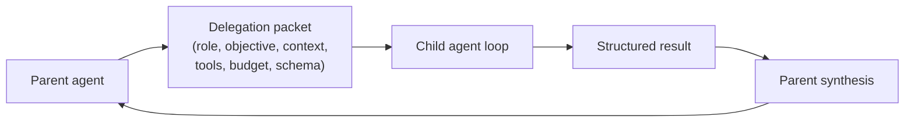
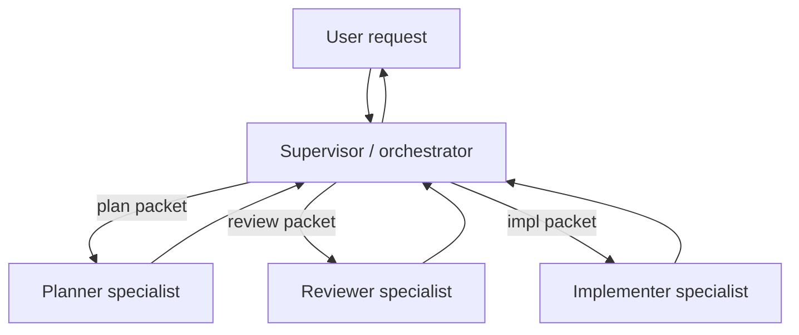

# Chapter 10 — Multi-agent delegation

## TL;DR

A multi-agent system is one agent (the parent) running another agent (the subagent) as a bounded unit of work. Done well, it isolates a subtask so the parent's context stays clean and the subagent can use a different tool set, model, or trust boundary. Done badly, it produces a vague *"look into this"* with unlimited tools and no output contract, and you debug it for a week. This chapter covers the delegation packet, the result contract, sync vs async and sequential vs parallel patterns, recursion caps and isolation modes, supervisor vs specialist topologies, and how to decide whether delegation is the right move or just a more expensive tool call.

---

## Why this matters

The first time you build a multi-agent system you discover three things at once: the subagent uses more tokens than you expected, returns more text than you wanted, and made decisions you cannot audit. Each is a contract failure. The packet was vague. The result schema didn't exist. The audit trail was implicit.

The second-time benefit is the reason to learn it anyway: a well-shaped delegation is the cheapest way to make an agent specialize. The parent stays general; the subagent gets a tight role, a small tool set, and a model fit for the task. The whole system costs less and reasons better than a single all-knowing agent would.

---

## The concept

### When to delegate (and when not to)

Reach for delegation when at least one is true:

- The subtask needs **its own context** — different system prompt, different memory, different focus.
- The subtask should **isolate side effects** — a worktree, a sandbox, a separate trust boundary.
- The subtask wants a **different model or tool set** — cheap model for a narrow lookup, expensive model for deep reasoning.
- The subtask is **safely parallelizable** with other subtasks — three reviews in parallel, then synthesize.

Do *not* delegate when:

- A deterministic tool can answer the question.
- A skill can teach the parent to do it.
- The child would need the parent's full context anyway (you'd pay context cost twice).
- The subtask is too small to justify another model loop (delegation has setup cost — system prompt, tool list, packet construction).

The cheapest improvement most teams skip: ask whether each delegation is replacing a tool call that would have been cheaper.

### The delegation packet

What the parent sends to the subagent is a *packet*, not a transcript:

```ts
type DelegationPacket = {
  role:            string;       // "researcher" | "reviewer" | "implementer" | ...
  objective:       string;       // the subtask, in prose
  context:         string;       // filtered slice, NOT the full parent transcript
  allowedTools:    string[];     // tighter than parent's
  constraints:     string[];     // "do not write outside /tmp", "max 10 file reads"
  maxSteps:        number;       // hard cap
  budget?:         { tokens?: number; cost?: number };
  outputSchema:    JsonSchema;   // what the result must look like
  remainingDepth:  number;       // delegation depth left (see Recursion caps)
};
```

A few rules from production:

- **Don't dump the parent transcript by default.** Summarize, or pick the few messages the subagent actually needs. Dumping increases token cost, prompt-injection surface, and the chance the subagent goes off task.
- **Tighten the tool list.** A reviewer subagent gets read tools only. An implementer gets writes scoped to a worktree. An external researcher gets web tools but no shell.
- **Pass the remaining delegation depth.** Every spawn decrements it. When it hits zero, no more spawning.



### The result contract

What comes back must be checkable. A bare paragraph is a contract failure waiting to happen. Production systems land on something like:

```ts
type ResearchResult = {
  answer:       string;
  evidence:     Array<{ source: string; quote: string }>;
  uncertainty:  "low" | "medium" | "high";
  followups:    string[];
  toolsUsed:    string[];      // for audit (Ch.16)
  cost?:        number;        // for the parent's budget rollup
};

function validateAgainstSchema(result: unknown, schema: JsonSchema) {
  // Reject the subagent's output if it doesn't match.
  // Bad output is a recoverable error — the parent can retry
  // with a corrective prompt or fail loud.
}
```

Structured outputs let the parent reason mechanically: validate the schema, score the confidence, compare across siblings, surface to the user. Unstructured outputs force the parent to call the model again to interpret them — a second hidden cost on every delegation.

### Synchronous vs asynchronous; sequential vs parallel

Two orthogonal axes:

- **Synchronous** — the parent waits for the subagent. Most production setups (OpenCode's `task` tool, Hermes Agent's `delegate_task`).
- **Asynchronous** — the subagent runs in a background thread or process. Hermes Agent's `spawn_background_review_thread` is the canonical reference; Paperclip's heartbeat scheduling is async at the system level.

- **Sequential** — parent delegates A, waits, then delegates B. The result of A informs B.
- **Parallel** — parent spawns A, B, C at once; they run independently; parent synthesizes when all return.

```ts
// Parallel, when inputs are truly independent.
const [api, ui, db] = await Promise.all([
  delegate(apiReviewPacket, ctx),
  delegate(uiReviewPacket, ctx),
  delegate(dbReviewPacket, ctx),
]);
const final = await synthesize([api, ui, db], ctx);

// Sequential, when one result shapes the next packet.
const investigation = await delegate(investigationPacket, ctx);
const patchPlan      = await delegate(buildPatchPlanPacket(investigation), ctx);
const final          = await synthesize([investigation, patchPlan], ctx);
```

Parallel saves wall-clock time; sequential keeps reasoning ordered. Mix them — parallel for the gathering phase, sequential for the synthesis phase.

### Recursion caps and the depth-1 default

A subagent that can spawn its own subagents is a stack overflow waiting to happen. Three patterns in production:

- **Depth-1 default** (the most common production choice): the parent can spawn subagents; subagents cannot spawn further subagents. Safest, simplest, and what you should start with unless a concrete need forces otherwise.
- **Bounded depth** (OpenClaw at depth 5): allowed up to a small limit; exhaustion throws.
- **Topology cap** (Paperclip): no in-loop spawning at all; the scheduler dispatches; the agent's parent/child relationships are tracked as data, not stack frames.

```ts
function assertCanSpawnChild(ctx: AgentContext) {
  if (ctx.remainingDelegationDepth <= 0) {
    throw new Error("Delegation depth exhausted; flatten or hand off via supervisor");
  }
}
```

A subtle gotcha: depth caps are usually count-based, but two subagents at depth N−1 can each spawn one child, doubling the effective work at depth N. If cost matters more than nesting, switch to a *cost-based* cap — total spawned tokens, not nesting count.

### Isolation modes

What level of separation each child gets:

| Mode | What's isolated | Cost | When |
|---|---|---|---|
| **Same process, shared memory** | Just the system prompt and tool set | Cheapest | Quick specialist queries |
| **Separate session, shared store** | Memory namespace, audit log | Low | Most subagent uses |
| **Worktree** | Filesystem (git worktree per subagent) | Medium | Code edits that mustn't touch main |
| **Sandbox** | OS-level isolation (Docker, Modal, Vercel) | High | Untrusted execution |
| **Separate process / adapter** | Full process boundary | Highest | Different runtime; channel adapter style |

OpenCode supports worktree isolation. Hermes Agent's tool environments (`tools/environments/`) support Docker, SSH, Modal, Vercel Sandbox at the per-tool level. Paperclip runs each adapter in a separate process. The choice is a trust-and-budget decision: higher isolation costs more but contains more.

The memory and recall side — what the subagent can read from and write to — is covered by Ch.06 (recall boundaries) and Ch.07 (write-back boundaries). Pick the same answer across both; mixed policies (subagent can read everything but write nothing) usually work; the opposite (write but not read) almost never does.

### Parallel work on shared artifacts

When subagents run in parallel on related artifacts (three reviewers across the same codebase, two implementers editing different sections of the same document), pick a coordination shape *before* spawning. Two patterns cover almost every case:

- **Isolated edit + merge at synthesis.** Each subagent works in its own worktree, sandbox, or namespace; the parent merges outputs when all return. Overlaps surface as merge failures resolved at a single point — by the parent's synthesis step (deterministic merge when the edits are disjoint), by a reviewer specialist (semantic merge when they overlap cleanly), or by the user (when overlap is real). This is the safer default; it pushes conflicts to one resolution point instead of letting siblings race in shared state.
- **Shared blackboard.** A small structured store (a JSON file, a Redis hash, a database row) that siblings can read and write during their runs — useful for *"I already checked `auth.ts`, skip it"*-style coordination. The blackboard inherits the locking and CAS discipline from Ch.07 (atomic writes) and Ch.08 (CAS transitions); a blackboard without those is a race condition pretending to be a coordination pattern.

For coding agents specifically, worktree isolation plus a post-synthesis merge step is the established pattern: each subagent gets its own checkout, the parent inspects the diffs side by side, and the merge is either deterministic (no overlap) or surfaced for resolution (overlap detected). Letting parallel subagents race on a single repo state is the most expensive class of multi-agent coding bug — partial, mutually inconsistent edits that look plausible per file and break on integration. The cost of one extra worktree is much smaller than the cost of unwinding that.

### Supervisor vs specialist topology

Two roles repeat across systems:

- **Supervisor / orchestrator** decides who runs, in what order, with what inputs. Often the main agent loop. Paperclip's heartbeat service is a control-plane-level supervisor.
- **Specialist** is a tightly scoped subagent with a narrow tool set and a clear role — `explore`, `review`, `summarize`, `extract`. The specialist does not decide what to do; the supervisor decides.



The pattern that scales: name your specialists. Each has a system prompt, a tool list, a result schema, and a one-line description. The supervisor picks by name. OpenCode's built-in agent profiles (`build`, `plan`, `general`, `explore`) are the canonical reference; you usually add a few custom profiles per project as new specialist needs surface.

### Per-subagent restrictions

Every restriction the parent puts on a specialist is also a Ch.04 win. A specialist with three tools has a shorter system prompt (more cache reuse across specialists). A specialist with a cheaper model costs less per call. The savings compound across many delegations.

In practice:

- **Tools.** Explicit allowlist per role; deny by default. (Ch.03's metadata flags tell the supervisor which tools are safe for which specialist.)
- **Model.** Cheap and fast for narrow tasks; reasoning model for genuinely hard subproblems.
- **Memory.** Scoped per Ch.06; usually read the parent's namespace, write to its own.
- **Approval gates.** If the specialist can take destructive action, it inherits the parent's permission rules — Ch.12 covers the gate.

### Context handoff

The single biggest cost of a subagent is the context the parent passes it. Three patterns, from cheapest to richest:

- **Fresh system prompt + objective only.** The subagent starts clean. Cheapest. Works when the objective contains all the context.
- **Summarized handoff.** The parent's compaction (Ch.05) summarizes the relevant turns into a `<context>` block. Medium cost; usually right.
- **Filtered transcript slice.** The parent picks the last N turns or all turns matching some filter. Most expensive; reserve for cases where the subagent genuinely needs the original wording.

A useful rule from Ch.05: the parent's *compact* operating transcript is usually a better starting point for handoff than the full audit log. The compaction already chose what matters.

### Subagent output discipline

A specialist that writes paragraphs when one sentence would do is a token leak. The parent should enforce:

- **Terse final answer.** A handful of sentences, or a structured object. Anything longer is a synthesis failure.
- **No intermediate noise.** The parent should not see the subagent's tool calls or reasoning *in its prompt context* by default — only the final answer. (OpenCode's `task` tool does this; Hermes Agent's `StreamingContextScrubber` hides injected memory from the parent's view.) This is a *prompt-context* rule, not an *audit* rule: the subagent's tool calls, reasoning, and intermediate turns are still recorded to the audit log (Ch.05) and the trace pipeline (Ch.16), and stay inspectable for debugging, replay, and post-hoc review. Hide from the parent's prompt to save tokens and keep the parent focused; never hide from the operator.
- **Cited evidence where the answer requires it.** Each load-bearing claim gets a source the parent can check.

Specialists trained to be terse are usually trained the same way as Ch.05's summarizer: explicit purpose in the system prompt, structured output schema, low temperature for the synthesis step. The model can do it; the parent has to ask for it.

### Subagent failure handling

A subagent can fail in three distinguishable ways:

- **Recoverable** (e.g., schema validation failed). The parent retries with a corrective prompt, capped at 1–2 attempts.
- **Permanent** (e.g., tool not available, credentials invalid). The parent surfaces the failure and either tries a different specialist or fails up to the user.
- **Silent** (e.g., the output validates but the answer is wrong). The hardest. Defenses live in the result schema (confidence field, citations, structured fields) and in cross-validation (a second subagent reviews the first).

Track subagent success rates over time. A specialist that fails 30% of the time is either poorly scoped or pointed at the wrong tasks; either way it is a Ch.16 signal worth catching early.

### The supervisor in a long-running control plane

A pattern that earns its own mention because it does not look like a subagent: a supervisor that lives *outside* the agent loop, across many runs. Paperclip's heartbeat service is exactly this. It schedules, retries, watches for orphans, enforces budgets, and routes work to agents. The "agents" it supervises are not in-process subagents — they are full agent runs that may span minutes or hours.

This pattern matters for production systems where work outlives a single agent invocation: long-running automations, multi-step approvals, async user interactions. The supervisor is the durable layer; the agents are the workers. Ch.08's persistence and state machine are the foundation it stands on. Treat the supervisor itself like a Ch.08 run: state machine, atomic claim, heartbeat, reaper.

### Background subagents

The simplest non-blocking delegation: a daemon thread that runs after a successful turn and writes back to memory or skills. Hermes Agent's background review fork is the canonical reference (covered from the memory-writing angle in Ch.07). Use it for *"decide whether to remember anything from this session"* or *"summarize the day's work in the background"* — not for anything the user is waiting on.

Constraints to honor:

- Background subagents should use a different (usually cheaper) model.
- A restricted tool set — typically memory and skill tools only.
- Their results are visible *next session*, not this one. The Ch.04 cache rule applies in reverse: don't mutate the running prompt from a background process.

### Verification and cross-checking

A more recent pattern, not yet widespread in the references but worth flagging: spawn a *second* subagent whose only job is to review the first one's output against the same context. The reviewer specialist gets the original packet plus the first subagent's result and returns either *approve* or *issues with this answer*. Cheap insurance against silent failures.

Two practical notes: keep the reviewer's tool set tighter than the worker's (usually read-only), and budget the reviewer at a fraction of the worker's cost — a reviewer that costs more than the work it reviews is not worth the call.

---

## Real-system notes

- **OpenCode** ships the cleanest in-process delegation reference: a `task` tool that spawns child sessions with filtered context and an `Agent.Service.handleSubtask` flow that returns a single structured observation to the parent. Built-in `build` / `plan` / `general` / `explore` profiles show the supervisor/specialist split.
- **Hermes Agent** is the reference for both styles: synchronous `delegate_task` for in-line subagents and `spawn_background_review_thread` for async background subagents with a tightly restricted tool whitelist.
- **Paperclip** is the control-plane pattern: a supervisor (heartbeat scheduler) routes issues to agents, tracks `parent_run_id` lineage, and enforces budgets and approvals across runs. Recovery tasks can request a lighter model via `assigneeAdapterOverrides` — model selection per subagent at the orchestration level.
- **OpenClaw** uses channel adapters as a form of delegation across process boundaries: inbound messages dispatch to the underlying agent runtime; the adapter is the boundary. Useful reference for *"the subagent is a different process."*

---

## Common failure cases

The chapter above is the design. This section is what still breaks once that design is running in production — the failures you actually get paged for — and the pattern that resolves each. They are ordered by how often they bite, not by how interesting they are: the first two go wrong on almost every multi-agent system that ships; the last three start to matter once you fan out wide, run subagents in the background, or operate at scale.

### Your token bill triples the week you add fan-out

*The symptom in one line: you split one task into a fan of subagents, the work got a little better, and the cost got a lot worse.*

A single parent answering a question costs one model loop. Replace it with a supervisor that spawns five specialists in parallel and you now pay for six loops — each with its own system prompt, its own tool descriptions, its own multi-step reasoning — plus the synthesis call on top. The reasoning improved, but the bill went up four or five times, and because each subagent is a separate run, no single trace looks alarming. The cost hides in the *aggregate* of the fan. The cause is that delegation was treated as free decomposition: every subtask got its own agent because it *could*, not because a cheaper tool call or a single longer parent turn would have done the job.

The fix is a **fan budget rolled up to the parent run**, not just per-subagent caps. Sum every child's tokens and cost into the parent's run total — the result schema's `cost?` field exists for exactly this rollup — and set a ceiling on the *whole fan*, not on each leaf, because per-leaf caps multiply: five subagents each capped at 20k tokens is a 100k-token run you never approved. Switch the recursion cap from count-based to **cost-based** when the fan can nest (this chapter names the count-vs-cost distinction; the operational move is to budget the tree, not the depth). Then watch it: `subagent_success_rate{role}` from Ch.16 tells you which specialists earn their keep, but the metric that catches *this* failure is total spawned cost per parent run — alarm when a single run's fan exceeds a multiple of your median run cost, the same shape as Ch.16's per-tenant 3×-rolling-average rule applied one level down. The discipline this chapter opens with — *"is this delegation replacing a tool call that would have been cheaper?"* — is the question you answer once at design time and then enforce with a number at runtime.

### The subagent returns a wall of text and the parent reads it back to you

*The symptom in one line: the specialist did good work, then wrote three paragraphs about it, and now the parent has to spend a model call just to figure out what it said.*

A research subagent finishes and returns a 900-word narrative of everything it tried. The parent cannot act on prose mechanically, so it does the only thing it can: it calls the model *again* to summarize the child's output before using it — a second, hidden cost on every delegation, and one that scales with the fan. Worse, that narrative lands in the parent's prompt context and eats the cache (Ch.04) and the parent's own context window (Ch.05), so a wide fan-in can blow the parent's budget on text it never wanted. The cause is a result contract that asked for *an answer* in prose instead of *a structured object*, and a packet that set no ceiling on output length.

The fix is to make terseness a **validated constraint, not a polite request**. Put the output cap in the packet as a hard number — a max-tokens budget on the subagent's *final* turn, plus a result schema with bounded fields (`answer` capped, `evidence` as an array of short quotes, not free text) — and reject-and-retry any output that overruns, the same recoverable-error path the chapter uses for schema failures. Two anti-patterns to name and ban: never let the subagent's intermediate tool calls and reasoning into the parent's prompt context (only the final structured result crosses the boundary — OpenCode's `task` tool and Hermes Agent's context scrubber both enforce this), and never let the parent "interpret" an unstructured result with another model call as the normal path — if you find yourself doing that, the contract failed and the fix is upstream in the schema. Measure it as **synthesis overhead**: tokens spent turning child outputs into something usable, as a fraction of the children's own output tokens. If that ratio is climbing, your specialists are writing for humans when they should be writing for a parser.

### Parallel subagents corrupt each other's work on a shared artifact

*The symptom in one line: three subagents edited the same repo at once, each looked right alone, and the merged result is broken in ways no single subagent's output explains.*

This chapter is explicit that letting parallel subagents race on one repo state is the most expensive class of multi-agent coding bug — partial, mutually inconsistent edits that pass per-file review and break on integration. The production shape is subtler than a hard crash: subagent A reads `auth.ts`, subagent B reads the same file, both edit against what they read, and the second write silently erases the first's change (a *lost update* — two writers, last-write-wins, one edit gone with no error). Or two subagents both "fix" the same bug in incompatible ways, and the parent's synthesis stitches together a Frankenstein that compiles and fails. Nothing throws; the cost is paid downstream when the integrated result doesn't work and you cannot tell which subagent to blame.

The fix is to **pick the coordination shape before you spawn, and make overlap impossible rather than detectable**. Isolated-edit-plus-merge is the safer default this chapter names; the operational addition is to *partition the work so siblings cannot touch the same artifact* — assign each subagent a disjoint slice (files, sections, namespaces) in its packet's `constraints`, so the merge at synthesis is deterministic because the edits are disjoint by construction, not by luck. When overlap is genuinely unavoidable, the shared blackboard must carry real concurrency control — compare-and-swap on a version field (Ch.08), atomic file replacement (Ch.07) — and a blackboard without that is, in this chapter's words, a race condition pretending to be a coordination pattern. The cheap diagnostic: have each subagent log the artifacts it touched, and at synthesis assert the touch-sets are disjoint. A non-empty intersection across siblings is your lost-update bug before it ships, not after.

### A subagent returns a confident answer that is simply wrong

*The symptom in one line: the result validated against the schema, the parent trusted it, and the answer was false.*

The chapter calls this the silent failure and the hardest of the three failure classes — the output has the right *shape* (it parses, the fields are populated, the confidence is "low") but the wrong *content*. A research specialist invents a citation; a reviewer approves a patch it didn't actually understand; an extractor returns a plausible number from the wrong column. Schema validation can't catch it because schema validation only checks structure. These compound in a fan-out: one wrong child poisons the parent's synthesis, and the parent presents the blend with the calm authority of something that passed all its checks.

The fix is **adversarial cross-checking with a real budget and a real track record**, not a confidence field the worker grades itself on. Spawn a reviewer subagent whose only job is to attack the worker's output against the same context — and crucially, give the reviewer *independent* access to the evidence rather than just the worker's claims, because a reviewer that only re-reads the worker's summary inherits the same blind spot. Make every load-bearing claim carry a *checkable* citation (a source the parent or reviewer can independently open and verify, not a sentence the model asserts is a source), and reject results whose evidence doesn't resolve. Budget the reviewer at a fraction of the worker (this chapter says a reviewer that costs more than the work isn't worth it) — but the operational piece the chapter doesn't spell out is *closing the loop*: log every disagreement between worker and reviewer as a labeled example, and track `subagent_success_rate{role}` (Ch.16) split by whether the reviewer caught it. A specialist whose reviewer-catch rate is climbing is mis-scoped or pointed at the wrong tasks; that signal, fed into the eval suite (Ch.16), is how silent failures become loud ones before a user finds them.

### A background subagent dies and the parent waits on a result that never comes

*The symptom in one line: the parent spawned an async worker, the worker crashed mid-run, and the parent (or the user behind it) is still waiting.*

This bites once delegation goes asynchronous or crosses a process boundary — a background review thread, a sandboxed worker, a channel adapter as subagent. The parent fires off the work and waits on a future, a queue message, or a status row. The subagent's process dies — OOM, sandbox timeout, a deploy that restarts the node — and the result never lands. In the synchronous in-process case the exception at least propagates; in the async case the parent can hang indefinitely, or worse, the orphaned subagent run sits in `running` forever, holding a budget slot nothing will ever release. There is no error to catch because the failure is an *absence*.

The fix is to treat every async delegation as a **Ch.08 run with a lease and a deadline**, not a fire-and-forget call. Give the parent a hard timeout on each child and a **fan-in policy** for when not all children return — wait-for-all with a deadline, then proceed on the partial set and mark the missing ones as a failed-subagent result the synthesis step can reason about (a fan-in that blocks forever on one slow sibling is its own outage). On the worker side, the orphaned `running` row is exactly Ch.08's problem: pair the subagent's claim with a heartbeat and a `lease_expires_at`, and let the same reaper that recovers crashed main-agent runs re-queue or fail the orphaned subagent. The mental shift: an async subagent is not a function call that might be slow — it is a durable unit of work that might never finish, and the parent must be written to survive that, with a timeout, a partial-results path, and a reaper standing behind it.

---

## Pair with your agent

A few prompts that work well on this chapter:

- *"For each tool I currently call, decide whether it should stay a tool or become a delegation to a specialist subagent. Apply the four criteria from this chapter and explain each decision."*
- *"Design two specialist subagents for my project: a `reviewer` (read-only, cheap model, terse structured output) and an `implementer` (worktree-isolated, expensive model). Write both system prompts and the result schemas, plus the supervisor logic that decides when to call each."*
- *"Wire the delegation packet from this chapter into my codebase. Add the `remainingDepth` field and the `assertCanSpawnChild` guard. Write a test that proves a depth-2 nested spawn fails cleanly with a useful error message."*
- *"Take one of my multi-step research tasks and refactor it as parallel delegation with a synthesis step at the end. Compare wall-clock time and total cost against the sequential version."*
- *"Pick three of my common subagent failures from the last week. Classify each as recoverable / permanent / silent. For each class, write the parent-side handling code and show me the audit trail it generates."*
- *"Add a background review subagent that runs after each successful turn, with the tool whitelist `{memory, skill_manage}`. Make sure its writes only become visible to the parent next session (Ch.04 rule). Verify with the prefix fingerprint."*
- *"For my agent, log subagent success rate by specialist over the last month. If any specialist fails more than 20% of the time, propose either a tighter scope or a different model."*
- *"Implement a reviewer subagent that double-checks any output from my `implementer` specialist before it returns to the parent. Budget the reviewer at 30% of the implementer's token spend; reject and retry if the reviewer disagrees."*

---

## What's next

You now have a parent agent that can plan, a way to express subagent work as bounded packets, and the discipline to keep delegation focused. Ch.11 puts everything from Ch.01–10 together as a single harness — the loop, the tool registry, the prompt builder, the memory layer, the persistence engine, the planner, the delegation surface — into one composable architecture you can adapt to your stack.
