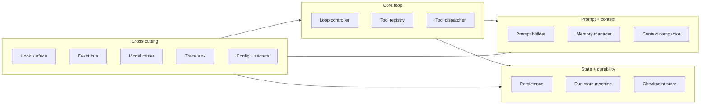
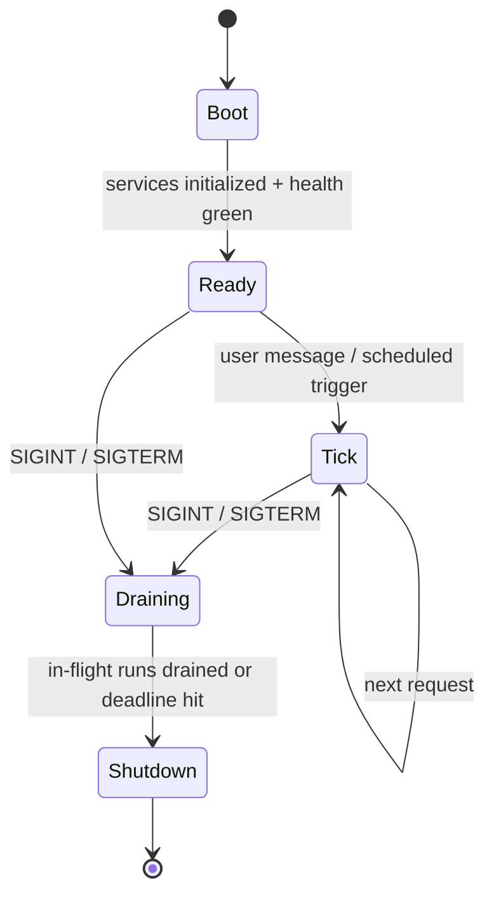
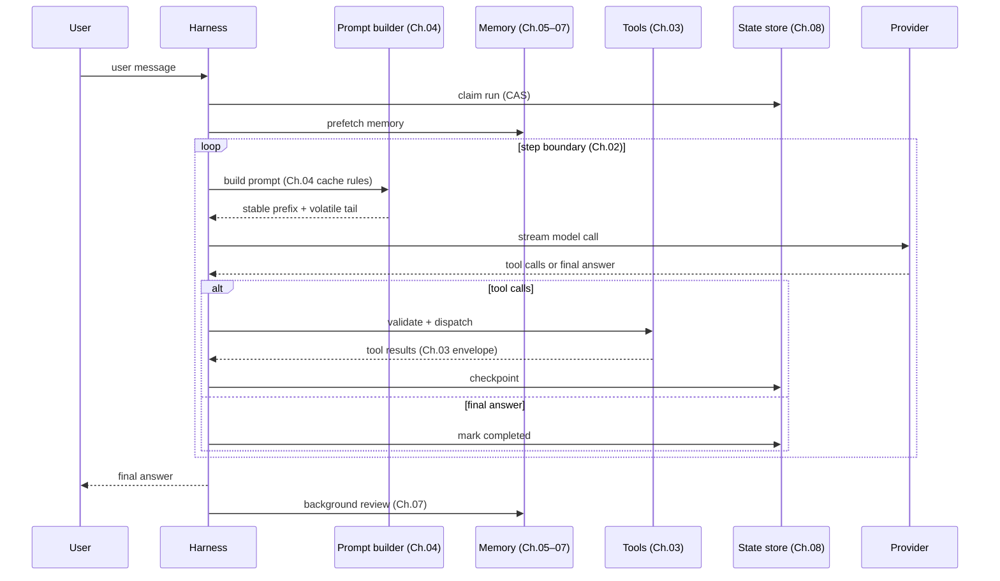

# Chapter 11 — The agent harness

## TL;DR

The harness is the runtime around the model. Every chapter from Ch.01–10 has been about one piece of it: the loop, the tools, the prompt, the memory, the persistence, the planning, the delegation. This chapter is about composing those pieces into a single program with a clear lifecycle (bootstrap → tick → shutdown), a well-defined hook surface for extension, a configuration model that does not leak secrets, and a clean boundary between the harness itself and the application code that uses it. The model brings judgment; the harness brings structure. By the end of this chapter you should be able to look at any production agent and name its components, its lifecycle, and what plugs into where.

---

## Why this matters

Three failure modes you can avoid by knowing what a harness is.

The first: you write the tool dispatcher inline in the loop, write the prompt builder inline in the dispatcher, write the memory layer inline in the prompt builder. Six weeks later you cannot extend any one piece without breaking the others. The harness exists so that each chapter's component has a clean interface and a known place to live.

The second: you have great components but no lifecycle. The DB connects after the first tool call, the plugin loader runs after the first model invocation, the heartbeat starts before the migration finishes. The harness defines a startup sequence so this stops being a surprise.

The third — Anthropic puts it well in their long-running-apps essay: *every component in a harness encodes an assumption about what the model can't do on its own.* Without that framing, harnesses accrete features long after the underlying model has stopped needing them. The harness is not a permanent monument; it is scaffolding that should evolve as the model evolves.

---

## The concept

### What a harness is, and what it is not

The harness owns: the loop, the prompt builder, the tool registry and dispatcher, the memory manager, the persistence layer, the hook system, the bus, the model router. Plus the lifecycle that wires all of them together.

The harness does *not* own: what the agent believes, the specific skills it accumulates, the prompts of specific tools, the business logic of which tasks to solve. Those are application code. The same harness should be able to host an explore agent today, a customer-support agent tomorrow, and an analyst agent next week — without any of the harness changing.

A useful rule: if removing a feature would break *what task can this system solve*, it is application code. If removing it would break *how this system runs at all*, it is harness. Paperclip is the cleanest reference for this split — Paperclip itself does not call models; it spawns adapter processes (the application) and orchestrates them. OpenCode splits server / services (harness) from agent definitions (application) the same way.

### The component inventory

Ten services every production harness has, with a couple of optional ones:



Each block is a chapter you have already read. Ch.01 — loop body; Ch.02 — loop controller; Ch.03 — tool registry + dispatcher; Ch.04 — prompt builder; Ch.05 — memory manager + compactor; Ch.06–07 — memory store + writer; Ch.08 — persistence + run state + checkpoint store; Ch.09 — planner (a layer on top of the loop); Ch.10 — delegation (the supervisor lives in the loop, specialists are spawned by it). Hooks, bus, router, trace sink, and config are the cross-cutting plumbing — covered next.

The harness is the diagram. The chapters were the pieces.

### Composition: how the services wire

Three patterns appear across production harnesses, in roughly increasing order of formality:

- **Closure factories.** Each service is a function that takes its dependencies and returns an object of methods. Wiring happens in `main` / `app.ts` once. Paperclip uses this — small, explicit, easy to test by passing fakes.
- **Service registry.** Components register themselves in a typed registry at boot; consumers look up by name. Useful when there are many similar things (tools, agents, providers).
- **Layered DI.** Each service declares its dependencies via type signatures; the runtime resolves them in order. OpenCode uses Effect's `Layer.effect` for exactly this.

Pick one and stick with it. The worst harnesses are the ones that mix all three — some services injected, some registered, some imported as singletons. The same goes for whether services are async at construction or synchronous: pick a convention and hold it.

```ts
// A typed harness — services as fields, all dependencies explicit.
type Harness = {
  config:        Config;
  bus:           EventBus;
  hooks:         HookRunner;
  tracer:        TraceSink;
  prompt:        PromptBuilder;     // Ch.04
  memory:        MemoryManager;     // Ch.05–07
  tools:         ToolRegistry;      // Ch.03
  loop:          LoopController;    // Ch.02
  state:         RunStateStore;     // Ch.08
  checkpoints:   CheckpointStore;   // Ch.08
  router:        ModelRouter;       // Ch.17 (forward)
};
```

### The lifecycle: bootstrap, tick, shutdown



Three phases, each with its own rules. Most harness bugs live at the boundaries between them — services used before boot finished, requests accepted after drain started, shutdown that does not wait for the run state machine to checkpoint.

### Bootstrap order

The boot sequence is not arbitrary — each step depends on the previous. The order that works across production systems:

1. Load and parse the config file (with env-var overrides).
2. Validate the config schema; fail fast on errors, surfacing *all* of them.
3. Substitute env vars and resolve `$secret:` references.
4. Open the database; run any pending migrations.
5. Initialize storage services (sessions, transcripts, memory store).
6. **Discover plugins** from bundled and user paths; load each plugin's *manifest* — the tools, agent profiles, hook handlers, and commands it contributes — without yet activating it.
7. Build the tool registry in deterministic order: built-ins, then plugin contributions, then config-declared (Ch.04's cache rule applies — the order is fixed at boot and does not change).
8. Build the agent registry the same way: built-in profiles, then plugin profiles, then config profiles.
9. **Activate plugin hooks** against the now-stable registries; this is the second pass.
10. Start the optional subsystems (scheduler, MCP server, WebSocket bus, cron).
11. Run health checks — DB reachable, model provider reachable, plugin handshakes OK.
12. Flip the readiness flag; start accepting traffic.

The two-pass shape is the load-bearing detail. Plugins contribute *to* the tool and agent registries, so the registries cannot be built before plugin manifests are loaded; but plugin hooks need to *fire against* a stable registry, so they cannot be activated until the registries are built. Splitting plugin loading into discover-manifest (step 6) and activate-hooks (step 9) is the simplest way to resolve the dependency without making the registry mutable at runtime (which would break Ch.04's cache stability).

Two flags worth distinguishing: *liveness* (is the process alive?) and *readiness* (is it accepting traffic?). They are separate signals to a load balancer or supervisor. Conflating them is the source of half the deploy-time outages in agent systems.

### One tick, end to end

One tick = one user message → one final answer. Every chapter's contribution shows up:



Every arrow is a hook point. Pre- and post-LLM hooks bracket the model call. Pre- and post-tool hooks bracket the dispatch. Session-start and session-end hooks bracket the whole tick. Plugins extend the harness by registering handlers at these points without modifying the loop.

### Graceful shutdown

A signal handler — SIGINT or SIGTERM — flips the harness into draining mode. In drain:

- New requests are refused (or queued, depending on policy).
- In-flight runs get a deadline (typically a few minutes) to reach a step boundary and checkpoint cleanly.
- After the deadline, surviving runs are marked `cancelled` in the state machine (Ch.08); their leases will be reaped by the next instance.
- Pending background-review forks are joined or marked abandoned.
- The database connection pool drains; the bus shuts down; the process exits.

The cost of skipping graceful shutdown is invisible until the day a deploy interrupts ten long-running agent sessions; the next instance then has to figure out what happened. Ch.08's reaper covers the recovery; this chapter covers the *prevention*.

### The hook surface

Hooks are the harness's extension API. Six lifecycle points cover most production needs:

| Hook | Fires when | What it is for |
|---|---|---|
| `pre_session` | Once at session start | Inject identity, set namespaces, kick off prefetch |
| `pre_llm_call` | Before each model call | Last-chance prompt mutation, gates, redaction |
| `post_llm_call` | After each model call | Token counting, redaction, plan extraction |
| `pre_tool_call` | Before each tool dispatch | Permission check (Ch.12), arg transform |
| `post_tool_call` | After each tool returns | Redact secrets, attach metadata, log |
| `post_session` | Once at session end | Background review (Ch.07), cost rollup, archive |

The harness fires each hook in registration order, passing a typed context object. Plugins return a directive (`continue`, `modify`, `deny`) and any side effects (logs, events) that go through the harness rather than mutating shared state directly. Hermes Agent and OpenClaw both register hooks this way; OpenCode's bus-event model is a close cousin.

Two rules from production:

- **Hooks must be idempotent.** A retried step (Ch.08) fires the same hooks again. If a hook writes a counter, increment with an idempotency key.
- **Fail-open vs fail-closed depends on the hook's job.** *Observational* hooks (tracing, metrics, plain logging, post-hoc transforms) are fail-open: a failure is logged and the loop continues. *Gating* hooks — security (Ch.18), approval (Ch.12), redaction, policy — must be fail-closed: a failed approval hook means the action is *not* approved; a failed redaction hook means the unredacted bytes never reach the next stage; a failed policy hook means the operation is denied. Tag each hook at registration with its failure semantics; the harness routes the failure based on the tag. Defaulting all hooks to fail-open is a vulnerability disguised as resilience.

### Provider abstraction (and its leaks)

The harness wraps providers behind a uniform interface so the loop, tools, and prompts do not care which one. In practice this is a *leaky* abstraction with three known holes:

- **Tool schema format** differs by provider (Anthropic uses `input_schema`; OpenAI uses `function.parameters`). The adapter normalizes on the way in.
- **Streaming events** differ (Anthropic emits `content_block_delta` and `tool_use`; OpenAI emits `choice.delta.tool_calls[i].function.arguments` fragments). Each provider has its own transport adapter.
- **Cache control syntax** is provider-specific (Ch.04 covers the Anthropic explicit-marker and OpenAI automatic-prefix shapes in detail). Apply it only inside the adapter that owns it; pass through for providers that do not support the marker.

```ts
// A clean provider interface lives behind every harness's loop.
// metadata() is capability negotiation — the harness asks what the
// provider supports and adapts requests, rather than hard-coding it.
interface ModelProvider {
  stream(req: ModelRequest): AsyncIterable<ProviderEvent>;
  countTokens(text: string): number;
  metadata(): {
    contextWindow:             number;
    maxOutput:                 number;
    supportsCacheControl:      boolean;
    supportsParallelToolCalls: boolean;
    supportsStructuredOutputs: boolean;
    supportsHostedTools:       boolean;
    refusalShape:              "block" | "finish_reason" | "none";
  };
}
```

This is *capability negotiation*: rather than hard-coding what each provider supports, the harness reads the metadata at boot (and on configuration reload) and routes/adapts accordingly. New provider capabilities arrive without code changes; missing capabilities surface as the router declining to route that request to that provider, rather than as a runtime failure deep in the loop.

The harness picks a provider via the model router (Ch.17 territory); the loop only sees the interface. When a provider fails, the router falls back to the next *compatible* one — same tool-schema dialect, at least the context window this turn needs, and reasoning and policy parity (Ch.02 covered this discipline in the loop's error-handling rules). A fallback that lacks the primary's capabilities is not a fallback; it is a different failure mode. Credential pools (rotating API keys on 429s) live in the router too — Hermes Agent and Paperclip both implement this.

### Configuration

The harness's configuration surface usually looks like this:

- **File.** YAML, JSON, or TOML; loaded once at startup. Hot-reload is optional and risky — it can break the cache by mutating tool descriptions mid-run (Ch.04).
- **Env-var overrides.** Every key can be overridden by an env var. Env wins over file. Use a documented, prefixed naming convention; random unprefixed env vars become debugging traps.
- **Secret references.** Sensitive values stored elsewhere — keychain, AWS Secrets Manager, encrypted file. Config holds `$secret:NAME` pointers resolved at runtime; secrets never appear in the loaded config object.
- **Schema validation.** Pydantic, zod, JSON Schema — pick one. Fail at startup on validation errors, surfacing *all* errors at once. The agent should not start if the config is invalid.
- **Plugin contributions.** Plugins can extend the schema with their own keys, merged at load time.

A common bug worth pre-empting: writing a config value to disk that contains a resolved secret. The serializer should re-emit `$secret:` references, never the resolved value. Test this with a unit check — serialize and grep for known secret material.

### Session, run, subagent — the vocabulary

Four work-unit terms recur across systems; pin their meanings to keep code and docs aligned:

- **Session** — a conversation thread with one participant on one channel in one workspace. Has a stable ID; persists transcript + state; can be resumed (Ch.08).
- **Run** — one invocation of the loop. Has a start, an end, a final state (succeeded / failed / cancelled). One session contains many runs over its lifetime.
- **Subagent** — a child run spawned by a parent (Ch.10). Sees a filtered slice of the parent's context; returns a single observation.
- **Heartbeat** — a wakeup tick used by control planes (Paperclip): the supervisor wakes up periodically and checks each session for work to do. A heartbeat may or may not result in a run.

OpenCode's `SessionID` and `RunID` branded types are the cleanest reference for keeping these straight; Paperclip's `issues` / `heartbeat_runs` / `agent_task_sessions` schema is the most thorough.

### Instance state and tenant scoping

A harness that serves more than one project, user, or tenant needs *instance state* — services scoped per project rather than globally. OpenCode's `InstanceState.make()` is the pattern: services are constructed lazily per `(project, agent)` combination and cached. Paperclip's multi-tenancy goes further — every table has a `company_id` and every query carries it.

The shape that scales: at the boundary of every harness operation, look up the instance for the current `(tenant, project, agent)` and route through it. Never reach into a global service from a request handler. The leak that comes back to bite you is one user seeing another user's memory because a global singleton was shared. Ch.06's namespace rule and Ch.08's tenant-scoped state machine both rely on this discipline.

### The bus and the streaming surface

Two adjacent concerns that production harnesses keep separate:

- The **internal event bus** lets plugins and observability subscribe to harness events (`session_started`, `tool_completed`, `run_failed`) without mutating shared state. Most harnesses run a simple in-process pub/sub; the bus is *not* durable by default — events that need to survive a restart get persisted separately (Ch.08).
- The **streaming surface** delivers tokens, tool events, and status updates to UIs (TUI, web, CLI). Server-sent events and WebSocket are both common. The harness fans bus events to connected clients filtered by session.

Keep the two separate. The bus is for in-process pub/sub; the streaming surface is the network face. Mixing them produces awkward coupling — every UI event becomes a global bus event, and the bus becomes a serialization point under load.

### Health and readiness

Two probes worth shipping from day one:

- **Liveness** — is the process alive at all? Cheap: a simple HTTP 200 with no dependencies.
- **Readiness** — is the harness ready to serve real traffic? Checks the DB, the model provider (with a tiny test call cached for a minute to avoid hammering it), plugin handshakes, and any critical hook errors at startup.

Three metrics that pay for themselves in the first month: number of active runs, queue depth, error rate per minute. These belong in Ch.16's trace pipeline but are worth wiring at the harness level from the start.

### Simpler harnesses age better

Anthropic's *Harness design for long-running agentic applications* essay names a useful rule: *every component in a harness encodes an assumption about what the model can't do on its own.* As models improve, those assumptions weaken. Components that earned their place last quarter may be unnecessary overhead this quarter.

Two practical consequences:

- **Audit your harness annually.** For each component, ask: *does the current model still need this?* Remove what no longer pays for itself. Anthropic notes they removed their "sprint" decomposition layer when a stronger model could handle longer coherent work without it.
- **Add complexity with the same discipline.** Each new harness component should solve a *measured* failure mode, not a theoretical one. Components added speculatively almost never come back out.

The goal is not the most sophisticated harness. It is the simplest harness that reliably handles your workload. The patterns in this chapter are a checklist of what is *available*, not a checklist of what must be *present*.

---

## Real-system notes

- **OpenCode** is the strongest end-to-end reference for an embedded harness: typed service composition with Effect Layers, a clean session/run separation, provider transport adapters per family, an SSE event bus, and a per-project `InstanceState` pattern. Read it as the "default" harness shape for a coding agent.
- **Hermes Agent** is the reference for harness + gateway separation: the inner agent loop is independent of the channel adapters (Telegram, CLI, cron), so the same harness serves many surfaces. The plugin hook surface (`pre_llm_call`, `post_tool_call`, and friends) is well-shaped and worth borrowing.
- **Paperclip** is the control-plane harness: it does not call models directly; it orchestrates *other* harnesses (adapter processes) through a heartbeat scheduler with explicit run-state machines, atomic claim, and reapers (Ch.08). Strongest reference for multi-tenant, multi-process production deployments.
- **OpenClaw** ships the cleanest channel-gateway abstraction over a personal-assistant harness — useful study for the gateway/harness boundary specifically.

A pointer outside the open-source repos: Anthropic's *"Harness design for long-running agentic applications"* (anthropic.com/engineering) is the best short read on context resets vs. compaction (Ch.05's territory), evaluator agents (Ch.10's verification pattern), and the principle that harness sophistication should track model capability.

---

## Common failure cases

The chapter above is the design. This section is what still breaks once that design is wiring real services together in production — the failures you actually get paged for — and the pattern that resolves each. They are ordered by how often they bite, not by how interesting they are: the first two go wrong on almost every harness that ships, usually at boot or at deploy time; the last three start to matter once you have plugins, tenants, or a model improving underneath you.

### A service gets used before the thing it depends on is ready

*The symptom in one line: the first request after a fresh boot fails, the second one works, and you can never reproduce it locally.*

The harness has a clean component list but a fuzzy startup order: the loop starts accepting ticks before migrations finish, a plugin hook fires against a tool registry that is still half-built, the model router reads provider metadata before the config has resolved its `$secret:` references. Nothing is wrong with any single component — the bug is purely *ordering*, and ordering bugs are the most reproducible thing on a slow machine and the least reproducible thing on a fast one. The reason it survives review is that on the developer's laptop the DB connects in two milliseconds and the race never opens; in production behind a cold container or a slow secrets fetch, the window is wide enough that one in fifty boots takes a request before a dependency exists.

The fix is the chapter's bootstrap sequence turned into an *enforced gate* rather than a convention. Make every service declare what it depends on (the layered-DI or closure-factory wiring already encodes this — read the dependency edges off it) and **refuse to flip the readiness flag until every declared dependency reports healthy** — DB migrated, registries frozen, provider handshake green. The load-bearing detail this chapter names is the two-pass plugin shape: discover manifests *before* you build the registries (so registries see plugin contributions) and activate hooks *after* (so hooks fire against a frozen registry). The operational add is a single boot-completed timestamp and a counter of **requests served before readiness was true** — that counter should be exactly zero, and an alarm on it being non-zero turns an un-reproducible Heisenbug into one log line that says "we accepted traffic 40ms early."

### Liveness and readiness are the same probe, so a slow dependency restart-loops the whole fleet

*The symptom in one line: the model provider has a bad ten minutes, and your orchestrator responds by killing and restarting every healthy instance you have.*

This chapter warns that conflating the two probes causes "half the deploy-time outages," and here is the exact shape. *Liveness* answers "is the process alive?" and *readiness* answers "is it safe to send traffic?" — two different questions for two different consumers (the supervisor that restarts crashed processes vs. the load balancer that routes requests). When a single `/health` endpoint answers both by pinging the database and the model provider, a transient provider outage makes the process report *un-live*, the supervisor concludes it has crashed, and it kills a process that was perfectly healthy and could have kept serving cached and degraded traffic. Worse, every instance fails the same check at the same moment, so the supervisor restart-loops the *entire* fleet against a dependency that restarting cannot fix — a self-inflicted outage layered on top of a vendor blip.

The fix is to **make liveness depend on nothing and readiness depend on everything** — and to wire them to different consumers. Liveness is a bare HTTP 200 that proves the event loop is turning; it must never call the database or the provider, because a liveness check that can fail on a dependency is a kill switch wired to your dependencies. Readiness checks the DB, the provider (with a tiny test call cached for ~60s so the probe itself does not hammer a struggling provider), and plugin handshakes, and on failure it pulls the instance *out of rotation* without killing it. The anti-pattern to name in code review: any health handler that touches an external dependency and is also wired to the process-restart path. The metric that proves the split works is **readiness flaps with zero corresponding liveness failures** during a provider incident — that is the system shedding traffic without restart-looping, which is exactly what you want.

### A plugin hook fails open when it should have failed closed

*The symptom in one line: an action that should have been blocked went through, and the only trace is a logged hook error nobody alarmed on.*

This chapter draws the fail-open / fail-closed line clearly, but the production failure is what happens when the *default* wins. A new plugin registers a `pre_tool_call` hook that does a permission check (Ch.12) or a redaction pass, the harness defaults unrecognized or untagged hooks to fail-open for resilience, the hook throws on some edge-case input — a malformed argument, a timeout calling the policy service — and the harness, being resilient, logs the error and *continues the loop*. The gate silently became a no-op. Nothing errors to the user, the tool runs, the secret reaches the next stage, and the only evidence is a log line in a stream nobody watches. This is, as the chapter puts it, a vulnerability disguised as resilience — and it ships constantly because fail-open is the comfortable default and most hooks never throw in testing.

The fix is to make failure semantics a **required, explicit tag at hook registration**, not a default the harness picks for you — and to make the *unsafe* choice the loud one. Refuse to register a gating hook (security, approval, redaction, policy) that has not declared `fail_closed`; let purely observational hooks (tracing, metrics, post-hoc logging) declare `fail_open`. The operational add this chapter does not spell out: **alarm on the fail-closed-denial rate**, not just the error rate. A redaction or approval hook that suddenly starts denying everything is either under attack or broken upstream, and either way you want to know within minutes, not at the next audit. And test the failure path on purpose — inject a throw into each gating hook and assert the action was *denied*, because a fail-closed hook you never watched fail is indistinguishable from a fail-open one until the incident.

### One tenant sees another tenant's session because a global slipped into the request path

*The symptom in one line: a user reports seeing a conversation, a memory, or a run that was never theirs — and it only happens under load.*

This chapter names the leak — "one user seeing another user's memory because a global singleton was shared" — and it is worth the full incident shape because it is the most damaging bug in this whole chapter. A service that should be scoped per `(tenant, project, agent)` gets constructed once at module load as a convenient singleton: a memory manager, a run-state cache, a "current session" holder. Under single-tenant testing it is invisible — there is only one tenant, so a global *is* correct. The first time two tenants' requests interleave on the same process, the second request reads state the first request left in the shared object, and tenant A gets tenant B's data. It is concurrency-dependent, so it passes every serial test and surfaces only when real traffic interleaves — which is to say, in front of customers.

The fix is the chapter's instance-state discipline made *unbypassable*: at the boundary of every harness operation, resolve the instance for the current `(tenant, project, agent)` and route everything through it — never reach into a global from a request handler. The operational add is to **make the global the thing that fails the test, not the thing that ships**: write an isolation test that fires two tenants' requests *concurrently* against the same process and asserts neither can read the other's session, memory, or run state (the chapter's "tenant A cannot reach tenant B" test, run in parallel rather than in sequence — serial passes, concurrent catches the leak). The anti-pattern to grep for in review is any module-level mutable state in a request-serving service. Ch.15 owns the broader multi-tenant isolation model and Ch.06 owns the namespace rule; the piece that lives in the harness is that *every* request-path lookup goes through the per-tenant instance, with no global escape hatch left open.

### The harness keeps the scaffolding the model outgrew

*The symptom in one line: a component is still running, still costing latency and tokens, and nobody can say what it is protecting against anymore.*

This is the slow failure — the inverse of a crash. This chapter's closing rule is that *every component encodes an assumption about what the model can't do on its own*, and the failure is simply never re-checking that assumption. A decomposition layer that earned its place when the model lost coherence past twenty steps, a re-prompting wrapper that patched a refusal quirk, an extra validation pass that compensated for sloppy tool-call formatting — all stay wired in long after a stronger model handles those cases natively. Nothing breaks; the harness just carries dead weight that adds a model call here, a few hundred prompt tokens there, and a layer of indirection that makes every future change harder. The cost is real but diffuse, which is exactly why it never gets a ticket.

The fix is to make harness simplification a **scheduled operation with evidence**, not a someday-refactor. Tag each component at the point it is added with the *measured* failure it solves (not a theoretical one — speculative components almost never come back out), and **audit the harness on a cadence** (Anthropic audits annually; quarterly is fine if your model cadence is fast), asking of each component: *does the current model still need this?* The way to answer it without guessing is an A/B with the component disabled on a slice of traffic, scored against the same eval suite that gates your deploys (Ch.16) — if quality holds, the component is dead weight and comes out. Anthropic removed their "sprint" decomposition layer exactly this way once a stronger model could hold longer coherent work. The discipline cuts both directions: the same evidence bar that lets you *remove* a component is the bar a *new* component must clear to be added. A harness nobody prunes only grows, and a harness that only grows is one that tracks last year's model, not this year's.

---

## Pair with your agent

A few prompts that work well on this chapter:

- *"Draw the component diagram of my current agent code. Identify which Ch.01–10 chapter each component implements, and flag anything that is implementing two chapters' worth of concerns inside one file."*
- *"Take my agent's startup code and reorder it into the bootstrap sequence from this chapter. Verify that health and readiness can fail independently — show me a failing readiness check that does not kill the process."*
- *"Wire the six lifecycle hooks (`pre_session`, `pre_llm_call`, `post_llm_call`, `pre_tool_call`, `post_tool_call`, `post_session`). Add a sample plugin that logs each event with timing. Verify the plugin can be added without modifying the loop."*
- *"Implement graceful shutdown: SIGINT triggers drain mode, in-flight runs get up to 60 seconds to finish, anything still running gets marked cancelled in the run state machine (Ch.08). Verify with a deliberately stuck run."*
- *"Refactor my provider integration into a `ModelProvider` interface with one adapter per family. Confirm the loop now compiles against a mock provider that has no network access. Use the mock for unit tests."*
- *"Audit my harness against Anthropic's rule: 'every component encodes an assumption about what the model can't do.' For each component, name the assumption. Propose one component to remove or simplify based on what the current frontier model can do reliably."*
- *"Add tenant scoping: every service that touches state takes a tenant context. Write a test that proves a request for tenant A cannot reach tenant B's session, memory, or run state."*
- *"Set up the harness's event bus and an SSE streaming endpoint that listens to it. Show me a session whose tokens stream live to a browser while plugins simultaneously subscribe to the same events on the bus."*

---

## What's next

You now have the architecture, the lifecycle, and the extension surface. The remaining chapters add the layers that production agents need to ship: human-in-the-loop approvals (Ch.12), connectors and MCP (Ch.13), skills and subagent design as a unit (Ch.14), backend infrastructure (Ch.15), observability (Ch.16), cost and latency strategy (Ch.17), safety and adversarial inputs (Ch.18), and operations (Ch.19). Each is a component or concern that bolts onto the harness shape you now have.

Ch.12 is next: the gate that pauses the loop and asks a human before taking high-risk actions.
