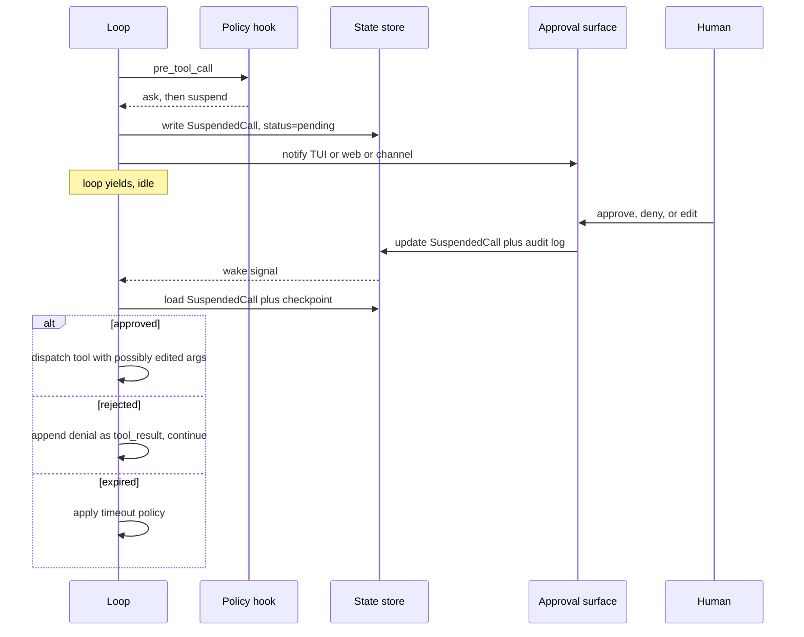

# Chapter 12 — Human in the loop

## TL;DR

Human-in-the-loop is not *"ask the user when unsure."* It is a structured control surface for high-impact actions: pause cleanly, persist state, present enough context for a decision, collect that decision, audit it, and resume from the exact same place. This chapter is about the mechanics — the three-action ruleset (allow / ask / deny), the approval surfaces (inline TUI, web dashboard, async channel), the suspend-and-resume protocol that ties into Ch.08's `WaitingApproval` state, the payload the human actually sees, time-bounded approvals and timeout policy, multi-approver workflows, the escape hatches for trusted automation, and what happens when the human says no.

---

## Why this matters

A short scenario you have probably seen. Your agent is helpful and capable. It has tools that read files, write files, send messages, and deploy code. One day a model emits a tool call that deletes the wrong directory. The action was unambiguous; the call was syntactically valid; the user typed *"clean up the build directory"* and the model interpreted it broadly. There was no approval gate. The agent did exactly what you let it do.

HITL is the design that says: actions are not all equal. Reading a file and deleting a directory are not the same operation; their approval surfaces should not be the same either. The model can be brilliant about the *what*; the human is still the right call on the *should*.

This chapter is about doing that without turning every tool call into a friction-laden checkbox.

---

## The concept

### Allow / ask / deny — the three-action ruleset

Across the production systems in `references/`, the approval primitive is the same shape: a list of rules, each with a pattern and one of three actions. Last match wins.

```ts
type PermissionRule = {
  match:   { tool: string; argsPattern?: Record<string, string> };
  action:  "allow" | "ask" | "deny";
  scope?:  "call" | "session" | "forever";
};

// Example ruleset: allow reads, ask before writes under src/, deny deletes.
const rules: PermissionRule[] = [
  { match: { tool: "read_file" },                                action: "allow" },
  { match: { tool: "write_file", argsPattern: { path: "src/**" } }, action: "ask"   },
  { match: { tool: "delete_*" },                                  action: "deny"  },
];
```

Three rules to keep in mind:

- **Last match wins.** A later, more specific rule overrides an earlier broad one. OpenCode's `Permission.evaluate` does exactly this.
- **`ask` is the default for anything destructive** — cross-reference the `destructive: true` metadata flag from Ch.03. The runtime promotes any tool marked destructive to `ask` unless an explicit `allow` rule overrides it.
- **`deny` is non-overridable inside the running session.** A user can edit config and restart, but the running loop respects `deny` absolutely.

The whole mechanism lives as a `pre_tool_call` hook in Ch.11's hook surface. The hook reads the ruleset, decides, and either lets the call proceed, queues an approval, or returns a denial as a tool result.

### Approval surfaces

The decision *what* to approve is one thing. The decision *where* the human sees it is what makes HITL practical. Three surfaces dominate:

| Surface | Latency | Best for | Failure mode |
|---|---|---|---|
| **Inline TUI prompt** | Seconds | Interactive coding, dev workflows | User is away — loop blocks indefinitely |
| **Web dashboard** | Seconds–minutes | Multi-user systems, governance flows | Notification gets missed in a busy queue |
| **Async channel** (Slack, Telegram, email) | Minutes–hours | Long-running automations, off-hours work | Reply chain confuses agent and human |

Production systems usually support more than one. OpenCode ships inline TUI + web; Hermes Agent adds async channels so a long cron job can ask for approval and continue when the user replies hours later; Paperclip leans toward web dashboards with email/Slack notifications. The choice per agent: pick the surface that matches the user's actual presence at the time of the ask.

A rule from production: *the longer the latency budget, the richer the payload must be.* An inline TUI prompt can rely on the user remembering what just happened. An email approval, hours later, must be self-contained.

### The suspend protocol

When the loop pauses for approval, Ch.08's run state machine moves to `WaitingApproval`. What must be on disk before the pause is durable:

- The pending tool call (name, args, the dispatch's idempotency key).
- A reference to the run, the session, the user, and the actor whose decision is needed.
- The reason — what the model was trying to accomplish, in one sentence.
- The expiry timestamp (see *Time-bounded approvals* below).
- A snapshot of any dry-run preview the tool produced.

```ts
// What the harness persists when it suspends. Ch.08's checkpoint extends with this.
type SuspendedCall = {
  approvalId:        string;
  runId:             string;
  sessionId:         string;
  actorId:           string;
  toolName:          string;
  proposedArgs:      unknown;
  dryRunPreview?:    string;
  reason:            string;
  riskTier:          "read" | "reversible" | "external" | "high_impact";
  createdAt:         string;
  expiresAt:         string;
  status:            "pending" | "approved" | "rejected" | "edited" | "expired";
};
```

Resume is the inverse. When the approval arrives, the harness reads the row, validates the decision against the schema (Ch.03), and either re-dispatches the (possibly edited) call or returns the denial as a tool result to the loop. The loop picks up from the exact step boundary it suspended at — Ch.08's idempotent step rule applies.



### What the human actually sees

The payload is what makes the difference between *"yes, I approve"* and *"wait, what?"*. Every approval surface should show:

- The proposed action, in one sentence, in plain language.
- The exact arguments, formatted for the surface (JSON in TUI, a form in web, a code block in chat).
- A dry-run preview when the tool supports it — *"Would delete `/workspace/build` (143 files, 2.4 GB)."* (Ch.03's dry-run pattern.)
- The reason the agent proposed it — generated explicitly by the model as a *user-facing rationale* alongside the tool call, optionally augmented by the plan step name (Ch.09) and the tool's deterministic metadata (Ch.03 description and risk tier). Do *not* pull this from the model's hidden or recent reasoning: some providers do not expose it, what is exposed is not always aligned with the action, and reasoning traces are an attack surface (Ch.18 — prompt-injection-shaped text from a prior tool result can end up reflected there). The rationale the human sees should come from a field the model wrote *for the human*, not a window into its thought.
- The risk tier and any flags that promoted it to `ask`.
- The time remaining before the approval expires.

OpenCode's approval dialog renders the diff for `edit_file`; Paperclip's includes the originating issue and stakeholder list; leading commercial coding agents show estimated token / cost impact for expensive operations. Steal what fits your surface.

### Approval scopes

Most approvals are not actually about *this one call*. They are about *this kind of call, going forward*. Three scopes that real systems offer:

| Scope | Persists until | When to use |
|---|---|---|
| **This call only** | The call completes | Truly one-off, high-impact actions |
| **This session** | Session ends or rotates | Repeated calls during one task |
| **Forever (scoped)** | The user revokes it from a single screen | Trusted tools, scoped tightly to a safe use case |

The UI is typically a set of buttons under *Approve*. The storage:

- **This call** — the `SuspendedCall` row is updated; nothing else changes.
- **This session** — the session's `permission_overrides` map gains a new entry; subsequent calls match against it before the global ruleset.
- **Forever** — the user's config gains a new `allow` rule, which takes effect at the next session start. *Trust is scoped, not blanket*: the rule is bound by tool name, by the MCP server and version (if external — Ch.13), by tenant or workspace, and by an argument class (a specific path glob, an enum value, a domain on a URL). A user who clicked *trust* on `web_fetch` for `docs.example.com` has not approved `web_fetch` for any URL. The rule should reference a fingerprint of the tool's definition so that a description rewrite or version bump triggers a fresh ask rather than silently inheriting the old trust. And the user must be able to revoke any *forever* rule from a single screen, not by editing YAML — revocability is the safety valve that makes broad scoping survivable.

The trap to avoid: silently promoting *this session* to *forever* because a UI defaulted to the broader scope. Make the scope explicit on every dialog. Defaults toward the narrower scope; expansion is an explicit click.

### Plan-mode approval — approve once, execute many

When the agent is in plan mode (Ch.09) the cheapest HITL is *approve the plan, then execute*. The plan itself is the approval payload — the user sees the steps, approves the shape of the work, and the executor proceeds without per-step asks.

The mechanics: the planner produces a plan with each step tagged by risk tier *and the concrete arguments it intends to use* — paths, identifiers, target resources, expected diffs. The approval dialog shows the plan. On approval, the harness inserts a session-scope `allow` *bounded by the planned arguments*, not just by tool name. A plan that said *edit `src/auth.ts`* yields an allow for `edit_file` with `path = src/auth.ts` (and, for diff-shaped tools, a diff-size or scope bound), not a blanket `edit_file` allow. The executor still asks for anything the plan did not anticipate; drift is detected by comparing the proposed call's argument shape against the bound — same tool name with new arguments is *drift*, not *match*.

Paperclip implements this via `executionPolicy = planning_mode`; OpenCode's `plan` agent writes a `.opencode/plans/<name>.md` that, on user approval, becomes argument-bounded session-scope allows for the build agent's matching tools.

The discipline: do not let the executor drift far from the plan. If the plan said *edit `src/auth.ts` and `src/db.ts`* and the executor proposes editing `src/payments.ts`, the plan-scope approval does not cover it — escalate back to the user. The argument bound is what enforces this mechanically; without it, *"same tool, different file"* slips through and the approval becomes a license rather than a contract.

### Edit instead of approve

Often the right human response is neither *yes* nor *no* but *not quite, do this instead*. Production systems make this a first-class action.

```ts
type ApprovalDecision =
  | { kind: "approved" }
  | { kind: "rejected"; reason?: string }
  | { kind: "edited"; replacementArgs: unknown }
  | { kind: "expired" };

// On `edited`, validate against the tool's schema (Ch.03) before dispatch.
function applyEdit(decision: ApprovalDecision, tool: ToolDefinition) {
  if (decision.kind !== "edited") return decision;
  const parsed = tool.schema.safeParse(decision.replacementArgs);
  if (!parsed.ok) {
    return {
      kind: "rejected",
      reason: `Edited args failed schema: ${parsed.error}`
    };
  }
  return decision;
}
```

OpenCode's approval dialog includes an *Edit* button that opens an inline JSON editor. Hermes Agent's interactive TUI lets the user rewrite a proposed shell command before approving. Leading commercial coding agents show a diff preview and let the user adjust the proposed file content before saying yes.

Two patterns from production: validate the edit against the same tool schema (a model-emitted call passed validation; a human-edited call should too), and log the edit alongside the original so the audit trail shows both.

### Dangerous-default detection

Sometimes a tool is marked `allow` in config but the *specific call* is risky in a way the model could not be expected to notice. The harness promotes `allow` to `ask` based on heuristics:

- **Large impact.** Delete >100 files; write >1 MB; batch operation affecting >N records.
- **Risky paths.** Anything touching `.git`, `.env`, `node_modules`, `/etc`, production config files.
- **Off-hours execution.** A cron-triggered destructive operation at 3 AM gets extra scrutiny.
- **Cross-tenant or cross-workspace operations** (Ch.06 namespace rule).
- **Production-shaped credentials** in the environment (env vars containing `PROD`, `LIVE`).

```ts
// Promotes any matching call from allow → ask, regardless of config.
function dangerousDefault(call: ToolCall, ctx: AgentContext): boolean {
  if (call.name === "delete_files" && call.args.paths.length > 100) return true;
  if (touchesProtectedPath(call.args.path))                          return true;
  if (ctx.now.getUTCHours() < 6 && call.tool.destructive)            return true;
  if (looksLikeProductionEnv(ctx.env))                               return true;
  return false;
}
```

Hermes Agent's `ToolCallGuardrailController` and Paperclip's heartbeat-level checks both implement variations. The thresholds vary; the principle does not — these are the calls that pass type checking, pass policy, and still benefit from a human glance.

### Time-bounded approvals

Approvals do not live forever. Three policies a harness must implement and pick between:

- **Auto-deny on expiry.** Safest. The request times out, the model gets a denial, the loop continues without taking the action.
- **Continue anyway on expiry.** Most pragmatic for low-stakes operations where blocking is worse than acting. Rarely the right default.
- **Escalate on expiry.** Governance-shaped: timeout routes the request to a backup approver or to a higher-permission user. Paperclip's multi-approver flow does this.

The right default is **auto-deny**, with *continue anyway* available only for tools the operator has explicitly opted in to. Defaulting to *continue anyway* is a footgun — a forgotten approval becomes silent execution.

A useful production touch: the approval surface shows a countdown. When it hits zero, the surface itself shows the outcome (denied / escalated). The audit log records the expiry as a first-class event, not as a silent timeout.

### Subagent approval inheritance

When a parent delegates (Ch.10), the question becomes: does the parent's approval cover the subagent? Three policies:

- **Inherit.** The subagent runs with the parent's session-scope approvals. Cheapest; safe when subagents are scoped narrowly.
- **Inherit only `allow`.** Inherit explicit allows from the parent; any `ask` re-asks at the subagent level. Most production systems default here.
- **No inheritance.** The subagent starts from the ruleset, period. Safest; noisiest.

OpenCode defaults to *inherit only allow*; the leading commercial coding agents follow the same default. The rule for picking: the more isolated the subagent (separate worktree, fresh context), the more reasonable inheritance becomes; the more powerful the subagent (writes, shell, network), the more it should re-ask.

### Multi-approver workflows

For high-stakes actions in shared systems, one approval is not enough. The pattern (clearest in Paperclip's `issue_approvals` table):

- The action requires sign-off from a list of roles (`author`, `project_lead`, `security`).
- Each sign-off is recorded with timestamp, role, decision, and optional comment.
- The action only proceeds when all required sign-offs are `approved`.
- Any single `rejected` stops the chain immediately.
- A timeout on any single sign-off escalates to a backup approver.

This is governance, not interactive HITL. The right tool when stakes justify the operational cost — deploys, account closures, cross-team changes. Wrong tool for everything else; sign-off chains will be ignored if they fire on routine operations.

### Autonomous mode — the explicit escape hatch

Some workloads should not have a human in the loop at all: cron-triggered routine work, sandboxed exploration, CI checks. The harness should support this *explicitly*, not as a side effect of misconfiguration:

```yaml
# Excerpt from a harness config.
permissions:
  mode: autonomous              # explicit; never inferred from missing TTY
  on_destructive: auto_deny     # never silently allow, never silently ask
  approval_log: enabled         # still audit, even with no human approving
```

Three rules: the mode is **explicit** in config (no implicit *"no approvals if no TTY"*); destructive actions still have a default (auto-deny, here) rather than silently allowing; and the audit log still records the *would-have-asked* events so the operator can review what an interactive run would have prompted on.

The honest framing: *autonomous mode is opting out of human review, not opting out of accountability.* The log must remain.

### Approval as audit trail

Every approval — granted, denied, edited, expired — is an event worth keeping. The minimum record:

- **Who** — actor ID, reviewer ID, source surface (TUI, web, channel).
- **What** — tool name, args (or hash if the args contain secrets), risk tier.
- **When** — created, decided, expired timestamps.
- **Why** — the reason the agent proposed it, the reason (if any) the reviewer gave for their decision.
- **How** — the decision shape: approved / rejected / edited (with the diff).

This is the same log Ch.16 will turn into observability. It is also what an after-the-fact incident review will ask for first. Hermes Agent writes structured JSON entries; Paperclip persists them in dedicated approval tables; OpenCode uses bus events that downstream collectors can persist.

### Approval-by-decline — what happens after no

A denial is a turn, not an exception. The harness returns a tool result to the loop:

```ts
{
  ok: false,
  recoverable: true,
  code: "user_denied_action",
  message: "User denied this action.",
  hint: "Try a different approach, or ask the user what they would prefer.",
}
```

The model reads the denial and decides what to do next — usually one of: propose a different action, ask the user for guidance, summarize what it tried and stop. Cross-reference Ch.03's `hint` field: a useful denial message tells the model *what kind of alternatives are acceptable*, not just *no*.

What the agent should *not* do: silently abandon the user's goal. A denied step almost never means a denied *task*. The loop should propose a different path or surface the impasse — never disappear.

---

## Real-system notes

- **OpenCode** is the clearest reference for the inline approval surface: a permission ruleset with `allow` / `ask` / `deny`, last-match-wins evaluation, scope-aware approvals (call / session / forever), and an *Edit* button that opens the JSON editor. The bus-event model integrates approvals cleanly into the harness from Ch.11.
- **Paperclip** is the multi-approver and async-channel reference: dedicated `issue_approvals` table, sign-off chains, escalation on timeout, web dashboard plus Slack and email notifications. Strongest reference for organizational governance.
- **Hermes Agent** is the reference for async-channel HITL in personal-assistant contexts: a Telegram or Slack approval message that arrives, waits, and resumes the agent when the human replies. The `--quiet-mode` flag plus structured logging shows how to design autonomous mode without losing accountability.
- **OpenClaw** ships the channel-gateway version: approval over a chat channel is different from approval in a dashboard, and the channel adapter shapes the payload for the medium. Worth studying for the surface-vs-payload separation.

---

## Common failure cases

The chapter above is the design. This section is what still breaks once that design is running in production — the failures you actually get paged for, and the pattern that resolves each. They are ordered by how often they bite, not by how interesting they are: the first two go wrong on nearly every agent that ships approvals; the last three start to matter once you are at scale, under a deploy, or under attack.

### The human stops reading and just clicks yes

*The symptom in one line: every dialog gets approved in under a second, and the one that mattered slips through the same way.*

This is the most common HITL failure by a wide margin, and it is a UX failure masquerading as a safety feature. You marked too many tools `ask`, the human sees a wall of approvals for routine work, and within a day they have trained themselves to approve reflexively — *approval fatigue*, the same habituation Ch.18 warns about. The gate is technically present and functionally absent: the destructive call that actually deserved a glance gets the identical half-second yes as the fortieth harmless file read. The cause is almost always over-broad `ask` rules — promoting a whole tool to `ask` when only a narrow slice of its calls is risky.

The fix is to **budget asks like you budget alerts, and measure the funnel**. Instrument the `approvals{state}` funnel from Ch.16 — requested → approved / rejected / edited / expired — and watch two ratios. An **approval rate above ~95% with a near-zero edit and reject rate** means the human is rubber-stamping; those tools are miscategorized and should move from `ask` to `allow` (or to a dangerous-default heuristic that only escalates the genuinely risky calls). An **ask rate above a few per task** is the friction signal — alarm on it. The discipline: an `ask` the human never says no to is not protecting anything; it is training them to say yes. Push the `ask` threshold up to where rejections and edits actually happen, and let the dangerous-default detection from this chapter catch the rare risky call inside an otherwise-allowed tool.

### The loop blocks forever on a human who isn't there

*The symptom in one line: a run sits in `WaitingApproval` for hours, holding resources, while nobody knows it's stuck.*

You shipped the inline TUI surface, then a cron job or an async channel started firing approvals when no human was watching. The run transitions to Ch.08's `WaitingApproval` and waits. With no expiry, it waits forever — pinning a worker slot, holding a lease, blocking the queue behind it. The async-channel case is worse: the human replies four hours later, after the session has rotated (Ch.05) and the cache (Ch.04) is cold, and the wake path was never tested for that gap. Nothing errors. The run is simply *parked*, and you find out when throughput quietly drops.

The fix is to **make every suspended approval time-bounded with auto-deny as the default, and alarm on the queue depth of pending approvals**. Every `SuspendedCall` gets a real `expiresAt`; when it fires, apply the timeout policy (auto-deny unless the operator explicitly opted a tool into *continue anyway*) and record the expiry as a first-class audit event, never a silent timeout. Then watch two operational signals the chapter does not name: the **count of approvals in `pending` state** (alarm when it climbs — that is parked work accumulating) and the **time-in-`WaitingApproval` distribution** (its p99 is your real human-response latency, and it tells you whether your expiry window matches reality). The anti-pattern to kill on sight: a run that can suspend on a surface no human is currently watching, with no timeout behind it. If a cron job can trigger an `ask`, that path needs an expiry or it needs autonomous mode — not an indefinite block.

### Approve-once becomes approve-everything

*The symptom in one line: the user approved one specific action and the agent quietly took ten broader ones under the same yes.*

The plan-mode and *forever* scopes from this chapter are the high-leverage convenience in HITL — and the high-leverage footgun. The failure shape: the user approves a plan that said *edit `src/auth.ts`*, the harness inserts a session-scope allow keyed only on the *tool name* `edit_file`, and now the executor can edit any file with no further ask. Or the user clicks *trust forever* on `web_fetch` for one domain, the rule is stored unbounded, and the agent fetches arbitrary URLs next session. The approval became a license instead of a contract. The cause is a stored permission whose *argument bound* was dropped — same tool name, any arguments, treated as a match.

The fix is to **bind every granted scope to the argument shape it was granted for, and treat argument drift as a fresh ask**. A plan-scope allow for `edit_file` carries `path = src/auth.ts` (and a diff-size bound for diff-shaped tools); a *forever* allow for `web_fetch` carries the approved domain and a fingerprint of the tool definition so a description rewrite or version bump (Ch.13) triggers a fresh ask rather than silently inheriting old trust. Then add the **drift metric**: count how often the executor proposes a call whose tool name matches a granted scope but whose arguments fall *outside* the bound — that number is how often *"same tool, different target"* would have slipped through if you had keyed on name alone. Pair it with the subagent rule: default child agents to *inherit only `allow`* so a parent's narrow grant cannot widen into a child's broad authority. The mental model: a scope is a contract over `(tool, argument-class, fingerprint)`, never over a bare tool name.

### A stale approval fires twice — or fires against a world that moved on

*The symptom in one line: after a crash the agent re-executes an action the human already approved, or executes one whose context is no longer true.*

This bites the moment approvals outlive a single process. A run suspends in `WaitingApproval`, the human approves, the harness dispatches the tool — and the process dies between the dispatch landing and the step boundary committing (Ch.08). On restart, the harness sees an approved `SuspendedCall` that was never marked complete and re-dispatches it: the deploy goes out twice, the email sends twice. The slower variant: the approval sat for six hours, the human said yes to *"delete the `build` directory (143 files)"*, but the directory now holds 4,000 files because a job ran in between — the human approved a snapshot, the agent acted on a different reality.

The fix is two distinct guards, and they are not the same guard. For *double-fire*, the resume path must treat the approved call as an **idempotent step** (Ch.08): carry the dispatch's idempotency key on the `SuspendedCall`, check the outbox / fulfillment marker on replay, and never blindly re-dispatch an approval whose completion you cannot confirm — reconcile with the downstream system instead. For *stale context*, **re-validate the approval payload against current state at dispatch time, not only at approval time**: if the dry-run preview the human saw (143 files) no longer matches what the tool would now do (4,000 files), the approval is void — re-ask rather than execute. Track an **approval-staleness metric**: the gap between `decidedAt` and actual dispatch, and the rate at which re-validation invalidates a previously-approved call. A non-trivial invalidation rate means your latency budget and your dry-run preview have drifted apart, and someone is approving fiction.

### The human approves what they can't actually see

*The symptom in one line: the approval dialog looks reasonable, the human says yes, and the action is nothing like what they thought they authorized.*

The payload is the entire safety value of HITL — a yes on a misleading payload is worse than no gate at all, because it launders a bad action through human judgment. Two production shapes. First, the *thin payload*: a chat-channel approval that shows `delete_files` and a truncated arg blob with no dry-run preview, so the human approves a directory wipe they could not actually inspect; the longer the latency budget (an email hours later), the richer the payload must be, and a thin async payload silently violates that. Second, the *poisoned rationale*: the agent pulls the "reason" it shows the human from a prior tool result that contained injection-shaped text (Ch.18), so the human reads an attacker's sentence presented as the agent's own justification — the confused-deputy attack routed straight through the approval surface.

The fix is to **make the payload self-contained and the rationale trusted by construction**. Require a dry-run preview (Ch.03) for any destructive tool before its approval can be surfaced at all — no preview, no `ask`, fall back to `deny`. Render the arguments as fenced, inspectable *data*, never free-flowing prose that a renderer might interpret (Ch.18's rendered-output exfiltration applies to approval dialogs too). And source the user-facing rationale from a field the model wrote *explicitly for the human* alongside the tool call — never from the model's hidden reasoning or from raw tool-result text, both of which are attacker-reachable. The anti-pattern is a destructive approval with no preview and a rationale lifted verbatim from upstream content; that is not a human in the loop, it is a human laundering an injection. The lesson: the human can only check what the payload shows, so the payload — not the model's good intentions — is what you harden.

---

## Pair with your agent

A few prompts that work well on this chapter:

- *"Classify all my tools into risk tiers (read / reversible / external / high_impact) and propose the default action (allow / ask / deny) for each. Then write the permission ruleset as YAML and validate it against my actual tool registry."*
- *"Implement the suspend protocol: when an approval fires, write a `SuspendedCall` row, transition the run to `WaitingApproval` (Ch.08), and notify the approval surface. On approve / reject / edit / expire, resume from the exact step boundary. Test with a deliberately delayed approval."*
- *"Add async-channel approval via Slack. The agent posts the approval payload; the human replies *yes / no / edit*; the loop resumes when the reply arrives. Handle the case where the human replies hours later, after a session has rotated."*
- *"Implement the dangerous-default heuristics: large delete, protected paths, off-hours, production-shaped env vars. Each promotes `allow` to `ask`. Show me five real tool calls from my history that would have been escalated."*
- *"Add the three timeout policies (auto-deny / continue / escalate) and let me configure them per tool tier. Verify with a deliberately-expired approval that the correct policy fires and the audit log records *expired* — not silent."*
- *"Wire approval audit logging: every approve / deny / edit / expire writes a structured row with who, what, when, why, how. Run my last week of approvals through it and tell me which tools are asking too often (UX friction) and which are never asking (probably miscategorized risk)."*
- *"Refactor my subagent spawn (Ch.10) so the parent's session-scope `allow` rules are inherited by the child but `ask` rules are re-asked at the subagent level. Verify with a subagent that proposes a destructive action — make sure the parent's earlier allow does not cover it."*
- *"Build a *trust this tool forever* button that adds an explicit `allow` rule to my user config. Verify the rule is written, persisted, and visible in the next session's permission evaluation, with an explicit scope label in the dialog so the user knows what they are about to opt into."*

---

## What's next

You now have a control surface for high-impact actions: a ruleset, a set of approval surfaces, a suspend-and-resume protocol, time-bounded approvals, and an audit log that answers the *who, what, when, why* questions after the fact. Ch.13 covers the layer beneath the surfaces — connectors and MCP. The first time you connect to a third-party MCP server, the approval gate from this chapter is what asks you whether you trust it.
