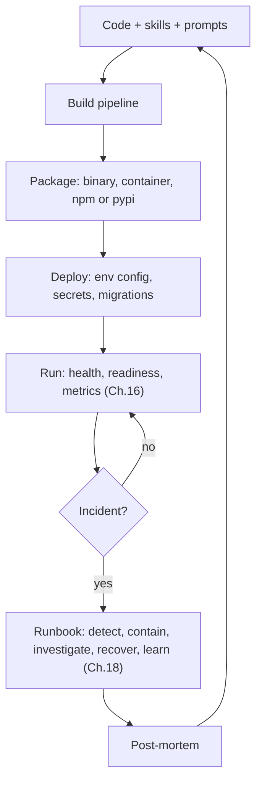
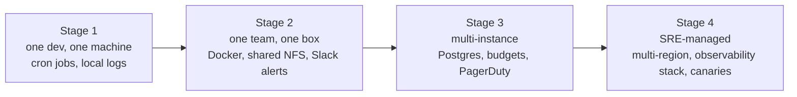

# Chapter 19 — Operations and forward-deployed agents

## TL;DR

Shipping an agent is the start of operating one. Real deployments run across restarts, secrets, queues, backups, model deprecations, cost spikes, and customer-specific environments. This chapter covers the operational discipline that makes that survivable: packaging and distribution, config across environments, schema migration on deploy, graceful shutdown, the runbook catalog, SLOs sized for agents, change management for prompt and skill edits, and the *forward-deployed* pattern where the operator ships with the system close enough to fix it in place. By the end you should know what every operator wishes they had wired before their first 3 a.m. page.

---

## Why this matters

Agent demos run in one terminal with one API key. Real deployments run for many users, across restarts, with secrets, queues, logs, approvals, budgets, and data boundaries. The operational design is what decides whether a useful prototype survives its first contact with real usage — and whether the team can iterate on it without being on fire every week.

The other reason it matters: agent ops is genuinely different from ordinary web-service ops. The model is a third-party dependency whose behavior changes with little notice. Costs can spike non-linearly with usage. The *bug* might be in a prompt, a skill, a tool, a config, or a model upgrade — and the fix is often a markdown edit, not a code deploy. The runbooks and the on-call shape have to reflect that.

---

## The concept

### The shape of operating an agent



Read it as a closed loop. Code becomes a package; the package becomes a deployment; the deployment runs and emits signals; incidents trigger runbooks; post-mortems feed back into the code. Each box has a chapter that owns it — Ch.19's job is the *operational discipline* that ties them together.

### Packaging and distribution

A serious agent ships as one of three shapes:

- **Single binary** — Bun-built (OpenCode), pip-installable wheel (Hermes Agent), npm-bundled (OpenClaw). Smallest install footprint; easiest to ship to operators who do not run Docker.
- **Container image** — Hermes Agent, OpenClaw, and Paperclip all provide Dockerfiles with multi-stage builds. The right default for server deployments; predictable runtime; easy to update.
- **Desktop wrapper** — Electron, Tauri, or SwiftUI shells around a local server. OpenCode's desktop app and OpenClaw's iOS/macOS clients are the references. Right shape for end-user installs.

Cross-platform matters more than you think. Hermes Agent ships explicit Windows handling (MinGit bundle, UTF-8 patching); OpenCode supports macOS, Linux, and Windows. The right packaging is workload-dependent — a single statically-linked binary works well for Go and Rust agents; a container is usually the right default for Python or Node agents that need their runtime alongside; a desktop wrapper fits end-user installs. Match the package shape to the operator's environment, not to a universal *fastest*.

Update mechanisms — Sparkle (Mac desktop), `npm publish`, container registry, or `pip` — should match the install path. Mixing them confuses the operator (*"do I `apt upgrade` or `pip install -U`?"*).

### Configuration across environments

Three layers, in load order:

```ts
type AppConfig = {
  environment:        "local" | "staging" | "production";
  databaseUrl:        string;
  queueUrl:           string;
  modelProfilesPath:  string;
  traceExporterUrl?:  string;
  secretsProvider:    "env" | "local_encrypted" | "cloud_secret_manager";
};

function loadConfig(env: Record<string, string>): AppConfig {
  // 1. Defaults baked in.
  // 2. File-based: config.yaml or config.json from a known path.
  // 3. Env vars override.
  // Validate with a schema; fail-fast on missing required fields (Ch.11 bootstrap).
  return ConfigSchema.parse({
    environment:       env.NODE_ENV ?? "local",
    databaseUrl:       env.DATABASE_URL,
    queueUrl:          env.QUEUE_URL,
    modelProfilesPath: env.MODEL_PROFILES_PATH ?? "./model-profiles.json",
    traceExporterUrl:  env.OTLP_ENDPOINT,
    secretsProvider:   env.SECRETS_PROVIDER ?? "env",
  });
}
```

The discipline: every required field has a schema, validation fails at startup (Ch.11's bootstrap order), and no plaintext secret ever lives in the config file — only `$secret:` references that resolve at runtime (Ch.15). Paperclip's `secret_access_events` table tracks every resolution so an operator can audit *who read what when*.

Per-environment overrides: separate config files (`config.staging.yaml`, `config.prod.yaml`) checked into source, plus env-var overrides for the actually-secret bits. The override chain is *defaults → file → env*, in that order, with the schema check at the end.

### Schema migration on deploy

Ch.08 covered the data discipline. On deploy, three things have to happen in order:

- Run pending migrations (idempotent; safe to re-run on the same revision).
- Verify the resulting schema matches the running code's expectations (a startup check, not a runtime assumption).
- Take a snapshot *before* the deploy, not after. Restoring a snapshot is easy; restoring after a destructive migration is not.

Drizzle-style tools (OpenCode, Paperclip) and Alembic-style ones (Hermes Agent) all converge on the same pattern: migration files are versioned, applied in order, recorded in a `migrations` table, gated by an atomic transaction per file. Additive migrations are safe; destructive ones wait until two releases past their last consumer (Ch.15).

### Graceful shutdown

A signal (SIGTERM, SIGINT) flips the worker into drain mode — Ch.11 covered the lifecycle, Ch.15 covered the multi-machine version:

```ts
class WorkerRuntime {
  private shuttingDown = false;

  async start() {
    onSignal(["SIGTERM", "SIGINT"], () => { this.shuttingDown = true; });

    while (!this.shuttingDown) {
      const job = await this.queue.claim({ timeoutMs: 5_000 });
      if (!job) continue;
      await this.runJobWithCheckpointing(job);
    }

    await this.flushPendingWrites();
    await this.releaseAllLeases();
    await this.closeConnections();
  }
}
```

Two rules from production: a graceful drain has a deadline (typically a few minutes); anything still running after the deadline is marked `cancelled` in the state machine (Ch.08) so the reaper picks it up cleanly. And every shutdown writes the same structured *"shutdown reason"* event so a post-mortem can answer *did the process die because we told it to, or because it crashed?*

### Runbooks — the catalog

The single most-used artifact in operating an agent is the runbook. Six recurring incidents and the shape of their runbooks:

| Incident | First checks | Likely fix | Rollback |
|---|---|---|---|
| Provider rate limit or quota exhausted | Per-tenant cost dashboard (Ch.16); credential pool status (Ch.15) | Rotate API key; switch to fallback model (Ch.17); raise tenant rate limit | None — it is external |
| Model deprecation announced | Provider release notes; eval suite results on new model | Re-pin to specific version; run eval gate; canary on 5% (Ch.17) | Pin previous version in config |
| Tenant cost spike (Ch.16 anomaly) | Per-tenant cost trace; recent tool histograms | Per-tenant rate limit or model downgrade (Ch.17); pause new runs if persistent | Restore previous limits; refund credit |
| MCP server down or compromised | MCP connect logs; reaper status | Mark server unavailable; surface to user; rotate credentials (Ch.13) | Disable the MCP server in config |
| Failed schema migration | Migration log; DB snapshot timestamp | Roll back the deploy; restore from snapshot (Ch.08) | Restore pre-deploy snapshot |
| Memory poisoning suspected | Trace replay (Ch.16); audit log (Ch.05); supersedes chain | Revert affected memory entries (Ch.07); scan with updated threat pattern (Ch.18) | Roll memory back via `supersedes` chain |

Each row is one markdown file in `RUNBOOK/` next to the code. Each file links to the dashboard query that confirms the symptom, the trace query that pulls the affected runs, and the exact commands to roll back. The runbook directory becomes the operator's most-edited file outside of code.

### Forward-deployed engineering

The pattern most under-discussed in agent ops: *the operator ships with the agent.* Instead of a SaaS team running the service from a distance, an engineer is embedded close to the customer — on-call for runbook edits, skill additions, cost spikes, and the day-to-day shape of the system. Anthropic and Palantir popularized the term; the pattern is broader than either.

What changes in the agent design when the operator is forward-deployed:

- **Local-first defaults.** OpenCode, Hermes Agent, and OpenClaw all run a single-user daemon on the operator's machine — no cloud account, no external state. The operator can resume, inspect, and rewind from their own filesystem.
- **The runbook is committed next to the code.** `RUNBOOK.md`, `SOUL.md`, `AGENTS.md` — all read at 3 a.m. and edited the next day. The operator's repo *is* the deployment.
- **Skills and memory accrete on disk** (Ch.06, Ch.07). The agent gets smarter as the operator uses it, without an external knowledge base. When the operator hands the system to a colleague, the skill directory is the handoff artifact.
- **Configuration is one file in the operator's repo** (or a private gist), with secrets in OS keychain or an encrypted local store. No cloud configuration UI; no separate deployment dashboard to keep in sync.
- **Observability is configurable, not assumed.** Sensitive deployments self-host traces (Ch.16); offline modes degrade gracefully. The operator decides what leaves the machine.
- **The operator is on-call for behavior, not infrastructure.** Cloud SREs watch CPU and memory. Forward-deployed operators watch *what the agent did* — they edit skills when the agent is stuck, add a runbook when an incident recurs, rotate the auth token when the API key cycles.

The pattern fits when the customer values control over convenience, when the data cannot leave the customer's boundary, or when the workflow is bespoke enough that a one-size-fits-all SaaS would not work. Most internal-tool deployments fit. Many enterprise deployments fit. Multi-tenant consumer apps usually do not — Paperclip's control-plane shape from Ch.15 is the right model there.

### The agent-operator role

Who watches the agent? What skills do they need? The role does not map cleanly to *SRE* or *developer.* A useful job description:

- **Reads logs and traces fluently** (Ch.16) — interprets what the agent tried and why it stopped.
- **Edits prompts, skills, and config** without a code deploy — the agent's behavior is mostly *configured*, not coded.
- **Manages secrets and API keys** (Ch.15) — rotation, audit, revocation.
- **Understands the task domain** — decides if the agent's work is correct, not just whether it completed.
- **Monitors cost and sets budgets** (Ch.17) — prevents runaway spending; renegotiates limits with stakeholders.
- **Triages incidents** — gathers reproduction steps, attaches session JSONL, writes the post-mortem.

The role is closer to a *domain SRE* than a classical SRE. Most teams either grow it from a senior engineer who likes the agent or hire someone who already has the domain knowledge. The split that works least: a generic ops team watching CPU dashboards while a separate ML team watches the model. Both miss what the agent actually *did.*

### Operational maturity progression

Most agent deployments traverse four stages, sometimes within one team:



The migrations between stages are themselves signals:

- *Stage 1 → 2:* more than one person needs to operate the system reliably. Time to put it in a container and add the runbook.
- *Stage 2 → 3:* more than one machine is needed (Ch.15's deployment topology spectrum kicks in). Postgres replaces SQLite; budgets become hard gates; alerts route to a real on-call rotation.
- *Stage 3 → 4:* the system is mission-critical for the business. Multi-region, observability stack, canary deploys, dedicated SRE coverage.

Most agent deployments live and thrive at Stage 1 or 2. Pushing to Stage 3 before the workload justifies it is a common form of engineering recreation.

### Change management for agent behavior

Prompt, skill, and tool changes deploy differently from code:

- **Prompt changes** invalidate the Anthropic prefix cache (Ch.04). The cost-impact estimate should be part of the change review.
- **Skill additions** are usually free — the model discovers them at the next session via the index pattern (Ch.06). Can be pushed without downtime.
- **Tool changes** may be incompatible with in-flight sessions (older runs expecting old schema). Either archive in-flight sessions or support both schemas during a rollover window (Ch.08's additive-migration rule).
- **Model upgrades** require an eval gate (Ch.16) before promotion — replay cheap traces of recent production runs against the new model, scored against the old.
- **Rollback discipline.** Every change is reversible without a deploy: prompts, skills, and tools should be in the repo (or in a versioned config) so `git revert` puts the agent back where it was.

### Model lifecycle

The model under your agent is a third-party dependency that ages on the vendor's schedule, not yours. The discipline:

- **Pin the version.** Reference specific model snapshots in config — the dated suffix or version-locked ID — not the unpinned alias. An alias that silently routes to a new snapshot is the same kind of bug as `latest` on a Docker image: a behavior change you did not deploy. Behavior-changes-with-little-notice is true for aliases; it should not be true for your production config.
- **Track the deprecation calendar.** Providers publish deprecation schedules. An unmonitored deprecation becomes a 3 a.m. outage when the endpoint returns a final-call error. A weekly job that diffs the provider's model list against your config and warns on entries scheduled to deprecate within sixty days is a few lines of code and one of the cheapest wins in agent operations.
- **Gate model changes through eval.** A model version bump is a deploy event, not a config edit. Run the eval suite (Ch.16) on the candidate snapshot, compare against the current one, gate the rollout on no critical regression. The model-deprecation runbook row earlier in this chapter is one half of the discipline; the eval gate is the other.
- **Canary before global.** Roll the new model out to a fraction of traffic first — by tenant, by agent profile, or by random sampling — and watch the metrics catalog from Ch.16. Promote on no regression; rollback if anything moves.

Treat the model the same way you treat any other dependency with a release cycle: pinned, monitored, gated, canaried.

### SLOs and error budgets for agents

The metrics that matter for an agent SLO are *agent-shaped*, not web-shaped. The numbers below are *starting examples*, not defaults — pick targets from a baseline measurement of your own workload (*target = baseline + improvement*, not *target = number from a textbook*):

| SLO | What it measures | Example starting target |
|---|---|---|
| **Task success rate** | Runs that reach a final answer / total runs | A high steady-state percentage on interactive workloads; set yours from baseline data |
| **Time-to-task-complete** | p50 / p95 turn duration | Workload-dependent |
| **Cost per task** | Average token spend per completed task | Set and review monthly |
| **Cache hit ratio** | Cache reads / total input (Ch.04) | Workload-dependent — Ch.04 has the full picture |
| **Approval-funnel completion** | Approved / requested (Ch.12) | A sharp drop is the signal that the agent is asking too often; healthy systems trend high |
| **Availability** | Heartbeats executed / scheduled (Ch.15) | Whatever your interactive users expect from comparable SaaS |

Error budgets work the same as for ordinary services: a budget for failed runs per quarter, drawn down by incidents. When the budget is exhausted, feature work pauses until reliability work catches up. The shape that breaks teams: setting SLOs on infrastructure metrics (CPU, RAM) while the user-visible metric (task success) is unmonitored.

### Feedback loops from production

Signals flow back to the dev team through five paths:

- **User reports.** Operator captures the issue with the session JSONL attached. Cheapest, highest-signal.
- **Eval-suite divergence** (Ch.16). Continuous eval flags when production traces diverge from the baseline.
- **Cost trends** (Ch.17). The cost ledger flags the tenant or model whose spend is climbing.
- **Trace anomalies** (Ch.16). New error patterns, new tool failures, new doom-loop signatures (Ch.02).
- **Skill and memory insights** (Ch.07). The curator surfaces sequences worth promoting to skills, and memory entries to archive.

The discipline: every channel routes into one queue the dev team reviews on a regular cadence — weekly is a useful starting point. Triaging from many channels with no aggregation is how regressions hide in plain sight.

### The runbook format that gets read at 3 a.m.

The runbook that works is the one someone actually reads while paged. Five rules from production:

- **Markdown, not PDF.** Lives in the agent's repo next to the code; greppable; rendered in the operator's editor.
- **Decision tree, not paragraph.** *"If symptom X, check Y; if Y is the issue, fix Z."*
- **Copy-paste commands.** The runbook should let an exhausted operator paste, not read.
- **Links, not duplication.** Link to the dashboard query, the trace query, the rollback script. Do not duplicate context that will go stale.
- **Blameless tone.** *"A rate limit is part of the design, not a crisis."* The runbook is also how new operators learn the system's failure modes.

A useful test: hand the runbook to a new team member during business hours and have them resolve a simulated incident. Anything that confuses them is what will confuse the on-call at 3 a.m.

A concrete template that fits the rules:

```markdown
# Runbook: <short symptom-shaped title>

**Severity:** P0 / P1 / P2 — what user impact justifies the page.

**Detection:** the alert or dashboard panel that paged you. Include the
exact query so you can verify the symptom in one click.

**First checks:** three to five concrete steps with copy-paste commands
or dashboard links. Decision tree, not paragraph.

**Likely fixes:** two or three most common causes and how to fix each.
*"Tried this; still broken"* routes back to the first checks.

**Rollback:** the explicit command or PR that puts the system back to
the last known good state, if the fix above does not hold.

**Comms:** who is told what, on which channel, on what clock. Includes
internal (engineering, on-call) and — for user-visible incidents — the
customer-facing status update. Privacy incidents have additional clocks
(regulator notification, affected-user notification); the runbook for
those names the deadlines explicitly so the on-call is not deriving
them mid-incident. See Ch.18 for the threat model that triggers them.

**Post-mortem trigger:** the threshold above which this incident gets a
written post-mortem rather than just a runbook execution.
```

The seven fields are what every runbook should answer; the template is short enough that an exhausted operator can fill it in for a new incident class in a single sitting. The discipline is not the template — it is *having one and using it every time*. Inconsistent runbooks are worse than missing ones: the on-call learns to distrust them and stops reading.

---

## Real-system notes

- **Paperclip** is the most operations-heavy reference: Postgres with scheduled `pg_dump`, encrypted secrets with `secret_access_events` audit, plugin worker isolation, adapter-level config and budgets, run logs that double as the audit trail, and a control-plane UI for run inspection. Read it for *what does an operations-grade agent service look like.*
- **OpenCode** shows local-first distribution with an embedded server, desktop wrapper, TUI, and Drizzle migrations on startup. Strong reference for the forward-deployed single-user shape.
- **Hermes Agent** is the reference for unattended operation: cron-triggered work, messaging-channel triggers, a Python wheel that installs with optional extras (gateway, MCP, web), and explicit Windows handling.
- **OpenClaw** is the reference for self-hosted channel operations: plugin and config management, per-channel adapters that can be enabled or disabled without restart, and a personal-assistant gateway pattern that an operator can run on a single VPS.

---

## Common failure cases

The chapter above is the operational discipline. This section is what still goes wrong once the agent is live and someone is on call for it — the failures that actually generate the 3 a.m. pages — and the pattern that defuses each. They are ordered by how often they bite, not by how dramatic they are: the first two land on nearly every team in the first month of real operation; the last three start to matter once you have paying users, real spend, and deploys that interrupt live work.

### The fix is a one-line prompt edit, but shipping it means a full code deploy

*The symptom in one line: the agent is misbehaving, you know exactly which sentence in the prompt to change, and you cannot ship the change for hours because it rides the same pipeline as code.*

This chapter's central observation is that the bug is often in a prompt, a skill, or a config rather than in code — *"the fix is often a markdown edit, not a code deploy."* The failure is having no path that respects that. A skill says the wrong thing, or a tool description is too eager, and the only release lane you built is *commit → CI → build → deploy → restart*, so a fifteen-character fix takes the same forty-five minutes (and the same change-freeze window) as a schema migration. The operator either waits while the agent keeps misbehaving, or — worse — SSHes into the box and hand-edits the file, which works once and then silently diverges from the repo until the next deploy stomps it.

The fix is a **separate, fast release lane for behavior**, kept distinct from the code lane the way this chapter's change-management section already separates prompt, skill, and tool changes from code changes. Behavior artifacts — prompts, skills, model-profile configs — live in a versioned store (a config branch, a signed bundle, a row the agent reads on session start) that can be promoted and reverted *without rebuilding the binary*. Two operational guardrails the chapter does not spell out: every behavior change carries the same provenance a code commit does (author, timestamp, diff, the eval-gate result from Ch.16), so the audit trail does not have a hole where the prompts are; and every behavior artifact is reverted by **`git revert` or a one-command rollback**, never by a hand-edit on the box — a config the operator cannot reproduce from the repo is a config that will be lost on the next deploy. The anti-pattern to alarm on: any divergence between the artifact running in production and the artifact in version control. If you cannot diff them, you cannot trust either.

### The model alias silently routes to a new snapshot and behavior shifts under you

*The symptom in one line: nobody deployed anything, but task success dropped and the agent started answering differently this morning.*

The model is a third-party dependency that ages on the vendor's schedule. The most common version of this failure is the cheapest to prevent and the one teams skip anyway: the production config points at an *unpinned alias* — the friendly name that the provider re-points to a newer snapshot whenever they ship one. This chapter calls it correctly — *"an alias that silently routes to a new snapshot is the same kind of bug as `latest` on a Docker image."* The agent's behavior changes with no deploy, no commit, no entry in your change log; the eval gate you built never fires because, as far as your pipeline knows, nothing happened. You find out from a user report or a drift in the success-rate graph, days later, with no obvious cause because the cause was not in your repo.

The fix is two-sided. The preventive half is the chapter's rule — **pin the dated snapshot ID** in config, never the bare alias — but the operational half is detection, because pins also rot: the snapshot you pinned gets *deprecated*, and an unmonitored deprecation becomes the outage where the endpoint returns a final-call error at 3 a.m. Run a **weekly model-drift check** that does two things at once: it diffs the provider's current model list against every model ID in your config and warns on anything scheduled to deprecate within sixty days (the chapter's calendar job), *and* it asserts that each alias you still reference resolves to the snapshot you expect — if the alias moved, that is the page, not a surprise. Wire one alarm: any model ID in production that is either (a) an unpinned alias or (b) a pinned snapshot inside its deprecation window. Both are the same incident — a behavior change you did not choose — and both want the model-deprecation runbook row from this chapter, not a fresh investigation.

### The runbook is stale the moment you actually need it

*The symptom in one line: you are paged, you open the runbook, you paste its command, and it errors — the flag changed, the dashboard moved, or the script was deleted two refactors ago.*

This chapter is emphatic that the runbook is the single most-used artifact in operating an agent, and that *"inconsistent runbooks are worse than missing ones: the on-call learns to distrust them and stops reading."* The failure mode that produces that distrust is silent rot. Runbooks are written once, during the calm after an incident, and then the system moves on around them — a dashboard query gets renamed, a rollback script moves, a CLI flag is deprecated — while the markdown sits frozen. Nothing tells you it went stale, because a stale runbook throws no error until the worst possible moment: mid-incident, when the on-call is least equipped to debug the runbook itself on top of the outage.

The fix is to treat runbooks as **testable artifacts, not documentation**. The chapter names the right test — *"hand the runbook to a new team member during business hours and have them resolve a simulated incident"* — and the operational move is to make a cheap version of that test run automatically. Three concrete steps: extract every copy-paste command and every dashboard/trace link from the `RUNBOOK/` files and run a periodic **link-and-command check** that flags dead links and commands whose `--help` no longer recognizes their flags; schedule a recurring **game day** — a deliberately injected, sandboxed instance of one runbook's incident — and measure *time-to-resolution-following-the-runbook-only* as the metric that proves the runbook still works end to end; and date-stamp every runbook with a *last-verified* field, alarming on any runbook not exercised in ninety days. The point is to move runbook decay from *discovered during an incident* to *discovered on a Tuesday*. A runbook that has not been run is a hypothesis, not a procedure.

### Cost quietly doubles and you find out from the invoice

*The symptom in one line: spend has been climbing for two weeks, no single day looked alarming, and the first hard signal is the monthly bill.*

The chapter's runbook catalog and SLO table both treat cost as first-class, and Ch.17 owns the cost-control machinery — but the operational failure is the one in between: a *slow* drift that never trips a same-day eyeball check. One tenant's usage creeps up, a retry path starts double-charging, a prompt edit quietly halves the cache-hit ratio (Ch.04) so every turn re-pays for the prefix, or an auxiliary-model call gets routed to the expensive tier (Ch.17). None of these spikes; they *ramp*. By the time the absolute number is obviously wrong, you have eaten two weeks of it, and the post-mortem is mostly archaeology because there was no alarm to anchor the timeline.

The fix is to alarm on **rate of change and per-tenant share, not just absolute total**, and to make the budget a *gate*, not a *report*. Three operational specifics the chapter gestures at but does not pin down: alert when **cost-per-task** drifts beyond a band off its trailing baseline (the chapter's *target = baseline + improvement* rule applied to spend — a 30–50% week-over-week climb on a stable workload is an investigation, not a shrug); track **per-tenant cost share** and page when any single tenant crosses a multiple of the median, which is the early signal of both a runaway loop and an abuse case; and wire the budget as a **hard gate** that pauses new runs for the offending tenant when its ceiling is hit, the way this chapter's tenant-cost-spike runbook prescribes, rather than a dashboard nobody is watching. Cache-hit ratio belongs on the same board: a sudden drop there is a cost incident wearing a performance costume, and it is almost always a prompt or tool change that broke the stable prefix.

### A deploy kills work that was in flight

*The symptom in one line: you ship a routine release, and a handful of long-running tasks vanish, restart from zero, or fire their side effect a second time.*

Graceful shutdown is in the chapter, and so is the rule that *"a graceful drain has a deadline."* The failure is shipping a drain that is too short for the actual work — a two-minute SIGTERM-to-SIGKILL window on an agent whose real tasks routinely run ten minutes — or shipping no drain at all, so a deploy or an autoscaler scale-in hard-kills the worker mid-step. Either way the in-flight run dies. The benign outcome is that Ch.08's reaper picks it up and restarts it from the last checkpoint; the ugly outcome is a run that had already called a non-idempotent tool (charged a card, sent a message) and re-runs it on resume because the step boundary was never committed before the kill. The reason this lands late is that it only shows up under load — demos and staging rarely have a ten-minute task running at the exact instant of a deploy.

The fix couples two patterns this chapter and Ch.08 own, with the operational numbers attached. First, **size the drain deadline to the p99 task duration, not a round number** — measure how long your longest real tasks run and set the SIGTERM-to-SIGKILL grace period above that, or, for genuinely long work, have the SIGTERM handler **checkpoint-and-requeue** at the next step boundary rather than try to finish (the chapter's *flush, release leases, close connections* sequence, made explicit about what happens to the half-done run). Second, make resume safe regardless of timing by enforcing **idempotency at the step boundary, not just inside the tool** (Ch.08): commit the step's completion record *before* the side effect is acknowledged, so a kill-and-resume replays a no-op rather than a second charge. Two signals prove it works: every shutdown emits the structured *"shutdown reason"* event the chapter requires — so a post-mortem can tell *we told it to stop* from *it crashed* — and you alarm on any run that resumes more than a small number of times, which is the fingerprint of a run that keeps dying mid-step instead of checkpointing cleanly. The acceptance test is the one already in this chapter's pairing prompts: SIGTERM during an in-flight run with pending tool calls and a partial outbox, and prove the next instance picks up without re-issuing the side effect.

---

## Pair with your agent

- *"Inventory every operational surface my agent has: packaging, config, secrets, deploy, migration, shutdown, runbook, SLOs, feedback loops. For each, mark which ones I have, which I am missing, and propose the smallest first step for each gap."*
- *"Write the runbook catalog from this chapter as markdown files in `RUNBOOK/`. Each file: symptom, first checks, likely fix, rollback. Link to the actual dashboard or trace query in my OTLP backend."*
- *"Set up the change-management discipline: every prompt, skill, or tool change goes through a review that includes an eval-gate check (Ch.16) and a cost-impact estimate (Ch.17). Show me the PR template."*
- *"Define SLOs for my agent: task success rate, time-to-task-complete, cost per task, cache hit ratio. Set targets from my last month of production data. Wire each into an alert that pages when the SLO is at risk of being missed for the quarter."*
- *"Audit my deployment for the forward-deployed pattern: are skills and memory on the operator's machine? Is config in their repo? Are secrets in a keychain, not a config file? Propose the smallest changes to fit the pattern if it makes sense for my workload."*
- *"Walk me through the four-stage operational-maturity progression. Identify my current stage and the *single most useful* migration to do next."*
- *"Build the feedback-loop aggregator: user reports, eval divergences, cost spikes, trace anomalies, and skill-curator suggestions all routed into one weekly review queue. Show me last week's queue as a sample."*
- *"Stress-test my graceful shutdown: SIGTERM during an in-flight run with two pending tool calls and a partial outbox write. Verify the next instance picks up cleanly via Ch.08's reaper without re-issuing the side effect."*

---

## What's next

You can now run an agent in production over time, recover from incidents with documented motions, and feed signals back into the agent's behavior. Ch.20 explores a closely related angle: *the agent acting on its own initiative.* Proactive agents — cron-scheduled work, event-driven wakeups, watchdogs, background curation — change the failure mode set and add their own design discipline (opt-in semantics, the escalation ladder, the *no user is watching* rules). Ch.21 then picks up *the agent improving its own behavior between runs* — self-evolving memory, skills, prompts, and weights. Ch.22 closes the course with a design canvas that helps you decide what shape of agent your own project actually needs.
