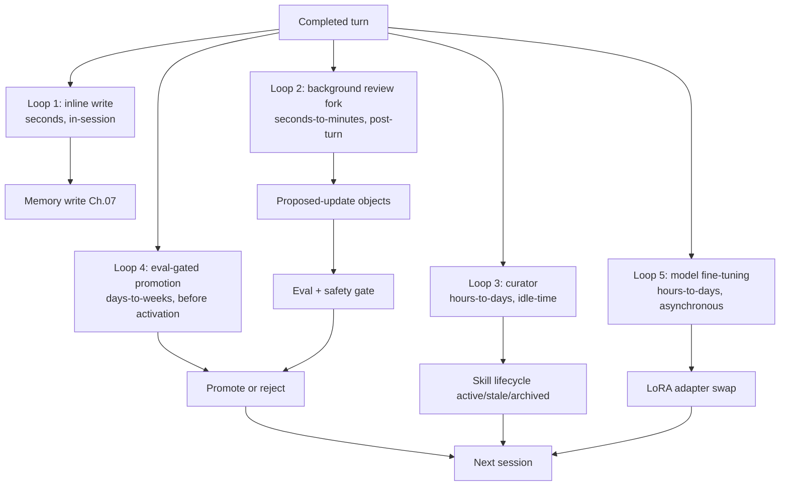
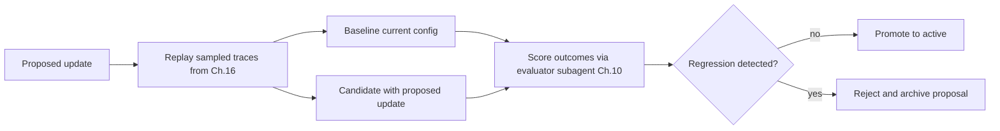
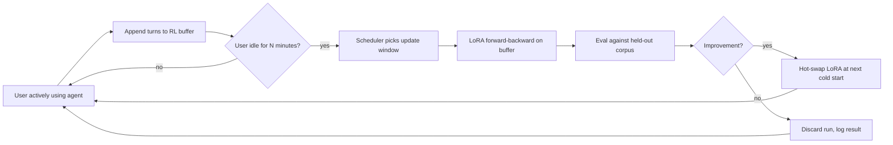

# Chapter 21 — Self-evolving agents

## TL;DR

A self-evolving agent updates its own memory, skills, prompts, tool descriptions, or even its model weights between runs — turning yesterday's experience into tomorrow's competence. Done well, the agent gets steadily sharper without a human in the loop on every change. Done badly, it drifts, poisons its own memory, or quietly rewrites its safety controls. The discipline that makes this safe is composed entirely of patterns earlier chapters built: proposed-update objects rather than direct writes, an evaluator subagent reviewing the proposal, the supersedes-chain rollback, eval-gated promotion, and a strict line between *what is allowed to evolve* and *what stays under human change control*. This chapter covers the full loop, the recent research surface (MetaClaw, Tinker, the agentskills.io federated hub, and LoRA-based personalization), and the rules that keep evolution from turning into mutation.

---

## Why this matters

An agent that never learns repeats its mistakes — re-discovering the same project conventions in every session, re-failing the same tool calls, re-running the same searches. An agent that updates itself without guardrails is worse: it can poison its memory, weaken its tools, learn the wrong lesson from a single bad turn, or quietly accumulate skills that conflict with each other.

The goal is *controlled adaptation, not autonomous mutation.* Hermes Agent's background review fork is the clearest production reference for the controlled version — Loops 1–3 below, shipping today. MetaClaw (a 2025 framework that wraps personal agents with continuous LoRA fine-tuning and skill evolution) is one of the earliest references for the more ambitious version — Loop 5 below, research-grade and shipping in a handful of systems. Both work — and both work because every update goes through a gate that the human or the harness controls.

---

## The concept

### What evolution actually means

Five layers of an agent can evolve, each at its own cadence, with its own gate. The first two are universal in production; the last three are research-grade in 2026 and shipping in a handful of systems.

| Layer | What changes | Cadence | Gate | Example |
|---|---|---|---|---|
| **Memory** | `MEMORY.md`, `USER.md`, structured facts | Per-session or background | Safety filter (Ch.07); curator | Hermes Agent background review |
| **Skills** | Named procedures the model can call (Ch.14) | Background curator | Curator lifecycle (Ch.07) | Hermes' `skill_manage`; MetaClaw skill bank |
| **Prompt sections** | Project context, glossary, preferences | Manual or curator-proposed | Eval gate (Ch.16, Ch.17) | OpenCode's `plan.md`; agent profile overrides |
| **Tool descriptions** | Wording, examples, "do not use for" lines | Manual; rarely automated | Cache invalidation (Ch.04); change review (Ch.19) | Per-tool description edits |
| **Model weights** | LoRA adapters, RL fine-tuned weights | Hours to days, asynchronous | Eval suite + canary | MetaClaw + Tinker; on-policy distillation |

Everything else — security policy, tool registry composition, secret access, approval thresholds — stays under explicit human change (Ch.19 change management). The line is sharp: *low-blast-radius, reversible outputs can evolve; anything that broadens authority cannot.*

### The five-loop evolution architecture

Self-evolution is not one loop, it is five overlapping ones at different timescales. Production systems combine them deliberately.



- **Loop 1 — inline write.** The agent calls `memory.write` mid-session. Cheapest, riskiest. Reserved for facts the user just stated.
- **Loop 2 — background review fork.** A daemon subagent (Hermes Agent's canonical pattern) reviews the just-completed transcript and proposes memory or skill updates. Non-blocking; writes are visible *next session*.
- **Loop 3 — curator.** A separate process runs on idle and grooms the skill store (active → stale → archived from Ch.07), consolidates duplicates, and prunes the index.
- **Loop 4 — eval-gated promotion.** Any proposed update from Loops 2 or 3 must pass a small eval suite before being activated. The gate prevents *plausible but wrong* updates from going live.
- **Loop 5 — model fine-tuning.** The newest loop. Conversations become training samples; a LoRA adapter (Tinker, MinT, Weaver) updates the model weights themselves. Asynchronous; happens during idle windows.

You do not need all five. Most agents ship Loops 1–3. Loop 4 is what separates production-grade evolution from clever-demo evolution. Loop 5 is the frontier.

### The background review fork — the canonical pattern

Hermes Agent's `spawn_background_review_thread` is the cleanest reference for Loop 2. After a successful, non-interrupted turn that meets nudge thresholds, the harness forks a daemon subagent with three constraints:

- **Restricted tool whitelist** — typically `{memory, skill_manage, skills_list, skill_view}` only. The review fork cannot exec, write outside memory, or call external APIs.
- **Receives the completed transcript** plus a review prompt (Hermes' `_MEMORY_REVIEW_PROMPT` and `_SKILL_REVIEW_PROMPT`).
- **Writes go to disk atomically and are visible next session, not this one** — the Ch.04 cache rule again, applied to writes: the running prompt cannot change mid-flight.

```ts
// Background review fork — non-blocking; writes visible next session.
async function spawnBackgroundReview(completed: CompletedTurn, ctx: HarnessContext) {
  if (!completed.successful || completed.interrupted)            return;
  if (!ctx.policy.meetsNudgeThreshold(completed))                return;

  spawnDaemon(async () => {
    const reviewer = ctx.subagents.fork({
      profile:        "memory_curator",                          // Ch.10/Ch.14
      tools:          ["memory", "skill_manage", "skills_list", "skill_view"],
      model:          "auxiliary_cheap",                          // Ch.17
      systemPrompt:   ctx.prompts.memoryReviewPrompt,
      maxSteps:       5,
    });
    const proposals = await reviewer.run({ transcript: completed.transcript });
    for (const p of proposals) await ctx.evolution.submitProposal(p);
  });
}
```

The pattern is *low-blast-radius by construction.* Even if the reviewer is wrong about every proposal, the harness still gates each one before applying. Even if a proposal passes the gate, it is reversible via the supersedes chain. And the main loop continues unblocked — the user never waits for evolution.

### Skill compilation — turning observed procedures into named skills

When the agent reliably runs three or four tools in the same order to handle a recurring task, that sequence is a *skill waiting to be named.* The pattern is now standard across coding and assistant agents:

- Observe a successful procedure across several runs.
- Name it: a clear `name`, `description`, ordered steps, prerequisites.
- Save it as a markdown skill file with YAML frontmatter (Ch.14's shape).
- Loaded into the next session's skill index; the model calls `skill_view(name)` to read the body when needed.

Hermes Agent's curator does exactly this — it proposes new skills from observed sequences, and the eval gate decides whether they get promoted to the active index. MetaClaw's *Skills Injection & Evolution* module is the same loop with explicit per-session summarization: every conversation contributes potential skill candidates, which an evolver LLM synthesizes into the library.

The discipline that makes this safe: skills are *added*, not edited. If the agent wants to change an existing skill, it proposes a new version with the version-bumped frontmatter; the previous version is archived, not overwritten. The supersedes chain from Ch.07 applies directly.

### The proposed-update object

The single most important pattern in self-evolution: *the agent proposes; the harness disposes.* The agent does not write memory or skills directly — it emits structured proposals that the harness validates, gates, and either applies or rejects.

```ts
type ProposedUpdate = {
  id:                string;
  kind:              "memory" | "skill" | "prompt_section" | "tool_description" | "lora_weight";
  targetId?:         string;                            // existing entry to update
  patch:             string;                            // diff or new content
  rationale:         string;                            // why the agent proposed this
  proposedByRunId:   string;                            // Ch.05 audit log link
  proposedByLoop:    "inline" | "background_review" | "curator" | "fine_tune";
  risk:              "low" | "medium" | "high";
  reversibility:     "instant" | "next_session" | "requires_redeploy";
  evalRequired:      boolean;
  evalResults?:      { baseline: number; candidate: number; delta: number };
  status:            "proposed" | "evaluating" | "approved" | "rejected" | "applied" | "rolled_back";
};
```

Three reasons this discipline matters:

- **Atomic audit.** Every change is an explicit object with a source run, a rationale, and a reversibility tier. Post-incident review can answer *who suggested this and why?* in one query.
- **Composable gates.** The same proposal flows through safety filter (Ch.07), eval gate (Ch.16/17), and approval gate (Ch.12) without each gate knowing about the others.
- **Reversible by construction.** Rolling back is "set `status = rolled_back` and re-activate the previous version" — no archaeology, no guessing.

### Eval-gated promotion

Before a proposed update activates, run a small eval suite that compares the proposed configuration against the baseline. This is Ch.16's eval-as-observability pattern applied specifically to self-evolution.



Three rules from production:

- **Use evaluator subagents** (Ch.10's verification pattern) on a fixed eval corpus, not on the same traces that produced the proposal. Otherwise you are evaluating against the proposer's own examples.
- **Promote gradually.** If a skill update passes the eval, activate it for 5% of sessions first; widen to 25% after a day of clean signal; full rollout only after a week.
- **Roll back automatically on regression.** The Ch.16 cost-anomaly pattern applies to quality too: if post-promotion eval scores drop more than 5% from baseline, revert and surface the proposal for human review.

The pattern aligns the agent's self-improvement with the same eval pipeline that catches model upgrades and prompt edits (Ch.17, Ch.19). Reusing the pipeline is what makes evolution operationally tractable.

### Versioning and rollback — the supersedes chain

Every applied update gets a version, a source proposal ID, and a pointer to the previous version. Ch.07 introduced the supersedes chain for memory; the same shape works for skills, prompt sections, and even LoRA weights.

```ts
type VersionedArtifact = {
  artifactId:        string;          // stable across versions
  version:           number;          // monotonic
  content:           string;          // the actual skill body, memory entry, prompt section
  createdAt:         string;
  createdBy:         "user" | "agent" | "curator" | "fine_tune";
  sourceProposalId?: string;          // links back to the ProposedUpdate
  supersedes?:       string[];        // versions this one replaces
  status:            "active" | "stale" | "archived";
};
```

Rollback is mechanical: re-activate the previous version, mark the current one `archived`, log the action. No surgery, no special case, no risk of leaving the store in an inconsistent state. *If you cannot roll an update back, you cannot let the agent propose it automatically.*

### RL personalization — the new frontier

The 2025–2026 development that makes self-evolution genuinely powerful: LoRA fine-tuning of model weights from production conversations, run asynchronously between active sessions. The reference systems:

- **Tinker** (Thinking Machines Lab, 2025) — an API for parameter-efficient fine-tuning with `forward_backward` and `sample` primitives. Multiple training runs share compute via LoRA. Supports custom RL loops with multi-turn tool use.
- **MetaClaw** (Aiming Lab, 2025) — a transparent proxy sitting between users and personal agents. Three modes: skills-only (no GPU), RL (continuous fine-tuning), and auto (RL with idle-window scheduling). A Process Reward Model scores responses asynchronously; LoRA adapters are hot-swapped without restart.
- **On-Policy Distillation (OPD)** — distill a larger teacher model's per-token log-probabilities into a smaller LoRA student, used by MetaClaw for cheap quality lifts.

The architecture every RL-personalization system converges on:

- **Conversations become training samples.** Each turn — input, output, tool calls, outcome — is recorded into a buffer.
- **An async judge scores responses.** A separate evaluator (often a stronger model) labels each sample with a reward signal.
- **LoRA adapters are fine-tuned offline.** A scheduler periodically pulls a batch from the buffer, runs `forward_backward`, and writes updated adapter weights.
- **Adapters are hot-swapped at session boundaries.** The agent loads the new adapter on its next cold start; sessions in flight keep their current weights.

Two safety rules that hold across these systems:

- **The fine-tuned adapter must pass the same eval gate as any other proposed update.** A drop in eval score reverts the adapter — same supersedes chain as skills and memory.
- **The base model is unchanged.** Personalization happens in an adapter layer; you can always fall back to the base. Operators who want this control should use LoRA, not full fine-tuning.

Two consent-and-policy concerns are also load-bearing for any production deployment of Loop 5 — they are not architectural, but they are non-optional:

- **User consent to training.** Every personalization scheme above turns production conversations into training data. The user has to consent — explicitly, in the legal sense — before their content can be used this way. The category-level opt-in framework from Ch.20 is the architectural spine for capturing it; the legal interpretation (what counts as consent in your jurisdiction, whether it must be granular, whether it must be revocable with deletion) is Ch.18 territory. Treat "we'll use your conversations to improve the agent" as a Ch.12-shaped explicit ask, not a buried clause.
- **Provider terms.** Some model APIs forbid using their outputs to train other models — including LoRA adapters that derive from those outputs. Read the underlying model's terms of service before designing around Loop 5; a personalization stack that violates the upstream provider's terms is one policy update away from being shut off, and that is not a failure mode you want to discover after shipping.

### Meta-learning scheduler — updating during idle windows

MetaClaw's most interesting contribution is the *meta-learning scheduler:* fine-tuning happens during sleep hours, keyboard idle periods, or scheduled calendar gaps. This prevents the user from waiting on training and avoids the cost of always-on GPU time.



For agents that run on user machines (forward-deployed, Ch.19), idle-window scheduling is the only way RL personalization is practical — the GPU is the user's, and training cannot block their work. For cloud-hosted agents, the same pattern controls cost: training during off-peak hours costs less and contends less with serving.

### Federated skill libraries — agentskills.io and the marketplace

Skills are markdown files with frontmatter. They are eminently shareable. The 2024–2025 development that turned this into a real pattern: `agentskills.io`, a hub for publishing and pulling versioned skills, GitHub-App-authenticated, with semver-style version pinning.

Hermes Agent ships first-class integration: `hermes skills install <name>` pulls from the hub; `hermes skills push <name>` publishes a local skill back. The discipline that makes this safe to use:

- **Skills imported from a hub are still proposed updates.** They go through the same gate as agent-proposed ones — the eval suite runs on the new skill before activation.
- **Pinned versions, not floating.** `version: 1.2.0` in the install, not `version: latest`. Hub-side rollback is one thing; your installed version is the truth.
- **Provenance survives the import.** The skill carries metadata about where it came from; the audit log (Ch.05) records the install action; the curator (Loop 3) can archive it later if it falls into disuse.

The same hub pattern extends to evaluator subagents, plan templates, and (when LoRA adapters become hub-distributable) personalization weights themselves.

### What NOT to automate

Self-evolution should make the agent better at its job, not more powerful by default. Keep these behind manual change (Ch.19's change-management discipline):

| Layer | Why not self-evolve |
|---|---|
| Security and safety policy | Self-modification of constraints is the exact failure mode (Ch.18 agentic misalignment) |
| Tool registry composition | Adding tools changes capability surface; needs human review |
| Permission rules and approval thresholds | Loosening these is what attackers want |
| Secret access patterns | Even read access changes the threat model |
| Production deployment rules | Outside the agent's blast radius |
| Model provider selection or fallback chain | Operational decision, not a learnable one |
| Cost budget enforcement | The agent will always want a higher budget |

A useful rule: *if the change makes the agent more cautious, narrower, or more transparent, automation is fine. If it makes the agent broader, more confident, or harder to audit, it stays manual.*

### The drift problem and drift detection

An agent that has self-evolved over 1000 sessions is a different agent. Its memory has consolidated, its skills have proliferated, its prompt has accumulated context. Without detection, you only notice when a user complains.

Three concrete defenses, all composing earlier chapters:

- **Snapshot the eval baseline at agent initialization.** Run the eval suite (Ch.16) on the fresh agent; save the scores. Every N sessions, re-run the suite; alert if scores drop more than a threshold.
- **Cap skill and memory growth.** Curator (Loop 3) archives entries unused in 30/90 days (Ch.07). Memory size budget (Ch.06) caps total prefix-stored memory at 10-20 KB. If either cap binds, an operator review is triggered.
- **Periodic baseline reset option.** Operators should have a one-command *reset memory and re-import only pinned skills* path. Used rarely; impossible without versioning. Hermes Agent's curator state file makes this a single archival operation.

The honest framing: drift is not a bug to be fixed, it is a property to be managed. Some drift is the agent learning your project; some drift is the agent forgetting what it was supposed to do. Eval gates and snapshots are how you tell the difference.

### Shadow evolution — parallel testing before promotion

A more conservative version of eval-gated promotion: run the candidate configuration *in parallel* with the production agent across N real sessions, compare outcomes, promote only on agreement. This is what eval-gates approximate offline; shadow evolution does it live.

OpenCode's session-fork primitive gives you the building block: fork the session, run the candidate, score against the live agent's output (the specific API has moved over time; check the current method names in the project's session module). Hermes Agent and OpenClaw can stand up parallel agent instances against the same gateway. The pattern is uncommon in production today — the operational complexity is non-trivial — but it is the natural next step past offline eval gates for high-stakes evolution.

### Population-based evolution — rare, but worth knowing

The far end of the spectrum: maintain a *population* of agent variants — different prompts, different skill sets, different fine-tuned adapters — and let them compete on real workload. Variants that score well propagate; variants that score poorly are retired. Research papers like ADAS and the broader "agent-as-a-genome" literature explore this; production systems do not implement it yet, mostly because the operational complexity outweighs the gains for current workloads.

Worth knowing for the design canvas in Ch.22 — if your workload is genuinely diverse and you have the engineering budget, population-based evolution can outperform single-agent evolution. For everyone else, the five-loop architecture above is the practical horizon.

---

## Real-system notes

- **Hermes Agent** is the strongest production reference for Loops 1–3 plus skill-hub integration: `spawn_background_review_thread` for the post-turn review fork, `agent/curator.py` for the idle-time skill lifecycle manager, `agentskills.io` hub integration for federated skills, threat-pattern scanning at the memory boundary (Ch.07), and pinned-version skill installs. It does *not* currently ship Loop 5 (model-weight evolution); that frontier lives in MetaClaw and Tinker-based stacks.
- **MetaClaw** (Aiming Lab, 2025; check the project README for the current state) is one of the earliest open references for Loop 5: transparent proxy in front of personal agents, three modes (skills-only / RL / auto), LoRA fine-tuning via Tinker/MinT/Weaver-style backends, On-Policy Distillation for cheap quality lifts, meta-learning scheduler deferring training to idle windows. Worth reading as the most-developed expression of brain-inspired continuous learning to date — but treat it as research-grade architecture, not yet a production default.
- **OpenCode** ships the foundational primitives — session-fork for shadow evolution, session compaction with parent-session chains (Ch.05), Drizzle migration for versioned schemas — but does not run a self-evolution loop by default. Strong base to build one on.
- **Paperclip** is the governance angle: every self-proposed update is an `issue` with an `approval` flow, audited, reversible, and visible in the operator dashboard. The right shape for organizations where self-evolution requires explicit sign-off, not just an eval gate.

A pointer outside the open-source repos: Anthropic's writing on *post-training* and the Thinking Machines Lab announcement of *Tinker* are the best short reads on where LoRA-based personalization is heading.

---

## Common failure cases

The chapter above is the design. This section is what still breaks once that design is running in production — and self-evolution is especially treacherous because the failures compound silently: a bad update doesn't crash anything, it just makes the agent a little worse, and the next update learns from the already-worse agent. They are ordered by how often they bite, not by how interesting they are. The first two go wrong on almost every agent that ships any evolution loop at all; the last three start to matter once you turn on eval gates, skill compilation, and weight-level personalization.

### Your eval gate exists, but nothing it sees ever fails it

*The symptom in one line: every proposed update sails through the gate, the agent keeps changing, and you cannot remember the last time a proposal was rejected for a real reason.*

This is the most common self-evolution failure, and it is the same rot that kills any eval suite (Ch.16's *"hasn't blocked a deploy in months"*), arriving here through three doors specific to evolution. The first is *proposer overlap*: the gate replays the very traces that produced the proposal, so the candidate config is being graded on its own homework and naturally wins. The second is *baseline drift*: the "baseline" is whatever the agent looks like right now, so each marginal update sets the new bar — promote ten 1%-better-on-their-own-examples changes in a row and you have walked the agent somewhere nobody chose, with every step passing its gate. The third is a gate so lenient (or a corpus so stale) that *plausible but wrong* is exactly what slips through, which is the one thing Loop 4 exists to stop.

The fix is to make the gate adversarial to the proposer, not friendly to it. Replay a **fixed, held-out eval corpus** that the proposer never sees — the chapter says this; the operational teeth are to *version the corpus and refresh it from recent production traces on a schedule* so it can't go stale, and to **freeze a golden baseline at agent initialization** and score every candidate against *that* frozen snapshot, not against the drifting current config, so accumulated 1% wins can't ratchet the bar. Then measure the gate's own health: track the **proposal rejection rate** over a rolling window — a gate that has rejected *zero* proposals in weeks is guarding nothing and deserves a look — and the **promotion-to-rollback ratio**, the fraction of promoted updates later reverted on regression; if it climbs, the gate is letting bad updates through and the post-promotion monitor (Ch.16) is doing the gate's job too late. A self-evolution gate you cannot show has rejected a real proposal is Loop 4 in name only.

### The agent learns the wrong lesson from a single bad turn

*The symptom in one line: one weird session — a fluke, an outage, an annoyed user — becomes a permanent "fact" or "skill," and the agent keeps acting on it.*

A background review fork (Loop 2) reads one transcript and proposes a memory write or a new skill from it. But a single transcript is a sample of one. The user was terse because they were in a hurry, not because they "prefer one-word answers." The tool failed because the API was down for ten minutes, not because "this endpoint is unreliable — avoid it." The agent took a clumsy four-step path once, and now that path is a compiled skill it will reach for forever. Each of these is a real, gate-passing proposal — it *is* supported by the evidence the reviewer saw — and that is exactly why it is dangerous: the evidence is just too thin to generalize from.

The fix is to gate evolution on **recurrence, not on a single occurrence**. The chapter's skill-compilation rule already says *"observe a successful procedure across several runs"* — make that a hard threshold on every Loop 2 proposal, not just skills: require the pattern to appear in **N independent sessions** (a small N — three is a reasonable floor) before a proposal is even eligible, and stamp every proposal with a **support count** the gate can read. Carry the `confidence` field from the proposed-update object through to retrieval ranking so a thinly-supported `agent-inferred` fact ranks below a `user-confirmed` one and decays faster (Ch.07's confidence-and-decay rule). And quarantine new memory and skills for a few sessions before they are allowed to influence behavior — the same read-side defense Ch.07 uses against memory poisoning, repurposed here against *over-fitting to noise*. The discipline in one line: a thing that happened once is an anecdote; only a thing that happens repeatedly is a lesson worth learning.

### Skills pile up until they start fighting each other

*The symptom in one line: the skill library keeps growing, the model picks the wrong skill or a redundant one, and the index is full of near-duplicates nobody pruned.*

Skill compilation (Loop 2) only ever *adds* — that is the safety rule, and it is correct. But "add, never edit" with no countervailing force is a one-way ratchet: after a few hundred sessions you have `debug-failing-test`, `fix-broken-test`, and `investigate-test-failure`, three skills that overlap by 80%, and the model now has to choose between them on every relevant turn. The curator (Loop 3) is supposed to consolidate duplicates, but on a busy agent it runs on idle time that never comes (the same trap Ch.07's curator falls into), so consolidation never happens. The cost is quiet and double-billed: a fatter skill index inflates every prompt (Ch.04), and a noisier index degrades skill *selection* — the model reaches for the wrong tool because three plausible ones are competing.

The fix is to put a hard ceiling on the library and force consolidation to earn each new entry's keep. Set a **skill-count cap and a skill-index byte budget** (the chapter's 10–20 KB memory budget, applied to skills); when a proposal would cross it, the curator must run a consolidation pass — merge overlapping skills into a version-bumped successor, archive the originals (the supersedes chain, never delete) — before the new skill can be admitted. Detect the overlap mechanically: compute pairwise **description similarity** across the active index on a schedule and flag any pair above a threshold for consolidation review. And measure whether the library is helping or hurting with **skill-selection precision** — of the times the model invoked a skill, how often was it the *right* one — alarmed to fire when it drops; a growing library with falling selection precision is the unmistakable signature of skills fighting each other. Run the curator on a **hybrid trigger** — idle *or* a max-interval floor *or* a cap breach, whichever comes first — so "no idle time" can never mean "no consolidation."

### Your personalized adapter quietly drifts off the rails

*The symptom in one line: the LoRA adapter keeps getting fine-tuned, eval looked fine the day you set it up, and weeks later the agent has developed habits nobody asked for.*

Loop 5 is the hardest to monitor because the change lives in opaque weights, not in a readable diff. Two failure shapes dominate. The first is **reward hacking**: the async judge rewards a proxy for what you want — longer answers, more confident phrasing, more tool calls — and the adapter learns to maximize the proxy, so eval scores stay green while the agent gets verbose, sycophantic, or trigger-happy in ways the judge wasn't built to catch. The second is **silent baseline erosion**: you snapshotted the eval baseline once at init (the chapter says to) and never re-ran it, so each adapter is judged against the previous adapter, and the agent slides a few percent per generation while every individual hop passes. Both end the same way — a model that is measurably "improving" on the metric and visibly worse to the user.

The fix is to monitor the adapter against an anchor it cannot move and to keep the escape hatch tested. **Re-run the frozen golden eval on every adapter swap**, scoring against the snapshot from agent initialization, not against the outgoing adapter — the chapter's drift-detection snapshot, enforced at *every* Loop 5 promotion rather than every N sessions. Guard against reward hacking by scoring on a **multi-signal eval, not a single judge number**: include behavioral checks the proxy reward doesn't optimize — response length distribution, tool-call frequency, a refusal/safety probe set — and alarm if any of them drift even while the headline score holds. Keep `reversibility: requires_redeploy` honest by **drilling the base-model fallback**: the chapter's *"the base model is unchanged"* rule is only real if you regularly prove you can drop every adapter and serve the base in one operation. And remember the policy floor the chapter names — user consent to training and the upstream provider's terms are not architecture, but a Loop 5 stack that violates either is one notice away from being switched off (Ch.18 owns the policy side).

### An auto-applied update quietly widens what the agent is allowed to do

*The symptom in one line: nobody changed a permission, yet the agent is now doing something it used to ask about — or something it was never supposed to do at all.*

The chapter draws a sharp line — *low-blast-radius, reversible outputs can evolve; anything that broadens authority cannot* — and lists what stays manual. The failure is that the line gets crossed *through a layer that looked safe to automate*. A self-proposed prompt-section edit adds *"the user has pre-approved file deletions in the project directory,"* and now an approval gate (Ch.12) that read its policy from that prompt section silently stops asking. A compiled skill bakes in a step that calls a higher-privilege tool the agent would otherwise have to request. None of these touch the explicitly-protected security policy or tool registry — they reach the same effect *sideways*, through a memory entry, a skill body, or a prompt section that the gate happily promoted because its `kind` was on the allowed-to-evolve list. This is the agentic-misalignment failure mode (Ch.18) wearing the costume of a routine update.

The fix is to gate on **what a proposal does, not on what layer it lives in**. Before any update is applied, run a **blast-radius classifier** over the *patch content* itself — does this diff grant a capability, loosen an approval threshold, reference a credential, weaken a refusal, or expand a tool's allowed scope? — and **deny-by-default any proposal that touches authority, regardless of its `kind`**, routing it to human change management (Ch.19) instead of the eval gate. This is the chapter's *more cautious / narrower / more transparent vs. broader / more confident / harder to audit* rule, turned from a guideline into an automated check on the diff. Two reinforcing controls: keep approval thresholds and permission rules in a **store the evolution loop has no write path to** — if a prompt section *can't* contain policy, a prompt-section edit can't loosen it — and add an alarm on the gap between *capabilities the agent exercised this week* and *capabilities it was provisioned for at init*, so a quietly-widened authority surface shows up as a number before it shows up as an incident. The mental shift that closes this class: a self-evolving agent is allowed to get better at its job, never to get more powerful — and "more powerful" can hide inside a diff that calls itself a memory note.

---

## Pair with your agent

- *"Inventory what currently evolves in my agent vs what is hard-coded. For each layer in the five-loop architecture (memory, skills, prompt sections, tool descriptions, model weights), tell me which ones I have, which I am missing, and which I should explicitly *not* automate."*
- *"Implement Hermes Agent's background review fork pattern: after every successful turn that meets a nudge threshold, spawn a daemon subagent with tool whitelist `{memory, skill_manage, skills_list, skill_view}`, have it propose updates, and submit them through the proposed-update object from this chapter."*
- *"Build the proposed-update object with all fields: id, kind, patch, rationale, source run ID, risk, reversibility, eval results, status. Wire the safety filter (Ch.07), eval gate (Ch.16), and approval gate (Ch.12) as composable middlewares on the proposal flow."*
- *"Wire eval-gated promotion: on every proposal, replay 20 traces from my Ch.16 corpus through both the baseline and the candidate config. Score with an evaluator subagent (Ch.10). Promote only if no regression > 5%. Gradually roll out (5% → 25% → 100%) with auto-rollback on quality drop."*
- *"Add the supersedes chain to skills and prompt sections. Verify rollback is one operation. Run a *propose / apply / detect-regression / rollback* drill end to end."*
- *"Set up drift detection: snapshot eval baseline at agent init, re-run every 50 sessions, alert when recent average drops 5% below baseline. Surface the option to *reset memory and re-import only pinned skills* as a one-command operator action."*
- *"If I want to try LoRA personalization with Tinker or MetaClaw, walk me through the integration: how conversations get into the buffer, how the judge scores them, how the scheduler picks idle windows, how the adapter hot-swaps at session boundaries. Show me the eval-gate that prevents a bad adapter from being promoted."*
- *"Audit what I am about to let the agent self-modify. For each layer, apply the *more cautious, narrower, more transparent vs broader, more confident, harder to audit* rule. Flag anything that fails."*

---

## What's next

You now have the full agent + integration + scaling + visibility + economics + safety + operations + proactivity + evolution spine. Twenty-one chapters in, the question becomes: what does your own agent need to ship? Ch.22 closes the course with a design canvas — a structured way to translate everything in Ch.01–21 into the specific shape of your project: the archetype, the bounded set of tools, the planning pattern, the memory layer, the deployment topology, the safety controls, the proactive triggers, the evolution policy. Less reading; more deciding.
